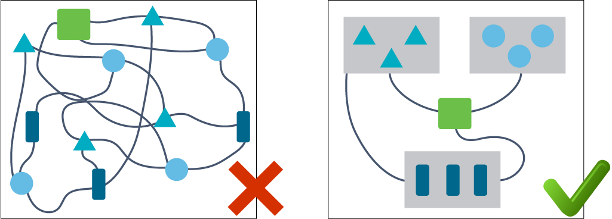
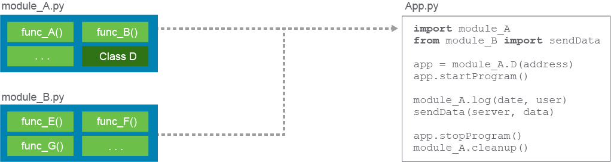
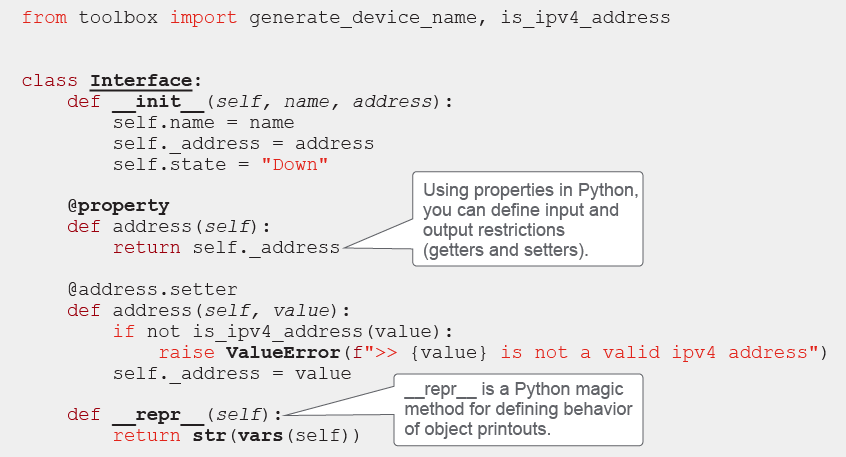
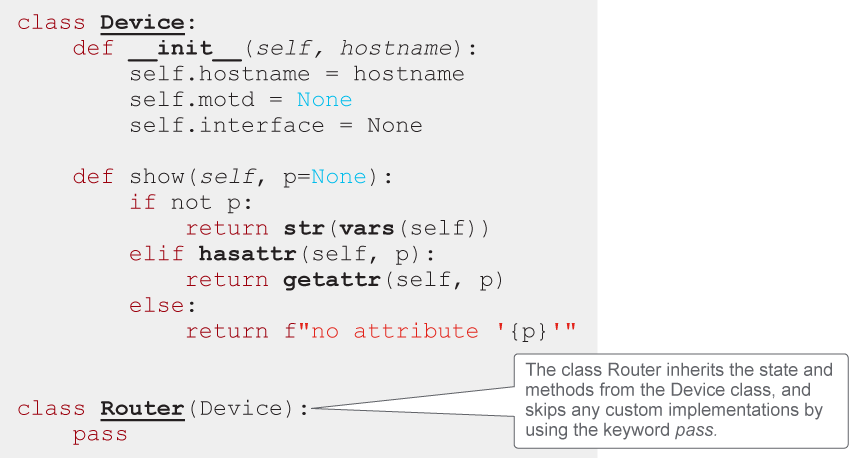

# Modular Software Design

Modular software design is a method of organizing and structuring code that allows for easy maintenance, scalability, and reusability. By breaking your code into smaller, self-contained modules, you can make it simpler to understand, test, and modify. Additionally, modular design allows for greater flexibility in making changes or adding new features to your software.



Modular software design is a method of organizing and structuring code that allows for easy maintenance, scalability, and reusability. By breaking your code into smaller, self-contained modules, you can make it simpler to understand, test, and modify. Additionally, modular design allows for greater flexibility in making changes or adding new features to your software.

The figure highlights that you should strive to develop a software system with a clear communication path between different components. Such systems are easier to reason about and are more sustainable. There are various paths to achieve more sustainable software that you, as a developer, can take when working on a project. The decision on how to design software largely depends on the type of system that you are trying to develop and how this system will be deployed.

Modular design is a powerful tool for software development that allows developers to break down a large and complex system into smaller, self-contained components. This design makes the code more organized and easier to understand, improving the readability and maintainability of the code. This means that developers can more easily find and modify specific parts of the code, making it easier to add new features, fix bugs, or make other changes.

Software modular design also provides better flexibility in making changes to the software. When code is broken down into smaller, self-contained components, it's easier to change one part of the code without affecting other parts of the system. Furthermore, this makes it easier to test and debug the code, and it also makes it easier to add new features or make other changes without impacting the rest of the system.

Additionally, modular design allows developers to create efficient and scalable software. By breaking the code down into smaller components, it becomes easier to optimize and improve the performance of specific parts of the code. This can lead to faster and more responsive software. Also, by separating the code into separate functional components, it becomes less problematic to scale the software as the need arises.

In Python, modules, functions, and classes are all used to implement modular design principles:
 - **Functions:** A function is a block of organized, reusable code that performs a specific task. Since they are reusable, Python functions can save development time and improve maintainability. Furthermore, functions can encapsulate a specific piece of the application's functionality, making it easy to understand and troubleshoot.
 - **Modules:** A module is a file containing Python definitions and statements. Modules can define functions, classes, and variables and include runnable code. Modules allow you to organize code into smaller, self-contained components that can be easily managed and reused.
 - **Classes:** A fundamental concept in object-oriented programming and are used to represent real-world objects and their behavior. Classes allow developers to encapsulate data and methods within a single object, making it easy to understand and use. Classes can also be used to create objects that can be reused throughout the program.

## Functions

Functions organize and achieve modularity in a program by dividing the code into reusable chunks that perform a specific, related task. They are a fundamental concept in most programming languages, including built-in functions. For example, the Python built-in bin() function returns the binary representation of a number without the need to install an additional library or require the developer to write multiple lines of code to achieve the same task.

```
>>> bin(42)
'0b101010'
```

> **Note** \
The `bin()` function was called from the Python interactive command line in the example.

Functions are used to organize and hide large amounts of code behind a simple call, they can be built-in into the programming language or part of imported libraries. Developers can also write their own functions to perform specific tasks.

How to define functions varies between different programming languages. Each of them will have its own syntax with custom keywords that denote where functions start and end, but they generally share similarities.

Observe the example of a function in Python.

```python
def is_ipv4_address(ip):
    """ Return True if ipv4 address,
    False if not
    """
    octets = ip.split('.')

    if len(octets) != 4:
        return False
    elif any(not octet.isdigit() for octet in octets):
        return False
    elif any(int(octet) < 0 for octet in octets):
        return False
    elif any(int(octet) > 255 for octet in octets):
        return False

    return True
```

Functions allow you to capture code intent and avoid repetitive code by calling the same function multiple times with different parameters. This principle is known as DRY or "Don't repeat yourself." Writing functions improve your code and allow for more concise documentation of intent. To write more intuitive and easy-to-read functions, you should follow good practices such as adding simple comments, naming functions properly, and making sure that functions are short and perform one task only. It's important to keep in mind that if you need to explain too much in comments, you should consider rewriting your code.

## Modules

Functions are useful for grouping code into callable units and become even more powerful when packaged into modules. Modules allow for the encapsulation of functionality and more granular control of how different parts of the application interact.

Modules are about encapsulating functionality and constraining how different parts of your application interact.

An application can be organized into smaller modules, so that a developer can easily understand the function and responsibility of each module, while ensuring that any changes made to the implementation will not cause unintended consequences. The following figure is an example of importing two Python modules into a single module, which then references the functions from the two separate modules.



Modules usually contain functions, classes, global variables, and different statements that can be used to initialize a module. They should ideally be developed with no or few dependencies on other modules, but most of the time, they are not completely independent. Modules will invoke functions from other modules, and design decisions in one module must sometimes be known to other modules.

Many modern and popular programming languages support the module concept. The syntax of the languages differs and is a subject of looking into the documentation, but they all share the idea of providing an abstraction for making a large codebase easier to understand and promoting code reusability.

## Classes and Methods

With functions and modules, you have learned some great techniques to improve the modularity of your code. There can be even higher levels of code organization that come in the form of classes.

A Class in object-oriented programming (OOP) is a construct used to create objects. OOP is a programming approach that uses objects, which are records or instances of code that can hold data and perform specific actions. Classes are blueprints for what an object should look like and define its behavior.

A class holds data in its parameters and uses methods to interact with and perform actions on an object. Classes can also inherit data from other classes, creating class hierarchies to simplify code and eliminate duplication.

In Python, classes often reside in their own files, so you might create `device.py` file for the `Device` class.

```python
class Device:
    def __init__(self):
        print('Device object created!')
```
Creating a new device object results in printing the message that it is being created. You can create as many objects as you want; each will be a new isolated instance of the device object with its own copies of data.

```python
<... output omitted ...>
>>> from device import Device
>>> dev1 = Device()
Device object created!
>>> dev2 = Device()
Device object created!
```

The method `__init__` is a special initialization method that is, if defined, called on every object creation. This method is generally known as a constructor and is usually used to initialize object data when creating a new object.

The variable `self` represents the instance of the object itself and is used for accessing the data and methods of an object. In some other languages, the keyword "this" is used instead.

Objects usually carry some data with them, so add an option to give the device object a hostname and a message of the day (motd).

```python
class Device:
    def __init__(self, hostname): 
        self.hostname = hostname 
        self.motd = None
```
When you create an object, you can pass arguments that are based on the signature of the class. The device class now accepts one parameter, which is `hostname`. The variable `motd` can be changed after the object is created. After the object initialization, `hostname` can also be changed to something else.

```python
>>> device1 = Device('test_device1')
>>> device2 = Device('test_device2')                                                                                   
>>> device2.motd = "Unauthorized access is prohibited!"
>>> print(f"device1 name:{device1.hostname} motd:{device1.motd}")
device1 name:test_device1 motd:None
>>> print(f"device2 name:{device2.hostname} motd:{device2.motd}")
device2 name:test_device2 motd:Unauthorized access is prohibited!
```

Besides storing values to objects, classes should also provide the possibility to perform domain-specific actions. To develop them, you will create code constructs called methods.

Methods in Python are like functions. The difference is that methods are part of classes and they need to define the `self` parameter. This parameter will be used inside methods to access all data of the current object instance and other methods if necessary.

Add a `show()` method to the device class, which will enable you to print the current configuration of a device object.

```python
class Device: 
    def __init__(self, hostname): 
        self.hostname = hostname 
        self.motd = None 
     
    def show(self, p = None): 
        if not p: 
            return str(vars(self)) 
        elif hasattr(self, p): 
            return (getattr(self, p)) 
        else: 
            return f">> no attribute '{p}'"
```

Create a couple of objects and try to print the configuration using the new `show()` method.

```python
<... output omitted ...>
>>> dev1 = Device("dev1")
>>> dev2 = Device("dev2")
>>> dev2.motd = 'Welcome!'
>>> print(dev1.show())
{'hostname': 'dev1', 'motd': None}
>>> print(dev2.show())
{'hostname': 'dev2','motd': Welcome!'}
>>> print(dev2.show('motd'))
Welcome!
>>> print(dev2.show('interface'))
no attribute 'interface'
```

As you start to develop more advance applications, you will need to understand and work with more advance topics like class inheritance in object-oriented programming, which is a mechanism for creating new classes from existing ones. This improves code reusability by allowing new child classes to inherit all parameters and methods from the parent class. In this example, you will create a router class that inherits from the device class and an Interface class with properties that is used in the device object to initialize the interface variable.




> **Note**\
> You will not add any custom implementation to the Router object yet, so you can use the pass keyword in Python, which will enable you to leave the implementation empty.

Create a router object. Even though it clearly does not have anything defined in it yet, it inherited all from the device class.

```python
>>> dev_name = generate_device_name("router", "test_env")
>>> router1 = Router(dev_name)
>>> router1.interface = Interface("eth0", "1.1.1.1")
>>> print(router1.show())
{'hostname': 'Cisco_CSR-1000v--test_env__RTP', 'motd': None, 
'interface': {'name': 'eth0', '_address': '1.1.1.1', 'state': 'Down'}}
>>> router1.interface.address = "in.domain.com"
<... output omitted ...>
ValueError: >> in.domain.com is not a valid ipv4 address
```

The router object originates from the parent class device but can be now extended further to support parameters and methods that a router might require for its operations.

These are some of the constructs that are used in programming to improve readability, modularity, and efficiency of your codebase. Out of these constructs, you will be able to build and understand other, more sophisticated design patterns.
