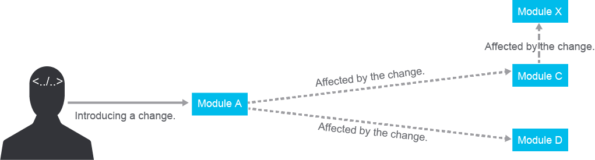
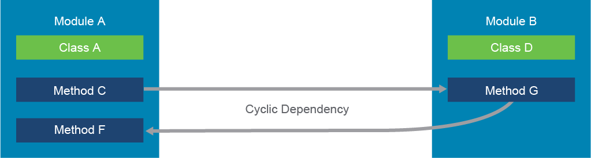
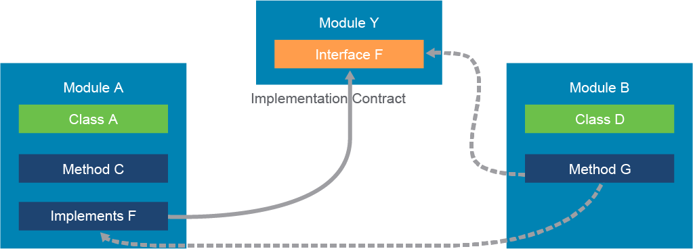
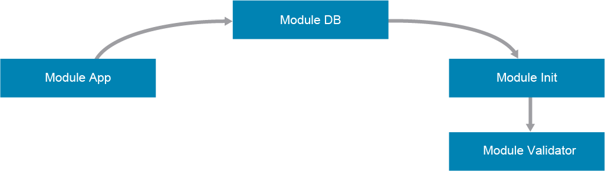

# Modular Design Benefits

Designing and developing software can be difficult because requirements and technology are constantly changing. To make it easier, we use constructs like functions, modules, and classes to make the code more organized and modular. However, just using these constructs alone doesn't guarantee success. To write code that is easy to read and understand, we should follow best practices like keeping functions short and having them do one thing and giving functions clear names. Additionally, it's important to focus on making the code reusable and easy to maintain for the long term.

## Maintaining Modularity

Modules make code easier to understand and less overwhelming when making changes. Modules should contain specific parts of a system's functionality and limit how those parts interact with each other. Too many interactions between modules can cause confusion and problems when making changes and modifying the codebase. Each module should have a clear and visible responsibility.



To prevent changes in one part of the code from breaking other parts of the system, modules should have well-defined interfaces that remain stable.

Here are some design guidelines to consider:
- Acyclic dependencies principle
- Stable dependencies principle
- Single responsibility principle

> **Note**\
> Only a few of the design principles are mentioned here; some of them belong to the SOLID design principles introduced by Robert C. Martin. Different approaches can be found in other design principles.

## Acyclic Dependency Principle

The Acyclic Dependency Principle ensures that when splitting a monolithic application into multiple modules, the dependencies between them only flow in one direction. Cyclic dependencies, where modules are dependent on each other in both directions, can cause unexpected behavior and are harder to detect in large and complex systems. Cyclic dependencies also make it impossible to separately reuse or test modules.



There are tools can help you with identifying cyclic dependencies. These tools often use the fact that the module's source code is in the same code repository. You may decide to move a module to its own code repository for reusability or separate tracing and versioning. But be careful, moving a module may create a cyclic dependency.

To avoid cyclic dependencies, use strategies such as dependency inversion or dependency injection by introducing an abstraction layer to decouple high-level modules with complex logic from low-level modules with specific application details.

Dependency inversion is defined as follows:
 - High-level modules should not depend on low-level modules. Both should depend on abstractions.
 - Abstractions should not depend on details. Details should depend on abstractions.

The Dependency Inversion Principle is a programming principle that says high-level code should not depend on low-level code, but both should depend on abstractions. This makes the system more flexible and easier to maintain. The way to implement this approach is different for statically typed languages like Java or C# and dynamically typed languages like Python.

In statically typed languages, an interface is used as an abstraction. An interface defines the skeleton code that needs to be extended in other classes. Your code depends on the abstraction and implements the details of the desired action.

For example, a class called `Device` might have a method called `show()`, but it doesn't say how the method should work. Instead, another class, like a `Firewall` class, would extend and implement the `show()` method. This way, the implementation is specific to the low-level class.

By developing against predefined interface abstractions, you can promote reusability and have a stable bond with other modules. Besides breaking the cyclic dependency, you also benefit from easier changes of the implementations and more flexible testability of the code, since you can produce mock implementations of interfaces in your tests.



## Stable-Dependencies Principle

Observe the following example of the `app.py` module

```python
import db


class App:
    def __init__(self):
        self.running = False
        self.database = db.DB()

    def startProgram(self):
        print('Starting the app...')
        self.database.setupDB()
        self.running = True

    def runTest(self, DB):
        print('Checking if app is ready')
        return 'Users' in DB.keys():
```

The signature of `db.py` is as follows:

```python
from init import Initialization


class DB:
    def __init__(self):
        self.DB = None

    def setupDB(self):
        print('Creating database...')
        self.DB = {}
        init = Initialization()
        self.DB = init.loadData(DB)
```

The initialization class is part of the `__init__` module.

```python
import app 

initData = {
    'Users': [ 
        {'name': 'Jon', 'title': 'Manager'}, 
        {'name': 'Jamie', 'title': 'SRE'} 
    ] 
}


class Initialization: 
    def __init__(self): 
        self.data = initData 
        self.application = app.App() 

    def loadData(self, DB): 
        print(self.data) 
        DB = self.data 
        validate = self.application.runTest(DB) 
        if validate: 
            return DB 
        else: 
            raise Exception('Data not loaded')
```

This is an example of a cyclic dependency where the app module uses the database module for setting up the database, and the database module uses the init module for initializing database data. In return, the init module calls the app module `runTest()` method that checks if the app can run.


In theory, you need to decide in which direction you want the dependency to progress. The heuristic is that frequently changing, unstable modules can depend on modules that do not change frequently and are more stable, but they should not depend on each other in the other direction. This is the Stable-Dependencies Principle.

Observe how you can, in a simple way, break the cyclic dependency between these three modules by extracting another module, appropriately named validator.

```python
class Validator: 
    def runTest(self, DB): 
        print('Checking if app is ready...') 
        return 'Users' in DB.keys(): 
```

The app class no longer implements the logic of the `runTest()` method, so the init module does not reference it anymore.

```python
import validator

<...  output omitted ...>

class Initialization:
    def __init__(self): 
        self.data = initData 
        self.validator = validator.Validator() 

    def loadData(self, DB): 
        DB = self.data 
        validate = self.validator.runTest(DB) 
        if validate: 
            return DB 
        else: 
            raise Exception('Data not loaded')
```

The cyclic dependency is now broken by splitting the logic into separate modules with a more stable interface, so that other modules can rely on using it.



## Single Responsibility Principle

The Single Responsibility Principle (SRP) is a programming principle that states that a class or module should have only one reason to change. This means a class or module should have a single, well-defined responsibility and not be responsible for multiple, unrelated purposes.

When developing software, each module should be responsible for one specific technical or business feature. When a change request comes in, it should only affect a narrowly defined service and should not affect other parts of the application. For example, a request from a technical group should not change the way business logic works.

A function or module should have a single responsibility. This way, the module will have one clear responsibility, making it easier to understand and maintain. Following this principle will make it easier to find the code that needs to be changed and prevent unwanted changes to other parts of the application.

An example of the Single Responsibility Principle in Python could be a class representing a customer in a system. The class should only be responsible for storing and retrieving information about the customer and should not be responsible for things like processing orders or sending emails. Separate classes would handle these responsibilities.

## Loose Coupling

Loose coupling in software development vocabulary means reducing dependencies of a module, class, or function that uses different modules, classes, or functions directly. Loosely coupled systems tend to be easier to maintain and more reusable.

The opposite of loose coupling is tight coupling, where all the objects mentioned depend more on one another.

Reducing the dependencies between components of a system reduces the risk that changes in one component will require you to change any other component. Tightly coupled software becomes difficult to maintain in projects with many lines of code.

In a loosely coupled system, the code that handles interaction with the user interface will not depend on the code that handles remote API calls. You should be able to change user interface code without affecting the way remote calls are being made, and vice versa.

Your code will benefit from designing self-contained components that have a well-defined purpose. Changing a part of your code without worrying that some other components will be broken is crucial in fast-growing projects. Changes are smaller and do not cause a ripple effect across the system, so the development and testing of such code are faster.

So how do you define if a module is loosely or tightly coupled?

Three parameters can define coupling criteria:
 - Size
 - Visibility
 - Flexibility

These criteria are based on the research of Steve McConnell, an author of many textbooks and articles on software development practices.

Keep modules, classes, and functions small to make connections easier. Functions with one parameter are more loosely coupled than those with 10. Limit functions to no more than two arguments without justification. Avoid similar functions and classes with too many methods. When creating a new solution, consider if it makes the code less understandable. Your solution should be clear to other developers, and there is no reward for hiding data in complex ways. Being straightforward is better.

For your modules to be flexible, it should be straightforward to change the interface from one module to the other. Examine the following code:

```python
import addressDb 


class Interface: 
    def __init__(self, name, address): 
        self.name = name 
        self.address = address 
        self.state = "Down" 


class Device: 
    def __init__(self, hostname): 
        self.hostname = hostname 
        self.motd = None 
        self.interface = Interface 

    def add_to_address_list(self): 
        addressDb.add(self.interface)
```

The device module interacts with the `add()` function of a module addressDb.

```python
def add(interface): 
    <... implementation omitted ...> 
    print(f'adding address {interface.address}')
```

At first sight, this code looks good. There are no cyclic dependencies between the modules. There is just one dependency. The function takes one argument, and there is no data hiding or global data modification, so it looks pretty good. What about flexibility? What if you have another class called "Routes" that also wants to add addresses to the database, but it does not use the same concept of interfaces? The addressDb module expects to get an interface object from where it can read the address. You cannot use the same function for the new Routes class; therefore, the rigidness of the add() function makes code that tightly coupled. Try to solve this using the next approach.

```python
def add(address): 
     <... implementation omitted ...> 
    print(f'adding address {address}')
```

The `add()` function now expects an address string that can be stored directly without traversing the object first. The function is not tied anymore to the interface object; it is the responsibility of the caller to send the appropriate value to the function.

```python
class Device: 
    def add_to_address_list(self):
        addressDb.add(self.interface.address) 
```

If you fundamentally change the conditions of a function in a loosely coupled system, no more than one module should be affected.

The easier a module or function can call another module or function, the less tightly coupled it is, which is good for the flexibility and maintenance of your program code.

## Cohesion

Cohesion is usually discussed together with loose coupling. It interprets classes, modules, and functions and defines if all of them aim for the same goal. The purpose of a class or module should be focused on one thing and not too broad in its actions. Modules that contain strongly related classes and functions can be considered to have strong or high cohesion.

The goal is to make cohesion as strong as possible. Aiming at strong cohesion, your code should become less complex, because the logically separated code blocks will have a clearly defined purpose. This should make it easier for developers to remember the functionality and intent of the code.

```python
def save_and_notify(device, users):
    filename = '/opt/var/'
    file = open(filename, "w")
    file.write(device.show())
    file.close()
    for user in users:
        sendEmail(user)
```

The `save_and_notify()` function is an example of low cohesion, because even the name suggests that the code in the function performs more than one action; it backs up the data and notifies the users.

> **Note**\
> Do not rely on a function name to identify if it has high or low cohesion.

A function should focus on doing one thing well. When a function executes a single thing, it is considered a strong, functional cohesion as described by McConnell.

Here is an example of a code with lower cohesion:

```python
def log(logdata): 
    file = open('/var/logs/app.log}', "w") 
    file.write(logdata) 
    file.close()
    logdata = [] 

    return logdata
```

In the `log()` function, the collected logs in the logdata variable are first being logged to disk, and then the same data is cleared in the next step. This is an example of communicational cohesion, in which there are multiple operations that need to be performed in a specific order, and those steps operate on the same data. Instead, you should separate the operations into their own functions, in which the first logs the data, and the second—ideally, somewhere close to the definition of the variable—clears the data for future usage.

Another example is logical cohesion, which happens when there are multiple operations in the same function and the specific operation is selected by passing a control flag in the arguments of a function.

```python
def actions(device, users, action):
    if action == 'backup': 
        file = open(f'{filepath}', "w") 
        file.write(device.show()) 
        file.close() 
    if action == 'notify': 
        for user in users: 
            sendEmail(user) 
    if action == 'wipe': 
        device = None 
        return device
```

Instead of relying on a flag inside a single function, it would be better to create three separate functions for these operations. If the task in a function would not be to implement the operations, but only to delegate commands based on a flag (event handler), then you would have stronger cohesion in your code.
