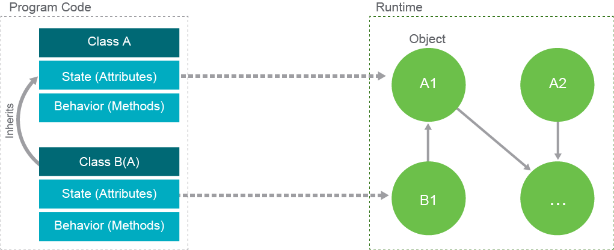
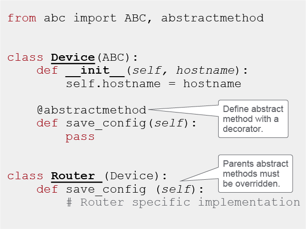
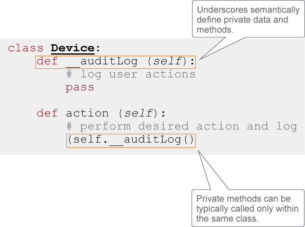

# Object-Oriented Programming (OOP) and Software Design

As you have learned so far, modularity and reusability of the code that makes your program run is a priority of good software design and architecture. It is difficult to discuss software design without talking about Object-Oriented Programming (OOP), a concept of binding and defining the behavior of programming objects.

You already saw that classes define the blueprint of how an object looks and behaves. You also learned that you can create class hierarchies in which the child class inherits the parent default behavior and can enhance its role with its own implementations.

The concepts that define what OOP enables:
 - Abstraction
 - Encapsulation
 - Inheritance
 - Polymorphism

## Abstraction

An abstraction aims to hide the logic implementation behind an interface. It provides a higher level of understanding between clients and class implementations. When creating an abstraction, the goal is to give access to the object's data without revealing the details of how it works. Abstract classes are not instantiated. They need subclasses to give behavior to the abstract methods. A subclass can't be instantiated until it implements the methods defined in the abstract class it's derived from. The methods must be overridden.

In Python, Duck typing is a programming concept that describes the practice of determining the type of an object based on its behavior rather than its class. In Python, this means that the type of an object is determined by its methods and properties rather than the class it belongs to. Duck typing allows for more flexibility in how objects are used and easy substituting objects of different classes as long as they have the same methods and properties. For example, if a function expects an object with a quack() method, it can accept any object with that method, regardless of its class. This ability is known as "duck typing" because it is based on the idea that "if it looks like a duck, swims like a duck, and quacks like a duck, then it probably is a duck."

In statically typed languages, abstract classes and interfaces provide the explicit means of defining an abstraction. But in dynamically typed languages like Python there are usually no special language constructs for abstractions. The usage of duck typing allows you to achieve almost the same effect, except that the contract between the client and a class is not too formal. While duck typing has the advantage of being very flexible, it sometimes misses the conventional rules that statically typed languages introduce. Python ABC, a Python library, brings your code a step closer to the discipline of statically typed languages and their definitions of abstract classes and interfaces. Abstract methods need to be defined by the classes that inherit them. Observe the following example of using Python ABC.

## Encapsulation

In object-oriented programming (OOP), objects interact with each other during runtime. Sometimes, you want to keep certain data and methods private to the object, so that other objects cannot access them. This is where encapsulation comes in. Encapsulation in OOP conceals the internal state and implementation of an object from other objects. It restricts access to certain parts of an object, allowing you to define which data can only be accessed through designated methods, known as data hiding. In languages like Java and C#, you can use the keyword "private" or "protected" to explicitly define variables and methods that other objects cannot access. Child classes also cannot access the data encapsulated in this way.

In Python, encapsulation is not as strictly defined as in other languages. You cannot explicitly define data as private or protected. Instead, Python uses the convention of prefixing a name with an underscore or double underscore to mark it as non-public data. Using double underscores causes name mangling, which means that a variable name is concatenated with the class name at runtime. For example, if you have a __auditLog() method in a Device class, it becomes _Device__auditLog() at runtime. This helps prevent subclasses from accidentally overriding methods and breaking internal method calls in the parent class. However, nothing stops you from accessing the variable or method, even though it's considered private by convention.

The following code calls the private `auditLog()` method for every call of the `action()` method.

## Polymorphism

Polymorphism goes hand in hand with class hierarchy. When a parent class defines a method that child classes must implement, the method is considered polymorphic because each child class can have its own unique way of solving the problem the parent class proposed. Polymorphism can also be found in any situation where a variable or method can accept multiple types of values or parameters. It allows for flexibility and code reusability.

Designing object-oriented applications is not easy and require a solid understanding of code constructs and experience in developing reusable and readable code. Your design should be definite for the problem you are trying to solve with the application but at the same time generic enough so that it can be extended in the future without major problems.

It is important to understand more about how to define class interfaces, hierarchies, and relationships between different modules and classes, and decide which programming languages to use—whether they support libraries that you will need, which database to use, how to use it, and how should all pieces of this puzzle communicate together cohesively. These questions fall into the architecture and design patterns paradigm, and you should ask them before writing any code.

## Inheritance

Inheritance in OOP is a mechanism that allows one class to inherit properties and methods from another class. It enables the creation of a new class (the child class) based on an existing class (the parent class). The child class inherits all the properties and methods of the parent class and can also define new properties and methods of its own. Inheritances allows for code reuse and a more organized and efficient way of creating new classes. In addition, when a change is made to the parent class, it will automatically be reflected in all child classes, reducing the need for repetitive code updates.