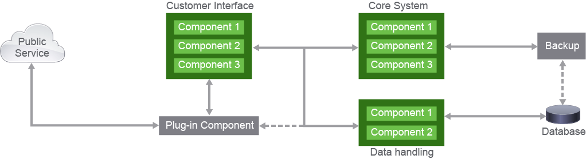
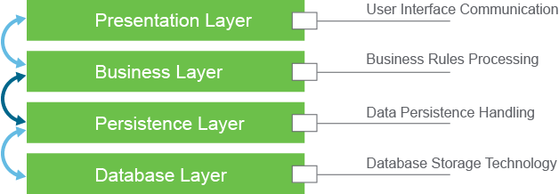
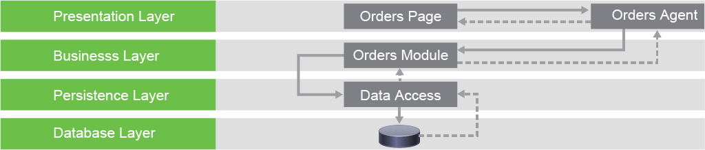
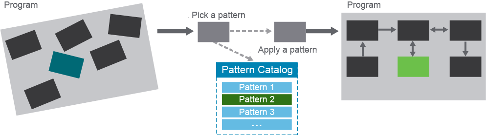
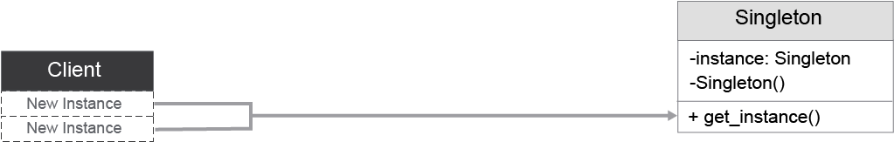
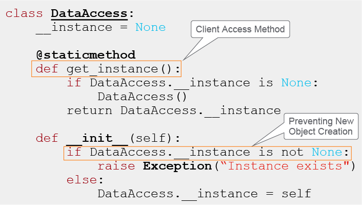
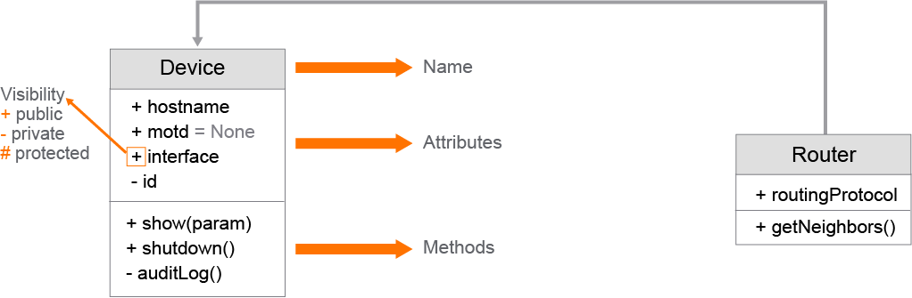

# Architecture and Design Patterns

Like building any complex structure or product, developing applications and software need a blueprint for how all the different parts will work together. That's where software architecture comes in. It outlines the relationships and interactions between all the components of the program.

But you might run into common design problems that can be tricky to solve. That's where design patterns come in handy. They are pre-made solutions to these problems that you can use repeatedly. These patterns work in specific situations and can be adapted to a different technology or programming languages. Design patterns help create a strong and easy-to-maintain program when used with software architecture.

Software Architecture involves various elements, including software components and their connections. A well-documented architecture can aid communication among stakeholders, predict system performance, and facilitate onboarding new team members.

When designing an application, developers must consider the attributes and goals of the system. For example, if security is a priority, critical elements must be identified, and communication with them limited. Similarly, if peak traffic is expected, the allocation of resources and its impact must be evaluated. The specific requirements of the software will determine the appropriate type of architecture to use.

When designing the software architecture for a system, the following characteristics must be considered:
 - **Performance:** The design should enable the system to handle workloads and meet its performance goals efficiently.
 - **Availability:** The architecture should ensure high reliability, fault tolerance, and system uptime.
 - **Modifiability:** The architecture should facilitate the ease and cost-effectiveness of making changes to the system as required.
 - **Testability:** The architecture should enable testing and validation of the system's functionality with ease.
 - **Usability:** The architecture should consider the system's user-friendliness for its intended users.
 - **Security:** The architecture should facilitate the protection of the system against unauthorized access, use, disclosure, disruption, modification, or destruction of information and support the system's integrity and confidentiality.

Designing a great system is like solving a tricky puzzle, but a poorly designed one is all too easy to put together. But not to worry, you don't have to reinvent the wheel. The industry has already figured out many best practices and design patterns for you to use, like cheat codes for new programmers. Moreover, these proven solutions are readily available for reuse, allowing you to avoid common pitfalls that others have encountered.

Some of the commonly known software architecture patterns:
 - Layered or multitier architecture pattern
 - Event-driven architecture pattern
 - Microservices architecture pattern
 - Model-View-Controller (MVC) architecture pattern
 - Space-based architecture

It is time to investigate one of the more common architecture patterns.

## Layered Architecture Pattern

The Layered Architecture Pattern is a commonly used design pattern in software development. It is a way to organize the different components of a software application as layers, each with a specific role or purpose. This pattern is closely related to the organizational structures of most companies, making it a natural choice for software development for large organizations and enterprises.

> **Note**\
> The business and persistence layers are sometimes combined, so you end up with three layers, or so called three-tier architecture.

Each layer of the architecture is responsible for a specific domain of actions and is not concerned with the logic of other layers. For example, the presentation layer is responsible for handling user interface communication and processing user input, while the business layer handles specific business rules and calculations. This is sometimes referred to as a separation of concerns, which makes the application easier to develop and maintain.

The number of layers used in a layered architecture pattern can vary, but the most common approach is to use four layers:
 - **Presentation Layer:** This layer handles the user interface communication and is responsible for processing user input and formatting and presenting the results to the user interface.
 - **Business Layer:** This layer performs specific business rules based on events that happen in the system or requests that originate from the user. It handles tasks such as customer data processing, order processing in a web store, and any calculation or action considered a part of business functionality.
 - **Persistence Layer:** This layer handles requests for data in the database layer. When the business layer needs to retrieve or save data to the database, it passes the request to the persistence layer, which performs the required action using the query language supported by the database layer.
 - **Database Layer:** This layer stores all the data and is responsible for the physical storage and retrieval of data. It may use a query language such as Structured Query Language (SQL) to interact with the data stored in the database.

The layers of isolation principle in Software Layered architecture is a design approach that separates an application into distinct layers, each with a specific responsibility and communicating with other layers through a well-defined interface. This helps to prevent tight coupling and promote loose coupling and high cohesion between different components of an application. Additional layers may be introduced to handle specific functionality, and these can be either open or closed, meaning they may or may not be required for all requests. Understanding the relationship between different layers in the architecture and the flow of requests helps to organize the various components of a software application using the layered architecture pattern. Each layer should be developed independently with changes that are done in isolation of other layers. The layered architecture is easy to test and develop, but it can be difficult to scale compared to a microservices architecture.

Each layer should be developed independently with changes that are done in isolation of other layers. The layers in the layered architecture should have well-defined APIs or interfaces over which they communicate. This way, your system will be more loosely coupled and easier to maintain and test. As an example, consider the following scenario for an application.

The layered architecture is a popular design approach for software development that separates an application into distinct layers, each with a specific responsibility. It is easy to test, and develop, and allows for the skills of developers to be used effectively. However, it can be difficult to scale compared to a microservices architecture, as most layered development tends to be monolithic, which can lead to complications in deployment and the need for careful planning.

Monolithic architecture is traditionally a software design where the entire application is built as a single, tightly coupled unit. This makes developing the software simpler compared to other designs. Monolith software is also easier to test and deploy since all components are part of a single codebase. On the other hand, software that is monolithic can be challenging to manage and scale as the codebase grows.

## Software Design Patterns

Having a well-designed software architecture is crucial, but it's not enough to guarantee a high-quality system. To ensure the best experience for all parties involved, the design needs to be well-implemented as well. Architecture patterns provide a bigger picture of how components should be assembled, while software design patterns focus on individual components and ensure that optimal coding techniques and patterns are used to avoid highly coupled and tangled code.

Design patterns are not libraries that you import into your project, but rather concepts for solving common obstacles in software design. They are language-agnostic and can vary in complexity and applicability to the system being observed. Some design patterns are simple idioms that are specific to a single programming language, while others are more complex and can be applied to various applications.

As you gain experience in software development, you may begin to recognize and use design patterns intentionally, rather than by coincidence. These patterns can save time in development by promoting reusability, as code that is loosely coupled is easier to reuse than code that was not written with extensibility and flexibility in mind.

> **Note**\
> One of the most influential books on object-oriented software design is *Design Patterns: Elements of Reusable Object-Oriented Software*, which set industry standards for writing better code by relying on patterns. Many of the concepts that you will learn here are coming out of the ideas of the book authors— Erich Gamma, Richard Helm, Ralph Johnson, and John Vlissides—who are commonly known as the Gang of Four (GoF).

When you are reading about software design patterns, you will typically be introduced to a pattern using a name—for example, the adapter pattern. Each pattern will describe the context and problem that it is solving, then a solution that acts as a template applicable to different programming languages, and finally, the good characteristics that a pattern brings, as well as the trade-offs of using patterns.

The sections that are usually discussed with the design patterns are:
 - Intent
 - Motivation
 - Applicability
 - Structure in a modeling language
 - Implementation and sample code

Software design patterns are ways to organize your code to make it easier to understand and use. They come in different types: creational, structural, and behavioral. Creational patterns help with creating classes or objects, structural patterns help with organizing bigger projects, and behavioral patterns help with how different parts of the code interact with each other.

A pattern will describe the context and problems it solves, together with a solution in a modeling language and code examples.

| Creational | Structural | Behavioral |
|--|--|--|
| Singleton | Adapter | Observer |
| Abstract Factory | Decorator | Interpreter |
| Prototype | Facade | Mediator |
| Factory Method | Proxy | State |

Design patterns are based on various design principles, including encapsulation to minimize the impact of changes to code, SOLID principles, and the use of abstraction rather than implementation. These principles are integrated into patterns that can be applied to solve specific problems.

The Singleton pattern is a way to ensure that a class can only have one instance, while also providing a global access point to that instance. This is useful for classes representing a shared resource, such as a database connection, that should only be created once and then reused throughout the program. By using the Singleton pattern, you can avoid using global variables and ensure that the shared resource is protected from being overwritten. This is achieved by making the class constructor private and providing a static method that returns the original instance to the caller. This allows the class to be accessed from anywhere in the code, while also ensuring that there is only one instance of the class at all times.

Here is how you would implement the singleton pattern in the Python language.

Class `DataAccess()` can be instantiated only once. The `__init__()` constructor first checks if an object instance exists, and if it does, it raises an error. If your code needs to access the object, it should retrieve the instance using the `get_instance()` method.

## Unified Modeling Language

Codebases that you encounter in the real world are written in a specific programming language. That said, there are not many developers that are proficient in every single programming language, so how can you find the right communication layer? When you are talking about software design, it is vital that you have a common language with all stakeholders and developers on a project. Capturing the intent of software design, no matter the implementation technology, is the goal of having a unified language that is simple enough for everybody to understand..

The Unified Modeling Language (UML) was created because programming languages, or even pseudocodes, are usually not at a high level of abstraction. UML helps developers to create a graphical notation of the programs that are being built. They are especially useful for describing, or rather sketching, code written in object-oriented style.

As an example, look at the following UML class diagram.

The UML can sketch your program before you start writing code for it. It can define many details of a class and the connection between other classes. In this example, the Router object would inherit all the fields and methods from the Device object. Class inheritance is shown with a solid line and an arrow at the end.

You can use UML as part of the documentation for a program, or use it for reverse-engineering an existing application, to get a better picture of how the system works..