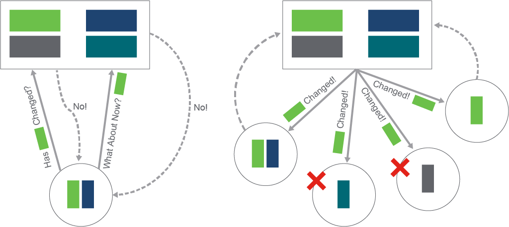
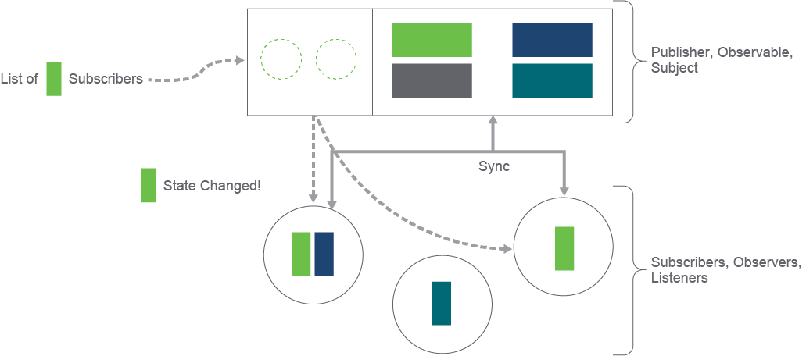
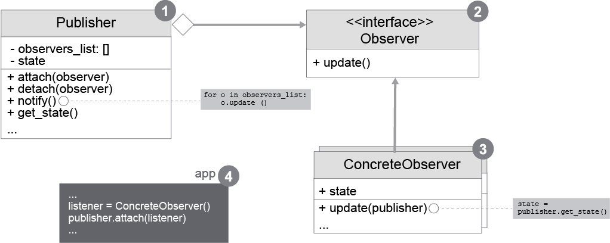
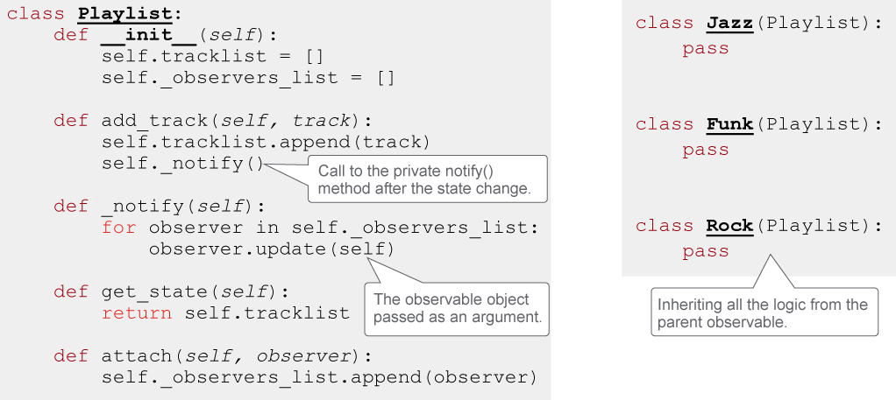
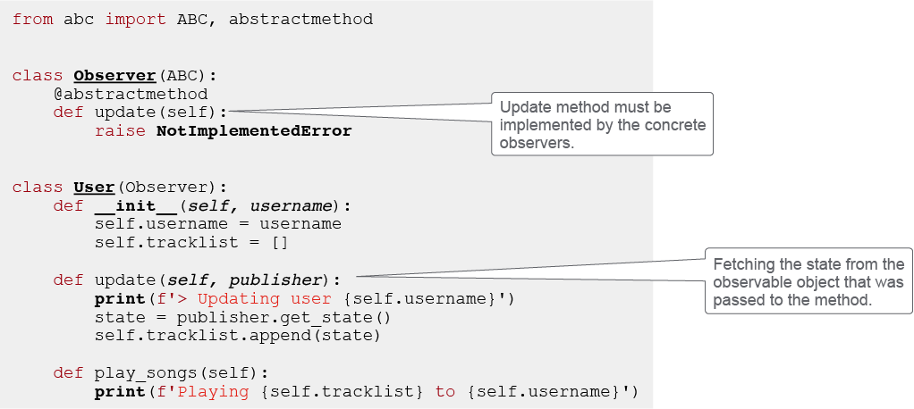
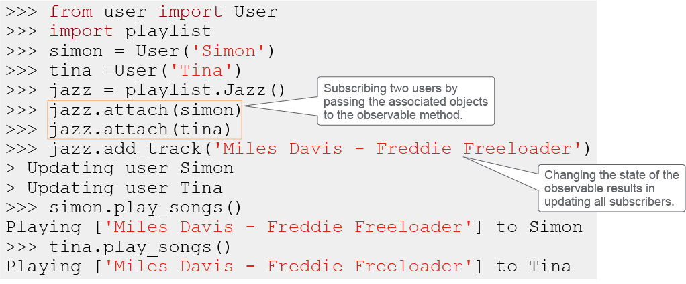

# Observer Design Pattern

This topic describes how and when to use the observer software design pattern, describes class diagrams, code, and sequence diagrams, and provides examples.

Observer design patterns are behavioral patterns that define a one-to-many dependency between objects, together with a subscription mechanism for informing subscribed objects on changes happening on the object they are observing. The pattern is also known as Event-Subscriber or Listener.

As an example, imagine a web application for streaming music. Users can register on the site and access many different artists and music. Every user develops a taste for a certain genre and wants to listen to more music from that genre. You start to check frequently for new music that your artist would put up on the streaming platform in the genre you are enjoying the most, but there could be days before the playlist would be updated. After a while, you see that checking the playlist again and again is time consuming, and you begin losing interest in the platform.

The developers decide to do something about it, so they establish a system for notifying users on every update there is in a certain genre. They solved a part of the problem. You now get notified about the new releases in the genre you like the most, but at the same time, you get updates on the genres you are not interested in, and so does everyone else. It looks that this solution just discovered a different kind of problem. Broadcasting the message to everyone is not the best way of dealing with the updates. The solution would be to let the users decide what they want to receive and let them subscribe to the notification from a genre and stop receiving messages for genres they are not interested in. If you take the analogy and put yourself in the shoes of the developers of the platform, you would need to incorporate some sort of subscription mechanism. The observer pattern can be the right tool for the job.

The motivation for this pattern comes from a practical case where a modular system has a collection of related classes that need to maintain consistency. If you relate to the example again, classes could be user and playlist. The user class kept consistency by periodically calling the playlist public method for getting back the information if there are any new songs from the genre. However, as a practical example, that solution did not work out, so the first way of achieving consistency failed.

Consistency also can be achieved by writing the classes to have more information about each other, but that would make them tightly coupled and would reduce the reusability of the components. So the playlist class could notify the user class and call the user public method when a new song comes from the genre that a user is interested in, but this makes the playlist too dependent and tightly coupled with the user. The observer patterns define how to establish these kind of relationships in the right way.

The fundamental elements in this pattern are observable or publisher and observer or subscriber. An observable can have any number of dependent observers. Observers are notified whenever the subject goes through a state change. When a state change happens, the observers that were notified contact the observable (the subject) to synchronize its state. The publisher is also known as the subject, and the observers can be referred to as subscribers. The publisher sends the notifications, but it does not need to know who the subscribers are or how many of them are subscribed. In networking terminology, you may say that the publisher is sending a multicast notification.

The observer pattern can be used in cases where an abstraction has more aspects that are dependent on one another, and you are able to encapsulate them in separate objects to increase reusability. It is also useful when changing an object requires changing other objects, but you do not know which and how many. For example, in the MVC architecture, you can have multiple views that depend on the same model component data. If one view initiates the change of the model state, you need to make sure that all the other dependent views are updated with the new data.

The idea of the observer pattern is that you add a subscription mechanism to the class from which you want to generate change notifications. Other objects (observers) will be able to subscribe or end subscription for certain stream of change notifications coming from this publisher (observable) class. The implementation is quite simple; the publisher class must store a list of references to the objects that are subscribing to the publisher, and methods for adding new subscribers and removing existing ones.

When an event happens on the object implementing the observable, it triggers the notification procedure. This trigger requires the observable class to go through the list of subscribers, calling their notification methods. You probably will have multiple objects that will be interested in change notifications from the same publisher. It is important that you do not write the observers and the publisher to be tightly coupled. Again, developing against interfaces, not implementations, is preferable. The subscriber classes should implement the same interface that the observable class can call. It also makes sense to have the same interface on all the publishers if you have more of them.

A publisher in the observer pattern should know that it has a list of observers, with the assumption that each observer conforms to the agreed abstraction interface. The publisher implements a subscription mechanism for attaching and detaching of objects that are interested in the state, together with the notification procedure for informing subscribed objects on changes (1). In the related figure, the implementation of the publisher class contains the observer pattern procedures and the business logic. You could also split the observable related logic into its own class, so you end up having an event propagator to which your state-holding objects delegate the operation of observer notifications.

The coupling of the publisher and observer should be loose, because the publisher should not know any concrete class implementation of the observers. The relation between the publisher and observers should therefore be through an abstraction interface that defines the observer API (2). In the simplest case, it defines an ``update()`` method that could also accept some parameters—for example, which part of the state changed—or other details. The ConcreteObserver class models the objects subscribing to the publisher. It stores the state that should stay consistent with the referenced publisher. It must implement the Observers ``update()`` method for staying in sync with the publisher (3).

The listener and publisher objects are independently created in the runtime, and they may be used in the program, providing their general function, before initiating the request for the subscription contract between them. When the subscription is needed, the ConcreteObserver object is passed to the `attach()` method of the publisher class, which automatically makes that object a part of the notification process of this publisher (4).

As a practical example, explore the Python implementation of the previously mentioned streaming music application, which incorporates the observer pattern.

First, the observable or publisher class from the playlist module implements the simple logic of adding musical tracks to the list (state), together with all the necessary observable data and methods. The parent class playlist implements all that logic, while the child classes only inherit it. The program will instantiate the genre objects, not the playlist directly. Currently, the genre classes do not have any custom additions to the playlist, but if additions are needed, they can be easily attached.

New observers can subscribe to the publisher by appending them using the `attach()` method, which simply adds the received object to the internal list of observers. The `detach()` method is not present in this implementation, but it is nevertheless very simple. You would use the `remove()` method on the list, specifying which object needs to be removed. It would also make sense that the state of the observer that was detached is aligned with this event, so cleaning the observers state from any state coming from the detached publisher is required. The `get_state()` method returns the current state of the program—in this case, the current list of the musical tracks in a genre. This method is used by the observers as a means of syncing their state.

The `private _notify()` method takes care of traversing the list of all subscribed objects and calling their implementation of the update method by passing a reference to the current playlist child genre object. This object will be later used inside the observer `update()` implementation for accessing the state of the genre publisher.

> **Note**\
> The `self` argument inside a Python class refers to the current object instance that you operate on, and can be used to access the methods and state of that instance.

Notice that the publisher class is not dependent on the type of the observer object that gets registered with it. The only contract between the publisher and observer is that the observer implements the `update()` method and that the publisher has the `get_state()` method for state retrieval. You could make the publisher more generic by separating the business logic and observable logic into separate classes. Then, you would end up having an event propagator for any kind of concrete publishers.

For implementing the observer or subscriber class, an abstraction is used. First, the abstract observer class defines an abstract method `update()`. This is a method that classes need to implement if they want to act as observers in this program.

The class user is the concrete observer in this case. It inherits the observer class, meaning that it must implement the `update()` method because of the contract between the observer class and because this is expected in the publisher implementation. The concrete observer represents a user object that stores track references from all the genres to which the user is subscribing. The track list gets updated when there is a change in one of the subscribed genre objects, and the publisher calls the `update()` method of a user object. When this occurs, and the user objects are notified, the `get_state()` method on the publisher object that was passed in as an argument gets called. The observer then promptly updates its state with the state of the publisher, and the user can simulate playing all the tracks that are part of the genre in which the user is interested.

The current implementation is quite simple. The publisher of the notification could also pass in, for example, the difference between the previous and the current state, or who initiated the change and similar information that might be necessary for properly updating the state.

To connect all the logic together, you may again use the Python interactive Shell and try running the program.

After you create a couple of users and a genre playlist, you can `attach (subscribe)` the users to that playlist. The application must pass the user objects to the `attach()` method, which are then stored within the playlist observers list, waiting to be called on a state change. A state change is initiated when a new musical track is added to the genre playlist. As seen in the figure, both users that were subscribed to the jazz playlist were updated. If you call the users method for playing the tracks, you will see that they both have the correct state of the playlist, so the observer pattern worked.

## Applicability of the Observer Pattern

When you need to dynamically sync the object state based on changes in some other object, and you cannot predict how many or what kind of objects will need this means of updating, the observer pattern might be the right tool for the job. How to apply this pattern is evident from the examples, but you need to be aware of a couple of things when you decide to implement it.

The easiest way of mapping publishers and observers is to store the references to the observers in the publisher. That approach is shown in the examples. If this is found to be inefficient, then it might be better to store the relationships outside of the publisher class, in a data structure such as a dictionary that may hold the relationship information. Sometimes, an observer subscribes to more than just one publisher. In this case, you will need to write the update method to provide the relation to the correct publisher. As in the examples, passing the publisher object to the update method works well.

The update of the observer is triggered after an event happens on the publisher and the notification is generated. The notification can be generated directly after the state change, initiated by the publisher as it was in the previous example. One problem of this approach is that there can be many consecutive calls to the business logic of the publisher, triggering many notifications, resulting in multiple consecutive synchronization calls between the observable and observer. In such cases, it could be better that the notification gets triggered by the application code that is using the publisher. This would mean that the application could call the business logic multiple times, and after it finishes, it calls the notify procedure, resulting in only one update procedure. To refer to the example from before, instead of users being updated every time a new track was added, the application can add multiple tracks without triggering the update, and then as the last step, it calls the notify procedure manually, reducing the number of updates.

When a publisher object is deleted, you need to make sure that the observers do not hold any references to that object anymore. You cannot just delete the observers because they might relate to other objects and publishers. The observer state should be up to date with the publisher. If the publisher does not exist anymore, then the proper handling would be to remove all those references. This can be implemented by publisher sending a delete notification to all observers before its deletion. The observers can then clean their state.

In a system requiring a more complex subscription mechanism, a viable option for registering observers would be to allow subscribers to attach to specific events of an observable. The event or part of the state that the observer is interested in would be passed into the `attach()` method, and on the update procedure, only that event or part of the state is passed to the update method. This solves objects from receiving unnecessary updates.

The observer pattern is applicable to many applications requiring described behavior. It is easy to introduce new subscriber classes without mangling the publishers code, and the same applies in the opposite direction if you develop against interfaces. One good thing about the observable-observer relationship is that it can be established at runtime, so there is no need to stop the program code and implement separately for every attachment. The drawback of the relationship is that the observers are being notified in a random order. The idea is that the publisher does not know the details of the objects that are subscribing to it, so it is understandable. You can, of course, get around it by twisting the rules a little bit, but be aware that it usually results in a more highly coupled code, which, on the other hand, might be just fine and unavoidable in some cases.