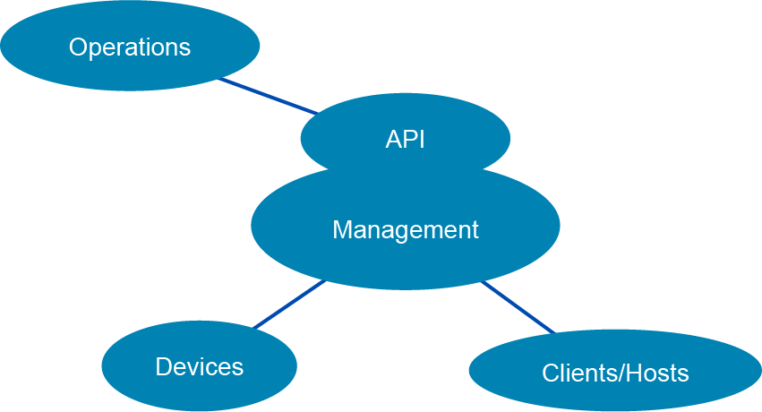
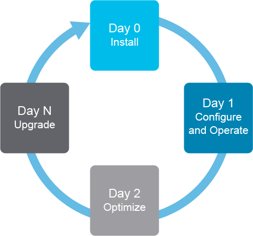
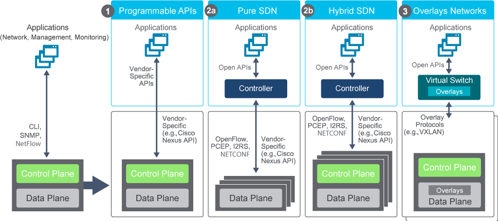

# Automating Cisco Network Operations

Since the very beginning of computer networking, network configuration practices have centered on a device-by-device manual configuration methodology. In the early years, this approach did not pose much of a problem, but more recently, this method for configuring the hundreds if not thousands of devices on a network has been a stumbling block for efficient and speedy application service delivery. As the scale increases, it becomes more likely that any changes that are implemented by humans are going to have a higher chance of misconfigurations, whether simple typos, applying a new change to the wrong device, or even missing a device altogether. Performing repetitive tasks that demand a high degree of consistency unfortunately introduces a risk for error. And the number of changes humans are making is increasing, because there are more demands from the business to deploy more applications at a faster rate than ever before.

The solution lies in automation. The economic forces of automation are manifested in the network domain via network programmability and software-defined networking (SDN) concepts. Network programmability helps reduce operating expenditures (OPEX), which presents a very significant portion of the overall network costs and speeds up service delivery by automating tasks that are typically done via the CLI. The CLI is simply not the optimal approach in large-scale automation.

Network automation plays a very crucial part in simplifying day-to-day operations and maintenance. With automating everyday network tasks and functions, and with managing repetitive processes, human errors are reduced and network service availability is improved. The operations teams can respond and handle trouble tickets faster and can even act proactively. Network automation also lowers costs by giving operations teams the ability to migrate mundane and repetitive tasks to automated processes.

A pivotal part of automating any network operations task is the ability to manage the network programmatically by using APIs.

The value of network programmability, and use cases, suggests possibilities for network programmability solutions. Network automation is used for various common tasks. Several of the most common are:

- **Device provisioning:** Device provisioning is likely one of the first things that comes to the minds of engineers when they think about network automation. Device provisioning is simply configuring network devices more efficiently, faster, and with fewer errors because human interaction with each network device is decreased.
- **Device software management:** Controlling the download and deployment of software updates is a relatively simple task, but it can be time-consuming and may fall prey to human error. Many automated tools have been created to address this issue, but they can lag behind customer requirements. A simple network programmability solution for device software management is beneficial in many environments.
- **Compliance checks:** Network automation methods allow the unique ability to quickly audit large groups of network devices for configuration errors and automatically make the appropriate corrections with built-in regression tests.
- **Reporting:** Automation decreases the manual effort that is needed to extract information and coordinate data from disparate information sources to create meaningful and human-readable reports.
- **Troubleshooting:** Network automation makes troubleshooting easier by making configuration analysis and real-time error checking very fast and simple even with many network devices.
- **Data collection and telemetry:** A common part of effectively maintaining a network is collecting data from network devices and telemetry on network behavior. Even the way data is collected is changing, because many devices now can push data (and stream) off box in real time in contrast to being polled in regular time intervals.

A very common real-world scenario, which can greatly benefit from network automation, is collecting data from the network for describing the network devices themselves, or providing information about the hosts and clients connected to the network. Cisco offers comprehensive APIs on its management platforms. Utilizing these APIs for collecting information about the network simplifies operational workflows and enables integration with business and operational support systems.

## Automating Device Operational Life Cycle

Network engineers are tasked with deploying, operating, and monitoring the network as efficiently, securely, and reliably as possible.

The first challenge is getting a device onto the network. This part is commonly referred to as "Day 0" device onboarding. The key requirement is to get the device connected with as little effort as possible. Depending on the operational mode and security requirements, either a small subset of the configuration or a "full" initial configuration will be deployed.

Once the device is provisioned, the configuration of the device needs to be maintained and upgraded. "Day 1" device configuration management is responsible for the ongoing configuration. Changes to the configuration need to be reliable, efficient, and auditable.

The next challenge is monitoring the network and measuring performance. "Day 2" device monitoring provides a view of how the network is operating. Based on this view, some changes may be required.

Lastly, optimizations to the device are made, such as extensions to the device capabilities, enhancements to operational robustness, or patches and software upgrades. Referred to as "Day n," it implies an iterative approach, looping back through Days 0, 1, and 2.

## Network Programmability Options

There are different network programmability options available today, as presented in the figure.

On the left side of the figure is how network management applications and monitoring tools access the device today, using CLI and Simple Network Management Protocol (SNMP), NetFlow, and so on. This approach has evolved in different directions.

When SDN started to evolve, Cisco and other vendors began offering vendor-specific APIs to program and control the existing network devices. As you can see in the figure (option 1), the control and data planes are still in the same box, the same as in a traditional approach. An example would be a Nexus API (NX-API) interface that is used in Cisco Nexus Data Center Switches. Later, open APIs (Network Configuration Protocol [NETCONF], Representational State Transfer Configuration Protocol [RESTCONF], and so on.) were added to vendor-specific APIs.

Option 2a shows a pure SDN environment where a control plane has been separated to a controller. OpenFlow was the first protocol for communication between the controller and the data plane, but it required a hardware upgrade to understand OpenFlow commands. Today, there are various APIs that can be used. NETCONF, for example, is one of the most popular network configuration protocols, but others can be used (for example, Path Computation Element Protocol [PCEP] and Interface to the Routing System [I2RS]).

The limitations of a pure SDN approach have led to a hybrid approach (option 2b), which today is used by most vendors, including Cisco. A control plane is still needed on the network devices so that it can independently run some network protocols (routing, for example). Also, the controller uses an abstraction layer between the applications and the network devices. Applications can communicate with a controller in a programmable way and achieve automation through it.

Option 3 represents an overlay approach, which is commonly using the Virtual Extensible LAN (VXLAN) protocol. The main idea is that the existing devices are kept intact and that a virtual network using overlays is created. Automation (and programmability) is achieved on top of the virtual network. Examples of such an approach are Cisco SD-Access and Cisco SD-WAN solutions.

### Content Review Question

For which two common tasks is network automation used? (Choose two.)

- [x] device provisioning
- [ ] accounting
- [ ] data entry
- [x] reporting
- [ ] text editing
