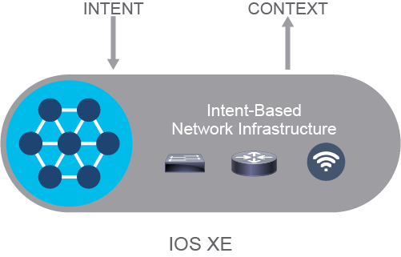
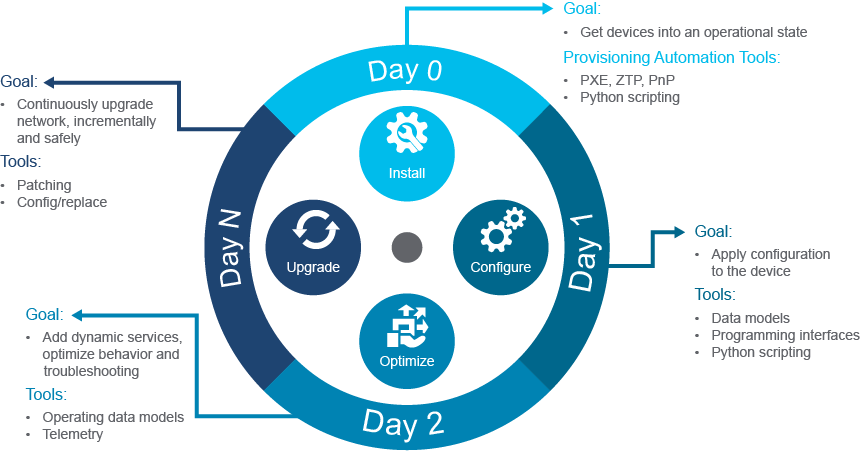
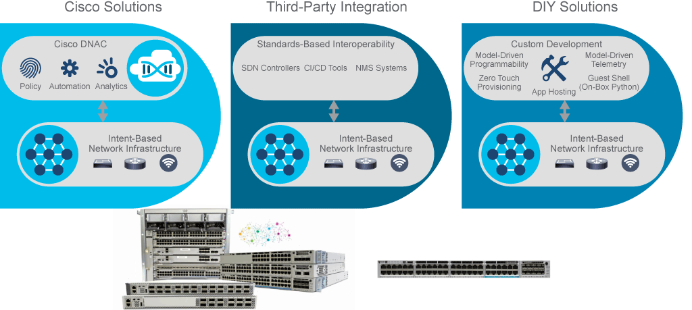
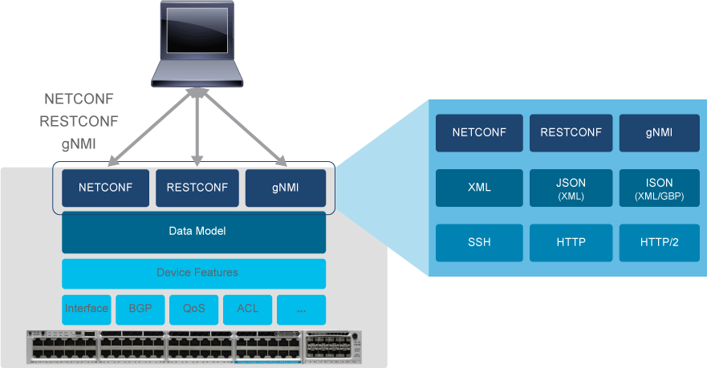
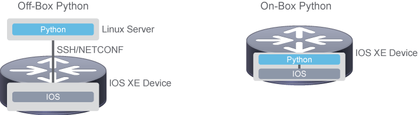

# Cisco IOS XE Device-Level APIs

Network automation is the process of automating the configuring, managing, testing, deploying, and operating of physical and virtual devices within a network. With everyday network tasks and functions automated and repetitive processes controlled and managed automatically, network service availability improves. Any type of network can use network automation. Hardware- and software-based solutions enable data centers, service providers, and enterprises to implement network automation to improve efficiency, reduce human error, and lower operating expenses. The basis for network automation lies in network operating systems like Cisco IOS XE Software for enterprise environments and Cisco Nexus Operating System (NX-OS) for data center environment support of different automation tools.

Cisco IOS XE is an intent-based network operating system:

- Optimized for enterprise networks
- Wired and wireless access, aggregation, core, and WAN
- Open and flexible
- Standards-based APIs

Cisco IOS XE Software addresses these needs as the single operating system for enterprise switching, routing, wired, and wireless access. It delivers a transformational level of automation and programmability, reducing business and network complexity.

A trend in the networking industry is to focus on business goals and applications. Intent-based networking (IBN) transforms a hardware-centric, manual network into a controller-led network that captures business intent and translates it into policies that can be automated and applied consistently across the network. The goal is for the network to continuously monitor and adjust network performance to help ensure desired business outcomes. IBN builds on SDN principles, transforming from a hardware-centric and manual approach to designing and operating networks that are software-centric and fully automated and that add context, learning, and assurance capabilities.

IBN captures business intent and uses analytics, machine learning, and automation to align the network continuously and dynamically to changing business needs. That means continuously applying and assuring application performance requirements and automating user, security, compliance, and IT operations policies across the whole network. Cisco IOS XE Software represents a basis for intent-based networking. Its standards-based programmable interfaces automate network operations, which provide a way for intent to be translated into configuration. It also provides deep visibility into user, application, and device behaviors, which gives contextual data that is needed for assurance.

Cisco IOS XE Software is the single operating system for enterprise switching, routing, wired, and wireless access. It provides open, standards-based programmable interfaces to automate network operations and brings deep visibility into users, applications, and device behaviors. Automating device life-cycle management through Cisco IOS XE programmability, as shown in the following diagram, assists network engineers to reduce business and network complexity.

Some examples of the benefits in different stages of the network device life cycle that uses Cisco IOS XE programmability are as follows:

- Network device onboarding is a manual and time-consuming operation, requiring highly skilled engineering personnel. Onboarding is tedious and repetitive in nature. Automated device onboarding with programmable workflows lowers the cost and time required to provision a network device, eliminating errors and allowing the use of lower-level engineering personnel and associated resources. With automated device onboarding, individuals with no networking knowledge or expertise can install the physical device. Initial configurations are deployed programmatically, providing a simple, secure, and integrated option to ease new branch or campus rollouts. Cisco IOS XE Software supports the following capabilities to automate device onboarding: Zero Touch Provisioning (ZTP), Cisco Network Plug and Play (PnP), and Preboot Execution Environment (PXE).

- Network devices located in dynamic environments, such as the cloud, need to avoid being the bottleneck in service provisioning. Rapid and repeatable service delivery is crucial in this environment. The Cisco IOS XE device APIs, which include NETCONF, RESTCONF, and the gRPC Network Management Interface (gNMI), enable automated configuration changes. Network devices running on Cisco IOS XE Software support the automation of configuration for multiple devices across the network using data models. Data models are developed in a standard, industry-defined language called "Yet Another Next Generation" (YANG), which can define configuration and state information of a network. Model-based interfaces coexist and interoperate with existing device CLI, syslog, and SNMP interfaces. Also, Python provides a means to programmatically interact with a device. Python scripting of Cisco IOS XE devices is available on-box on some platforms and releases, but often, it is more efficient or desirable to run scripts off the box.

- Events such as link flaps, power supply failure, and configuration drift are difficult to act on in a consistent manner. The Cisco IOS XE Guest Shell feature assists IT organizations to develop an entirely new suite of applications that help with existing operational challenges. Python scripts running on Guest Shell can trigger alerts to IT network operation centers (NOCs) when new critical events are detected, automatically create service tickets, and mitigate the issues by dynamically applying configurations. For example, oil and gas producers have many remote locations where Internet or WAN access bandwidth is very limited and expensive. Data collected from drilling operations needs to be centralized in a corporate data center. Cisco IOS XE Application Hosting provides a solution to host the compression applications at the edge of the network so that the data can be compressed to consume less bandwidth. Model-driven telemetry, a new approach for network monitoring in which operational, configuration, event, and flow data are streamed from network devices continuously using a push model, provides near real-time access to operational statistics. Cisco IOS XE streaming telemetry allows pushing data off the device to an external collector at a much higher frequency more efficiently, and data on-change streaming.

## Cisco IOS XE Operational Approaches

There are three operational approaches to programmatically integrate a network element:

- Via a controller such as Cisco Digital Network Architecture (DNA) Center
- Via a configuration management tool (that is, DevOps)
- Directly to the device

Each comes with various benefits and trade-offs. However, Cisco IOS XE Software has been designed to enable all three integration options.

Through controller integration, programmatic control of the underlying network elements is abstracted via an intermediary to simplify automation efforts. Controllers are purpose-built, exposing only a subset of the element features and functionality of the underlying network, as the underlying capabilities are abstracted through the controller. Controllers usually expose REST APIs for northbound integration. Their southbound interfaces may not be based on open protocols, potentially limiting integration with the Cisco IOS XE standards-based network configuration interfaces. Some controllers, such as Cisco DNA Center, are designed to provide closed-loop feedback, allowing the controller to dynamically adjust network configurations based on changing network context.

Configuration management tools enable DevOps workflows and access to the full feature set of the device. In a DevOps workflow configuration, changes are "modeled" and run through comprehensive validation in a simulation environment prior to deployment. Configuration management tools are used not only to manage network devices but also to manage compute and application resources. Their input is in the form of a simplified data model to provide human readability. Their southbound interfaces may not use standard-based network configuration interfaces. Configuration management tools do not provide closed-loop feedback. Instead, configuration changes are extensively tested and validated in a simulation environment before being pushed into production. Validation testing and configuration pushes are orchestrated through continuous integration tool chains.

Do it yourself (DIY) or direct integration, as the name implies, involves a direct programmatic control of each network element. While manageable with a few devices, this approach is more challenging in networks with more devices. Cisco IOS XE devices support RFC 6241 NETCONF and RFC 8040 RESTCONF network configuration protocols, providing the option of XML-based or JavaScript Object Notation (JSON)-based integration. With direct integration, configuration changes are made on a single set of devices, then replicated across the entire network. Direct integration is helpful for monitoring network devices and ensuring the changes made did not create undesired behaviors.

## Cisco IOS XE APIs

Model-driven programmability of Cisco devices allows you to automate the configuration and control of those devices or even use orchestrators to provide end-to-end service delivery (for example, in cloud computing). Data modeling provides a programmatic and standards-based method of writing configurations to network devices, replacing the process of manual configuration. Although configuration using a CLI may be more human-friendly, automating the configuration using data models results in better scalability.

To manipulate and automate on the data models supported on a network device, a network management protocol needs to be used between the application client (such as an SDN controller) and the network devices. Cisco IOS XE devices support multiple protocols such as NETCONF, RESTCONF, and gNMI via a corresponding programmable interface agent for these protocols.

When a request from client is received via NETCONF, RESTCONF, or gNMI protocol, the corresponding programmable interface agent converts the request into an abstract message object that is distributed to the underlying model infrastructure. The appropriate model is selected, and the request is passed to it for processing. The model infrastructure executes the request (read or write) on the device data store returning the results to the originating agent for response transmission back to the requesting client.

### NETCONF on Cisco IOS XE Software

There has been a NETCONF interface on the Cisco IOS XE platform for quite some time, but prior versions of software supported sending only CLI commands over NETCONF. In most recent versions of NETCONF, the configuration is modeled using YANG, and as such, the NETCONF interface is now extremely robust in that native XML objects can be sent and received from the device.

NETCONF on IOS XE Software is based on an XML representation of YANG models.

| Layer | Example |
| - | - |
| Transport protocol | SSHv2 |
| RPC | `rpc`,`rpc-reply` |
Operations | `get-config`, `get`, `copy-config`, `commit`, `validate`, `lock`, `unlock`, `edit-config`, `delete-config` |
| Content | XML Representation of YANG Models |

NETCONF on IOS-XE Software supports NETCONF 1.1 and common operations such as `get-config`, `get`, `copy-config`, `commit`, `validate`, `lock`, `unlock`, `edit-config`, and `delete-config`.

Cisco IOS XE Software supports two data stores—running and candidate. It also supports locking of the data stores as well as configuration rollback.

To get started with NETCONF on IOS XE devices, you must prepare the client and the server. The client must support NETCONF over SSH because IOS XE Software supports NETCONF as an SSH subsystem. On a Linux system, the default SSH configuration works just fine.

NETCONF over SSH is initiated by the exchange of a hello message between the client and the server. After the initial exchange, the client sends XML requests to which the server responds with XML responses.

After the NETCONF server sends their capabilities, you (the XML client) must send a hello message with the capabilities that the client supports.

Once you send your capabilities, you can start sending XML documents to perform the equivalent of show and configuration commands as seen in the following examples. After connecting directly to the NETCONF server, you can test XML documents for collecting data and configuration changes. It can ensure that they are properly formatted and adhere to the YANG models supported by the IOS XE device before you start using them in network applications.

### RESTCONF on Cisco IOS XE Software

RESTCONF exposes a web-based interface in a consistent fashion in that it is just like any other REST API. The only differences are that you need to use specific headers and that the URL and data is driven by YANG models.

Two of the common headers are Content-Type and Accept when working with RESTful APIs. They are often set to application/json or application/xml. While there are a few variations supported for Cisco IOS XE Software, the common ones are:

- application/vnd.yang.data+json for JSON
- application/vnd.yang.data+xml for XML

The Cisco IOS XE implementation supports both running and candidate data stores.

Constructing a URL is no different for RESTCONF as it is for common REST APIs. You need to understand the methods, entry points, resources, queries, and so on that are supported. For RESTCONF, they are determined by YANG models. The full running configuration of the IOS-XE device is modeled.

When using Python, the RESTCONF module should be no different than for other REST APIs.

### gNMI on Cisco IOS XE Software

The gRPC Network Management Interface (gNMI), developed by Google, provides the mechanism to install, manipulate, and delete the configuration of network devices and also to view operational data. The content provided through gNMI can be modeled using YANG. gNMI uses JSON for encoding data in its content layer.

Also developed by Google, gRPC is a remote procedure call for low-latency, scalable distributions with mobile clients communicating to a cloud server. gRPC carries gNMI and provides the means to formulate and transmit data and operation requests.

## Python on Cisco IOS XE Software

Cisco IOS XE Software supports both on-box and off-box Python. On-box refers to the location of the Python interpreter that is running within the IOS XE Guest Shell. Off-box represents an externally hosted Python interpreter. Using an off-box Python interpreter requires authentication to access the device, while on-box Python removes this burden as Guest Shell is preauthenticated.

Scripts can be executed externally from the switch:

- Configuration management automation
- Telemetry and operational data
- Controller use cases including Cisco DNA Center and Cisco Network PnP

Scripts can be executed locally on the switch within the Guest Shell:

- Provisioning automation
- Automating Embedded Event Manager
- Application development
- IoT

Executing Python code directly on the device is referred to as on-box Python. On-box Python can be executed interactively, or scripts can be run within the Guest Shell. A Guest Shell container is a built-in Linux Container (LXC) running on Cisco IOS XE systems with Python version 2 preinstalled. The Python interpreter within Guest Shell can be run in interactive mode, which takes commands and runs them as they are entered. Additional Python libraries such as "requests" and "ncclient" can be installed.

> **Note** \
Guest Shell is an execution space running within an LXC, designed to run Linux applications including Python. It also supports Day 0 device onboarding. The Guest Shell environment is intended for tools, Linux utilities, and manageability rather than network routing and switching functions. Guest Shell shares the kernel with the host Cisco IOS XE system. While users can access the Linux shell and update scripts and software packages in the container root file system, users within the Guest Shell cannot modify the host file system or processes. Decoupling the execution space from the native host system allows customization of the Linux environment to suit the needs of the applications without affecting the host system.

> **Note** \
Each Cisco IOS XE device has hardware resources available for Guest Shell. Cisco IOS XE Software running on a Cisco Catalyst 9000 switch reserves dedicated memory and CPU resources for Guest Shell. It does not reserve any storage. Storage is shared with all the other Cisco IOS XE processes. Guest Shell uses internal by default, but it will use external Solid State Drive (SSD) storage if available.

The following are some use cases for on-box Python:

- **Provisioning automation:** During the provisioning automation process, a Python script is downloaded to the Cisco IOS XE devices and executed within the Guest Shell. This script completes the initial action of the device.

- **Embedded Event Manager (EEM):** A Python script can be executed in response to an event detected by EEM. For example, if a critical interface goes down, then a Python script can be executed to alert the administrator or return the interface to an operational state.

- **Application Development:** Ability to develop and execute on-box Python scripts.

- **Internet of Things (IoT):** Cisco IOS XE devices power Cisco Catalyst industrial switches and routers that are purpose-built for IoT environments, and on-box Python can be used to build and manage IoT applications at the edge.

Often, it is more efficient or desirable to run scripts off the box. Off-box scripts might be run on a server or even on your laptop. Cisco IOS XE Software provides several interfaces for Python scripters.

The following are some use cases for off-box Python:

- **Configuration management automation:** Configuration management is the practice of defining performance, functional, and physical attributes of a product and then ensuring the consistency of the configuration of a system throughout its life. With these tools, you can define and enforce configuration related to system-level operations (that is, authentication, logging, image), interface-level configuration (such as VLAN, QoS, and security), routing configurations (such as Open Shortest Path First [OSPF] or Border Gateway Protocol [BGP] specifications), and much more.

- **Telemetry and operational data:** Model-driven telemetry is a new approach for network monitoring in which data is streamed from network devices continuously, using a push model, and provides near real-time access to operational statistics. Applications can subscribe to specific data items they need by using standard-based YANG data models over NETCONF-YANG. Cisco IOS XE streaming telemetry allows pushing data off the device to an external collector at a much higher frequency more efficiently, and it allows data on-change streaming.

- **Controller use cases including Cisco DNA and Cisco Network PnP:** The function of controllers is to abstract and centralize administration of individual network devices, reducing or eliminating the need for device-by-device configuration and management.

- **IoT:** Off-box Python on Cisco IOS XE-powered devices enables IoT device connectivity management and deployment automation, as well as monitoring.

## Content Review Question

Which option ensures that JSON is used as the encoding type when using RESTCONF for IOS XE Software?

- [x] application/vnd.yang.data+json
- [ ] application/vnd.yang.data+xml
- [ ] application/yang.data+xml
- [ ] application/data+json
