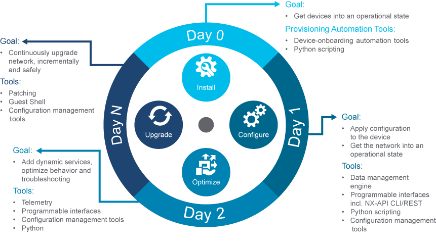
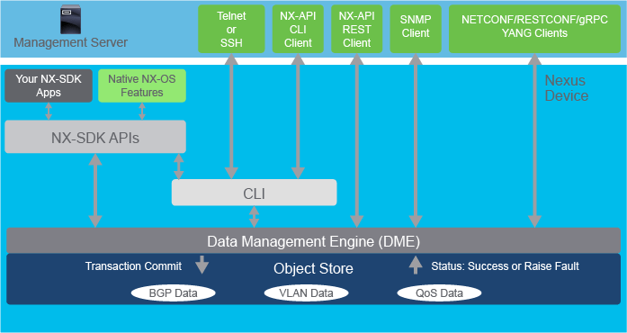
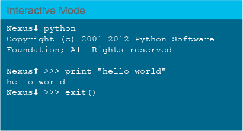
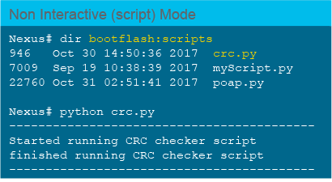
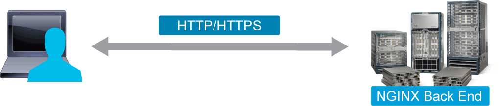

# Cisco NX-OS Device-Level APIs

Cisco NX-OS Software running on the Cisco Nexus switches is a data center-class operating system built with modularity, resiliency, and serviceability. Focused on the requirements of the data center, Cisco NX-OS provides a feature set that fulfills the switching and storage networking. Cisco NX-OS simplifies the data center operating environment and provides a unified operating system that is designed to run all areas of the data center network, including storage, virtualization, and Layer 3 network protocols. Cisco NX-OS contains open source software (OSS) and commercial technologies that provide automation, orchestration, programmability, monitoring, and compliance support.



Some examples of the benefits in the different stages of the network device life cycle that uses Cisco NX-OS programmability are as follows:

- Automated device onboarding automates the process of installing and upgrading software images and installing configuration files on Cisco Nexus devices that are being deployed in the network for the first time. It reduces the manual tasks required to scale the network capacity. Network automation that started at Day 0 with PowerOn Auto Provisioning (POAP) and PXE can be extended by tools like Puppet, Chef, and Ansible,

- Day 1 provisioning covers incremental and ongoing configuration changes. During this phase, flexible configuration management and automation allow changes to be accomplished in an efficient way. Management of endpoints and segmentation are examples. The division between Day 0 and Day 1 configuration can be very fluid, because the initial configuration can span from simple management access to an extensive configuration to enable a network device to participate in a data center network fabric. Using APIs and configuration agents, operators can affect configuration changes in a more programmatic way. Cisco provides various tools and frameworks to enable developers to automate and program Cisco Nexus devices, including NX-API REST and CLI interfaces, and also open interfaces like NETCONF, RESTCONF, and gRPC. Also, Python provides a means to programmatically interact with a device. Python scripting of Cisco NX-OS devices is available on-box on some platforms and releases, but oftentimes, it is more efficient to run scripts off the box. Using tools for day-to-day management, monitoring and configuration changes, and IT automation with dynamic configuration management can optimize the work of infrastructure operations teams and at the same time mitigate the risk of error-prone keyboard input.

- At Day 2, visibility and monitoring become extremely important. In most environments, Day 1 and Day 2 operations run in parallel and extend through the entire life cycle of the network device, and appropriate tooling is necessary to achieve these tasks efficiently. Open Cisco NX-OS supports a wide range of third-party telemetry applications and can support a pull or push model for telemetry data to be extracted from the devices.

- Configuration management tools also are part of the larger process of device life-cycle management—from planning and implementing to operations, upgrades, and eventual device decommissioning. Also, Guest Shell, a specialized container that is prebuilt and installed within the system, allows customers and third-party application developers to add custom functionality directly on the device in a secure, isolated environment.

With Cisco NX-OS, the device functions in the Unified Fabric mode to provide network connectivity with programmatic automation functions. Cisco NX-OS contains OSS and commercial technologies that provide automation, orchestration, programmability, monitoring, and compliance support. Cisco NX-OS supports several capabilities to aid programmability.

The Cisco Open NX-OS Model-Driven Programmability (MDP) architecture is an object-oriented software framework aimed at development of management systems. The MDP object model is an abstract representation of the capabilities, configuration, and operational state of elements and features on a Cisco Nexus switch.

The open Cisco NX-OS Software is designed to allow administrators to manage a switch such as a Linux device.



The open Cisco NX-OS Software stack addresses several functional areas to meet the needs of a DevOps-driven automation and programmability framework:

- **NX-API REST** interacts with network elements through RESTful API calls. It allows for a data model-driven approach to network configuration and management. Both the NX-API CLI and NX-API REST back-end use the NGINX HTTP server.

- **NX-API CLI** provides the ability to embed Cisco NX-OS CLI commands in a structured data format (JSON or XML) for execution on the switch via an HTTP or HTTPS transport. The data returned from the calls will also be formatted in JSON or XML, making it easy to parse the data with modern programming languages.

- **Traditional tools** like CLI and protocols such as SNMP.

- **Modern transport protocols** like NETCONF, RESTCONF, and gRPC that use respective agents, which provide secure transport and southbound interface to the Data Management Engine (DME).

- **Cisco NX-OS SDK (NX-SDK)** is a C++ abstraction and plug-in library layer that streamlines access to infrastructure for automation and custom application creation, such as generating custom CLIs, syslogs, event and error managers, interapplication communication, and route manager. You can use C++, Python, or Go for application development with NX-SDK.

Cisco NX-OS has a comprehensive number of both native and open YANG models that allow you to manage the rich feature set that Cisco NX-OS provides. Data models provide a structured and well-defined base that facilitates programmatic interaction with Cisco NX-OS devices. The list of supported models includes native, OpenConfig, and IETF models.

The Cisco Open NX-OS MDP architecture is an object-oriented software framework aimed at development of management systems. The MDP object model is an abstract representation of the capabilities, configuration, and operational state of elements and features on a Cisco Nexus switch. The object model consists of various classes that represent different functions and their attributes on the switch. The data management framework consists of the DME, clients of the DME ("northbound" interface), and back-end processes and applications.

The DME holds the repository for the state of the managed system in the Management Information Tree (MIT). The MIT manages and maintains the whole hierarchical tree of objects on the switch, with each object representing the configuration, operational status, accompanying statistics and associated faults for a switch function. The MIT is the single source of truth for the configuration and operational status of Cisco NX-OS features and elements. Object instances, also referred to as managed objects, are stored in the MIT in a hierarchical tree.

Cisco Open NX-OS MDP is object-oriented, and everything within the model is represented as an object. Objects store the configuration or operational state for open Cisco NX-OS features associated with the data model. Within the model, objects can be created concerning other objects. References may be among various networking constructs, such as interfaces and VLANs, and relationships between these components. Trunked VLAN interfaces represent an example of related, hierarchical objects.

## Programmability Options on Cisco Nexus Devices

Programmability Options on Cisco Nexus devices include a few different options.

- Onboard Python
- EEM
- NX-API CLI and REST
- NX-SDK = Currently Nexus 9000 and 3000 Series only
- NX-Toolkit = Currently Nexus 9000 and 3000 Series only
- Guest Shell and Bash
- Configuration Management Tools (Puppet, Chef, and Ansible)

### Onboard Python

Cisco Nexus switches have various APIs to enhance off-box scripting capabilities, but there is also the ability to run Python scripts directly on each switch as well. There is a native Python execution engine that allows you to use the dynamic Python interpreter directly from the switch command line. Also, you can also run standalone scripts from the command line.

Onboard Python characteristics include:

- Use it for event-based activity, where polling may not be possible.
- Python on Cisco Nexus is useful for automating tasks:
  - CLI commands
  - Generate syslogs
  - Process information and act on it quickly
- Integrate with EEM, Scheduler; get some data from the box and work on it.





> **Note** \
The Cisco Nexus switches support all features available in Python v2.7.5.

To enter the interactive Python interpreter, simply type in the word `python` and press **Enter**.

The Python environment on each Cisco Nexus Series switch comes with a preinstalled Python module called cisco. You can use standard helper functions on this module to see a list of its available methods and attributes and how to use them.

There are three core APIs, or methods, that are available to use within the Cisco Python module: `cli()`, `clip()`, and `clid()`, as shown in the following table:

## CLI Command APIs

| Function | Example | Output |
| - | - | - |
| `cli()` | `cli('show hostname')` | nxosv \n' |
| `clip()` | `clip('show hostname')` | nxosv |
| `clid()` | `clid('show hostname')` | Code Below |

``` cisco
data = cisco.clid('show hostname')
print type(data)
<type 'str'>
data= json.loads(data)
print data['hostname']
nxosv
```

Descriptions of the functions:

- `cli()`
  - Returns the raw output of CLI commands, including control and special characters.
- `clip()`
  - Prints the output of the CLI command directly to stdout and returns nothing to Python.
- `clid()`
  - Returns a dictionary of attribute-names/values for CLI commands that support JSON.

### Embedded Event Manager

EEM monitors events that occur on your device and takes action to recover or troubleshoot these events, based on your configuration. EEM has the following characteristics:

- A subsystem to automate tasks and customize the device behavior
  - **Event > Notification > Action**
- Many built-in system policies
- Useful for collecting more data and debugging issues, especially when unpredictable
- Can be scheduled at a specific time or intervals

EEM consists of three major components:

- **Event statements:** Events to monitor from another Cisco NX-OS component that might require some action, workaround, or notification.
- **Action statements:** An action that EEM can take, such as sending an email, or disabling an interface, to recover from an event.
- **Policies:** An event paired with one or more actions to troubleshoot or recover from the event.

The EEM feature can be used to repeatedly execute scripts on a given schedule, possibly to examine interface counters or cyclic redundancy check (CRC) errors, or you can even use EEM to dynamically execute a script when a given CLI command is executed, as shown in the figure.

### NX-API CLI and REST

Cisco NX-OS provides a built-in web server called NGINX to respond to HTTP calls to the switch to improve accessibility, extend capability, and improve manageability of Cisco NX-OS.

On Cisco Nexus devices, CLIs are run only on the device and used far too often to manage data center networks.

NX-API CLI improves the accessibility of these CLIs by making them available outside of the switch by using HTTP and HTTPS. You can use the NX-API CLI as an extension to the existing Cisco Nexus CLI. The NX-API CLI API is great for network engineers getting started with the API because it still makes use of commands. It sends commands to the device, wrapped in HTTP or HTTPS, but receives structured data back.

You have the ability to send show, configuration, and Linux commands directly to the switches using NX-API CLI.

Although this approach increases capabilities, it is not an ideal method for incorporating programmability. The CLI based programming, whether locally on switch or remotely using HTTP/HTTPS, is still synchronous, proprietary, order dependent and sequential. Hence automating using CLI makes the task harder.

On the other hand NX-API REST is a RESTful programmatic interface for Cisco NX-OS. NX-OS stores configuration and operational data in a centralized object store MIT. The nodes in the MIT store the configuration and state for a switch element or feature (interfaces, protocols, etc.). NX-API REST provides access to objects stored in the MIT. Managed objects (MOs) are associated with a well-defined REST URI, and can be queried or configured from NX-API REST using their URI.

The NX-API-REST API operates in forgiving mode, which means that missing attributes are substituted with default values (if applicable) that are maintained in the internal DME. The DME validates and rejects incorrect attributes. The API is also atomic. If multiple MOs are being configured, and any of the MOs cannot be configured, the API stops its operation. It returns the configuration to its prior state, stops the API operation that listens for API requests, and returns an error code.



### NX-SDK and NX-Toolkit

Cisco NX-SDK provides a simple, flexible, modernized, and powerful tool for off-the-box third-party custom application development to gain access to Cisco Nexus infrastructure functionalities, which when run inside or outside the Cisco Nexus switches allow the custom applications to run natively, just like any other native Cisco Nexus applications. It is appropriate for DIY automation to develop custom applications to fit your needs, and by that, decoupling application development from Cisco Nexus releases. NX-SDK offers various functionalities, like the ability to generate custom CLIs, syslogs, event manager, high availability, route manager, streaming telemetry, and more.

NX-SDK provides an abstraction/plug-in library layer, and consequently, decouples the application from the underlying infrastructure being used. It is easy and simple to change the infrastructure without affecting the applications. Therefore, NX-SDK is being used for developing native Cisco applications as well.

It is built using C++ language. Other language (Python, Go, Ruby, and so on) bindings also will be provided for NX-SDK; therefore, custom applications can be developed and built in any language of choice. Starting from NX-SDK v2.0.0, NX-SDK applications can run anywhere (inside or outside of Cisco NX-OS).

The NX-Toolkit is a set of Python libraries that allow basic configuration of the Cisco Nexus switch. It is intended to allow users to quickly begin using the REST API and accelerate the learning curve necessary to begin using the switch.

### Guest Shell and Bash

Cisco Nexus devices support direct Bourne Again Shell (Bash) access. With Bash, you can access the underlying Linux system on the device and manage the system.

In addition to the NX-OS CLI and Bash access on the underlying Linux environment, the Cisco Nexus devices support access to the Guest Shell, a decoupled execution space running within LXC. With the Guest Shell, you can add software packages and update libraries as needed without affecting the host system software.

Cisco NX-OS supports direct Linux shell access and LXCs. With Linux shell access, you can access the underlying Linux system on a Cisco NX-OS switch and manage the underlying system. You can also use LXCs to securely install your own software and to enhance the capabilities of the Cisco NX-OS switch. For example, you can install bare-metal provisioning tools like Cobbler on an NX-OS device to enable automatic provisioning of bare-metal servers from the top-of-rack switch. Cisco NX-OS devices support Docker functionality within the Bash shell and container orchestration with Kubernetes.

## Content Review Question

Match the Cisco NX-OS capability to its description.

- REST-like API that sends commands and receives structured objects --- NX-API CLI
- REST API that sends and receives structured objects --- NX-API REST
- allows you to execute scripts locally on the switch --- Python on-box
