# Cisco Controller APIs

As the networks grow, traditional management becomes more challenging. Advanced systems are too complex to be easily managed by traditional tools. To meet these challenges, systems can utilize APIs for configuration and monitoring within the system and with external management utilities.

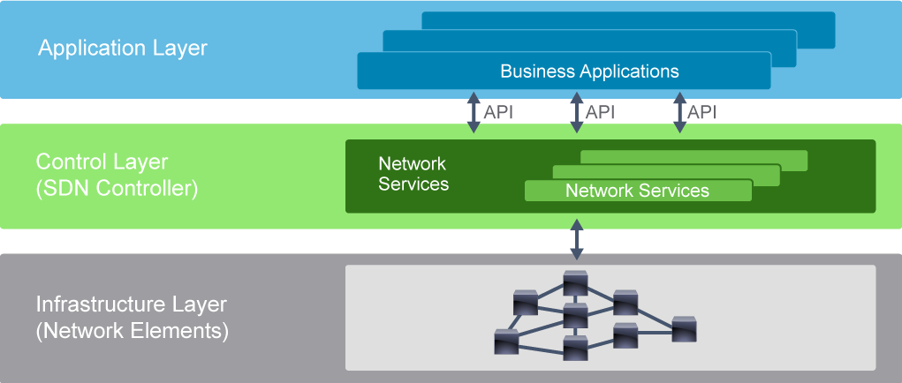

The SDN architecture differs slightly from the architecture of traditional networks. The different software programs represented in the SDN architecture are composed of three stacked layers called the infrastructure, control, and application layer.

- **Infrastructure layer:** Contains network elements (physical and virtual devices that deal with customer traffic).
- **Control layer:** Represents the core layer of the SDN architecture. It contains SDN controllers, which provide centralized control of the devices in the infrastructure layer.
- **Application layer:** Contains SDN applications that communicate their network requirements toward the controller.

The SDN controller uses APIs to communicate with the application and infrastructure layers. Communication with the infrastructure layer is defined with the southbound interfaces, while services are offered to the application layer using the northbound interfaces.

Solutions that contain an SDN controller:

- Cisco Meraki
- Cisco DNA Center
- Cisco Application Centric Infrastructure (ACI)
- Cisco Software-Defined WAN (SD-WAN)
- Cisco Network Services Orchestrator (NSO)

## Cisco Meraki

Cisco Meraki supports a large portfolio of networking devices, from routing and switching to smart security cameras, and industry-leading wireless infrastructure. It has a cloud-based platform to which all the devices connect using secured connection and from where they can be managed. The Cisco Meraki cloud-based management platform has a robust set of APIs that can be used to monitor and manage the infrastructure.

The Cisco Meraki cloud-based platform is a solution that offers customers a single user interface to manage all their Meraki supported devices. When a new device from the Meraki product family is installed on the network, it requires minimal to no effort to connect it to the management platform. The web user interface has very limited options that can be configured compared with the Cisco Catalyst product family, making it simpler to deploy and manage. After the device comes online, it initiates a Secure Sockets Layer (SSL) tunnel to the management platform letting it know that it is available to be claimed and configured. From there, the device will be managed via the cloud-based management platform.

Cisco Meraki offers a wide portfolio of API capabilities. It offers a REST API with which you can:

- Retrieve data about the Meraki infrastructure
- Configure Meraki devices

Cisco Meraki offers five primary types of APIs:

- Dashboard API
- Scanning API
- mV Sense API
- External Captive Portal API
- Wireless Health API

**Dashboard API** provides methods to interact directly with the Meraki cloud platform and Meraki managed devices. Using the API, some of the use cases are as follows:

- Add new organizations, administrators, networks, devices, VLANs, and more
- Onboard and off-board employees
- Build your dashboard for store managers or field technicians

**Scanning API** enables Cisco Meraki users to detect and aggregate real-time data for custom applications. The Scanning API delivers data in real-time from the Meraki cloud and can be used to detect Wi-Fi and Bluetooth Low Energy (BLE) devices in real-time. The elements are exported via an HTTP POST of JSON data to a specified destination server.

**mV Sense API** provides a collection of endpoints to interact with Meraki cameras, zone, and analytics.

**External Captive Portal API** extends the power of the built-in Meraki splash page functionality by providing complete control of the content and authentication process offering to redirect login and authentication to client-provided servers, using your own authentication, authorization, and accounting (AAA) servers as well.

**Wireless Health API** allows you to retrieve wireless health information such as connection health, connection failures, and network latency.

### Cisco Meraki API Example

Thanks to widely available smart devices equipped with Wi-Fi and BLE, Cisco Meraki wireless access points can detect and provide location analytics to report on user foot traffic behavior. It can be especially useful in multisite retail or enterprise deployments where administrators or departments beyond IT wish to learn more about trends and user engagement. Coupled with traditional reporting from the Wi-Fi network on client devices, applications, and websites, Cisco Meraki provides a holistic view of online and offline user traffic. In addition to the built-in location analytics view, the Scanning API enables Cisco Meraki customers to detect and aggregate real-time data for custom applications.

**Use case:** Meraki cloud estimates the location of the client.

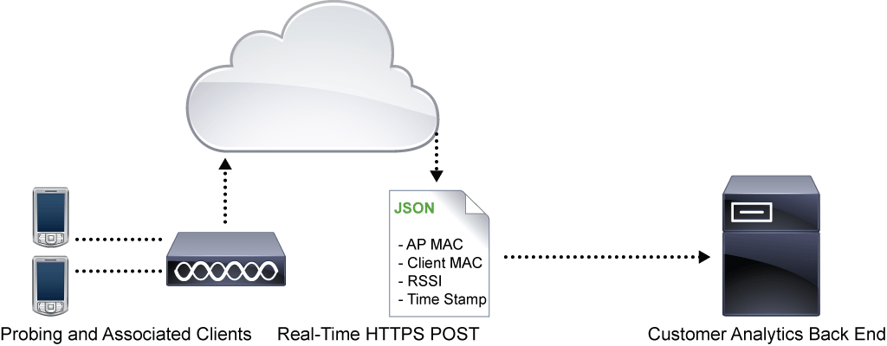

The Scanning API delivers data in real time from the Meraki cloud and can be used to detect Wi-Fi (associated and nonassociated) and BLE devices in real time. The elements are exported via an HTTP POST of JSON data to a specified destination server. The raw data is aggregated from all access points within a network on the Meraki cloud and sent directly from the cloud to an organization data warehouse or business intelligence center. The JSON posts occur frequently, typically batched every minute for each access point.

Using the physical placement of the access points from the Map & Floorplan on the Dashboard, the Meraki cloud estimates the location of the client. The geolocation coordinates (latitude, longitude) and X,Y location data accuracy can vary based on several factors and should be considered a best-effort estimate. Access point placement, environmental conditions, and client device orientation can influence X,Y estimation; experimentation can help improve the accuracy of results or determine a maximum acceptable uncertainty for data points.

## Cisco DNA Center

Cisco DNA Center is the network management and command center for Cisco DNA, an intent-based network for the enterprise. It supports the expression of business intent for network use cases, such as base automation capabilities in the enterprise network.

Cisco DNA Center provides open programmability APIs for policy-based management and security through a single controller. It provides an abstraction of the network, which leads to simplification of the management of network services. This approach automates what has typically been a tedious manual configuration.

The Analytics and Assurance features of Cisco DNA Center provide end-to-end visibility into the network with full context through data and insights. Cisco customers and partners can use the Cisco DNA Center platform to create applications that use the native capabilities of Cisco DNA Center. You can use Cisco DNA Center Intent APIs, Integration Flows, Events and Notification Services, and the optional Cisco DNA Center Multivendor SDK to enhance the overall network experience by optimizing end-to-end IT processes, reducing total cost of ownership (TCO), and developing new value-added networks.

Cisco DNA offers the following REST APIs:

- Intent API
- Software Image Management (SWIM) API
- PnP API
- Operational tools
- Authentication API
- Integration API

**Intent API** is a northbound REST API that exposes specific capabilities of the Cisco DNA Center platform. It provides policy-based abstraction of business intent, allowing you to focus on an outcome to achieve instead of struggling with the mechanisms that implement that outcome. The RESTful Cisco DNA Center Intent API lets you use HTTPS verbs (GET, POST, PUT, and DELETE) and JSON syntax to discover and control your network. Intent API can be divided into multiple groups:

- **Site Hierarchy Intent API:** Retrieves site hierarchy with network health information.
- **Network Health Intent API:** Retrieves network devices by category, with health information on each of the devices returned. Additional request paths retrieve physical and virtual topologies.
- **Network Device Detail Intent API:** Retrieves detailed information about devices retrieved by time stamp, MAC address, universally unique identifier (UUID), name, or nwDeviceName. Additional REST request paths allow you to retrieve additional information, such as functional capabilities, interfaces, device configuration, certificate validation status, values of specified fields, modules, and VLAN data associated with specified interfaces. You can also add, delete, update, or synchronize specified devices.
- **Client Health Intent API:** Returns overall client health organized as wired and wireless categories. It returns detailed information about a single client.

**SWIM API** enables you to retrieve information about available software images, import images into Cisco DNA Center, distribute images to network devices, and activate images that have been installed on devices.

**PnP API** enables you to manage PnP projects, settings, workflows, virtual accounts, and PnP-managed devices.

**Operational tools** enable you to configure and manage CLI templates, discover network devices, configure network settings, and trace paths through the network. Operational tools can be divided into these groups:

- **Command Runner API:** Enables you to retrieve the keywords of all CLIs that Command Runner accepts, and it lets you run read-only commands on a network device to retrieve its real-time configuration.
- **Network Discovery API:** Provides programmatic access to the Discovery functionality of Cisco DNA Center. You can use this API to create, update, delete, and manage discoveries and their associated credentials. You can also use this API to retrieve the network devices that a particular discovery job acquired.
- **Template Programmer API:** Enables you to perform create, read, update, and delete (CRUD) operations on templates and projects that the template programmer uses to facilitate design and provisioning workflows in Cisco DNA Center. You can use this API to create, view, edit, delete, and version templates. You can also add interactive commands to templates, check the contents of templates for syntactical errors or blocked commands, deploy templates, and check the status of template deployments.
- **Path Trace API:** Simplifies resolution of network performance issues by tracing application paths through the network and providing statistics for each hop along the path. You can use this API to analyze the flow between two endpoints on the network, retrieve the results of a previous flow analysis, summarize all stored flow analyses, or delete a saved flow analysis.
- **Task API:** Queries Cisco DNA Center for more information about a specific task that your RESTful request initiated. Often, a network action may take several seconds or minutes to complete, so Cisco DNA Center completes most tasks asynchronously. You can use the Task API to determine whether a task completed successfully; if so, you can then retrieve more information from the task itself, such as a list of devices provisioned.
- **File API:** Enables you to retrieve files from Cisco DNA Center; for example, you might use this API to get a software image or a digital certificate from Cisco DNA Center.

All Cisco DNA Center platform REST requests require proof of identity. The **Authentication API** generates a security token that encapsulates the privileges of an authenticated REST caller. Cisco DNA Center authorizes each requested operation according to the access privileges associated with the security token that accompanies the request.

The role of the **Integration API** is to allow Cisco DNA Center to connect to other systems. Integration capabilities are part of westbound interfaces. To meet the need to scale and accelerate operations in modern data centers, IT operators require intelligent, end-to-end workflows built with open APIs. The Cisco DNA Center platform provides mechanisms for integrating Cisco DNA Assurance workflows and data with third-party IT Service Management (ITSM) solutions.

## Cisco DNA Center: List Devices

The Cisco DNA Center Intent API is a northbound REST API that provides a consistently structured way to access Cisco DNA Center workflows for automation and assurance. The Intent API is hierarchically structured into functional domains and subdomains. To retrieve a list of devices on the network, you need to examine the Devices subdomain of the Know Your Network domain.

The Devices subdomain enables API clients to perform CRUD operations on the devices in the network. A wide range of parameters for filtering the response are supported, such as hostname, management IP address, MAC address, and software version.

The complete Intent API reference is available at `https://developer.cisco.com/docs/dna-center/api/1-3-1-x/`. The documentation provides example requests with detailed descriptions, available parameters, response codes, and examples of response data.

One of the most common scenarios is to gather information about all devices connected to the network that are in this case managed by Cisco DNA Center. You might need that information to get a general overview of the operational status for the devices, or you require a detailed view of the performance of any device or client over time and from any application context. Another example could include a software image upgrade. In all these cases, you first need a list of all devices.

**Use case:** Operational status of every network device connected to Cisco DNA Center

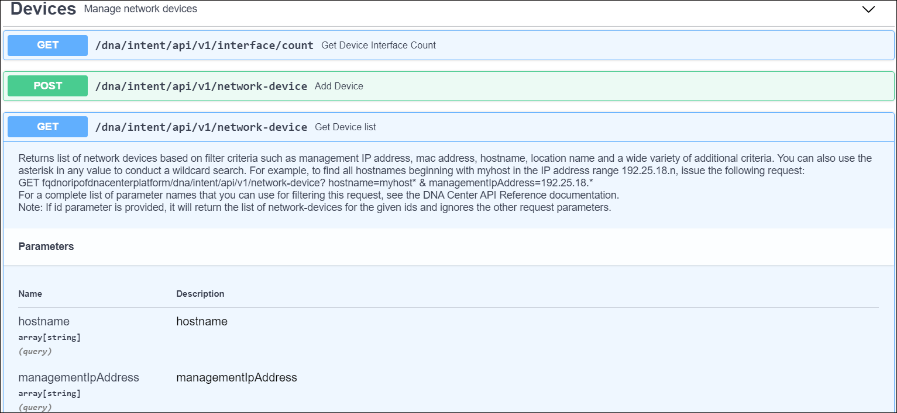

The following figure shows a response model of the network-device resource.

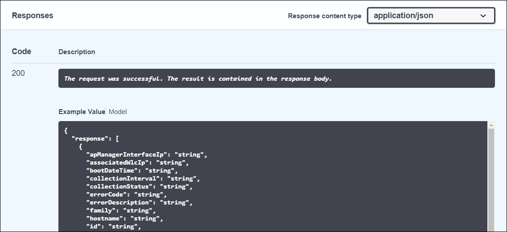

The following code is an example of a GET request to the Intent API. The API call is made to the /network-device resource, and JSON-formatted data with a list of devices and their properties is returned. Properties include detailed information about devices by time stamp, MAC address, name, software type and version, or management IP address.

```python
GET https://dnacenter-ip/dna/intent/api/v1/network-device
Response code: 200
Response headers:
Response body:
{
    "response": [
        {
            "errorCode": null,
            "type": "Cisco Catalyst 9300 Switch",
            "family": "Switches and Hubs",
            "location": null,
            "role": "ACCESS",
            "hostname": "leaf1.labb.local",
            "roleSource": "AUTO",
            "lastUpdateTime": 1574202456591,
            "errorDescription": null,
            "interfaceCount": "68",
            "lastUpdated": "2019-11-19 22:27:36",
            "lineCardCount": "1",
            "lineCardId": "53ac6145-45ee-4122-84fb-9c729f388868",
            "locationName": null,
            "managementIpAddress": "10.10.20.81",
            "memorySize": "1425966824",
            "platformId": "C9300-48U",
            "reachabilityFailureReason": "",
            "reachabilityStatus": "Reachable",
            "series": "Cisco Catalyst 9300 Series Switches",
            "snmpContact": "",
            "snmpLocation": "",
            "tagCount": "0",
            "tunnelUdpPort": null,
            "waasDeviceMode": null,
            "serialNumber": "FCW2214L0VK",
            "collectionStatus": "Managed",
            "apManagerInterfaceIp": "",
            "associatedWlcIp": "",
            "bootDateTime": "2019-01-16 21:49:15",
            "collectionInterval": "Global Default",
            "inventoryStatusDetail": "<status><general code=\"SUCCESS\"/></status>",
            "softwareType": "IOS-XE",
            "softwareVersion": "16.6.4a",
            "macAddress": "00:72:78:54:d1:00",
            "upTime": "214 days, 5:20:22.14",
            "instanceUuid": "6a49c827-9b28-490b-8df0-8b6c3b582d8a",
            "instanceTenantId": "SYS0",
            "id": "6a49c827-9b28-490b-8df0-8b6c3b582d8a"
        },
<... output omitted ...>
```

Additional REST request paths would allow you to retrieve additional information, such as functional capabilities, interfaces, device configuration, certificate validation status, values of specified fields, modules, and VLAN data associated with specified interfaces. You can also add, delete, update, or synchronize specified devices.

## Cisco ACI

Cisco has taken a foundational approach to building a programmable network infrastructure with Cisco ACI. The ACI infrastructure operates as a single system at the fabric level, controlled by the centralized Cisco Application Policy Infrastructure Controller (APIC). With this approach, the data center network as a whole is tied together cohesively and treated as an intelligent transport system for the applications that support business. On network devices that are part of this fabric, the operating systems have been written to support this system view and provide an architecture for programmability at the foundation.

Cisco ACI provides programmability for the data center fabric as a whole, including hardware and software devices, by using integrated protocol and device packages with scripts for third-party devices:

- Built-in programmability in both software and hardware
- Entire data center switching infrastructure can be programmed as a single fabric
- Declarative model enforces desired state

Instead of opening up a subset of the network functionality through programmatic interfaces, like previous SDN solutions, the entire ACI infrastructure is opened up for programmatic access. It is achieved by providing access to the Cisco ACI object model. The ACI object model represents the complete configuration and runtime state of every software and hardware component in the entire infrastructure. The object model is made available through standard REST API interfaces, making it easy to access and manipulate the configuration and runtime state of the system.

The API accepts and returns HTTP or HTTPS messages that contain JSON or XML documents. You can use any programming language to generate messages and JSON or XML documents that contain the API methods or managed object descriptions. In addition to the standard REST interface, Cisco provides several open source tools or frameworks such as ACI toolkit, Cobra (Python), ACIrb (Ruby), Puppet, and Ansible to automate and program the APIC. On top of the REST API are a CLI and GUI for day-to-day administration.

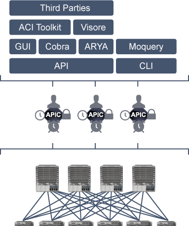

At the top level, the Cisco ACI object model is based on promise theory, which provides a scalable control architecture with autonomous objects responsible for implementing the desired state changes provided by the controller cluster. This approach is more scalable than traditional top-down management systems, which require detailed knowledge of low-level configurations and the current state. With promise theory, desired state changes are pushed down, and objects implement the changes, returning faults when required.

Beneath this high-level concept is the core of Cisco ACI programmability: the object model. The model can be divided into two major parts: logical and physical. Model-based frameworks provide an elegant way to represent data. The Cisco ACI model provides comprehensive access to the underlying information model, providing policy abstraction, physical models, and debugging and implementation data.

The logical model itself consists of the objects—configuration, policies, and runtime state—that can be manipulated and the attributes of those objects. In the Cisco ACI framework, this model is known as the Management Information Tree (MIT). Each node in the MIT represents a managed object or group of objects. These objects are organized in a hierarchical way, creating logical object containers.

Cisco ACI offers different SDKs:

- **Cobra—Cisco ACI Python SDK:**

  - Python implementation of the API
  - Provides native bindings for all the REST functions
  - Objects in Cobra are one-to-one representations of the MIT
  - Provides methods for performing lookups and queries and for object creation, modification, and deletion
  - Offers full functionality, better suited for more complex queries and incorporating Layer 4-to-Layer 7 devices, initial fabric builds, and so on

- **Cisco ACI toolkit:**

  - Python libraries for basic configuration of Cisco APIC
  - Exposes a small subset of the Cisco APIC object model
  - Not full functionality as Cobra SDK

- **Cisco APIC REST to Python adapter:**
  - Converter for XML and JSON code to Python
  - Often used with API Inspector

- **ACIrb:**
  - Ruby implementation of the Cisco APIC REST API
  - Enables direct manipulation of the MIT through the REST API, using standard Ruby language options

Besides REST API, ACI also offers a Cisco NX-OS style CLI to configure and manage ACI in a traditional CLI way. Moquery is a CLI object model query tool, while Visore is an object store browser (GUI).

> **Note** \
When you perform a task in the Cisco APIC GUI, the GUI creates and sends internal API messages to the operating system to execute the task. By using the API Inspector, which is a built-in tool of the Cisco APIC, you can view and copy these API messages. An administrator can replicate these messages to automate key operations, or you can use the messages as examples to develop external applications that will use the API.

## Cisco ACI REST API Example

The Cisco REST API is the interface into the MIT and allows manipulation of the object model state. The same REST interface is used by the APIC CLI, GUI, and SDK, so that whenever information is displayed, it is read through the REST API, and when configuration changes are made, they are written through the REST API. The REST API also provides an interface through which other information can be retrieved, including statistics, faults, and audit events. It even provides a means of subscribing to push-based event notification so that when a change occurs in the MIT, an event can be sent through a web socket.

Standard REST methods are supported on the API, which includes POST, GET, and DELETE operations through HTTP. The POST and DELETE methods are idempotent, meaning that there is no additional effect if they are called more than once with the same input parameters. The GET method is nullipotent, meaning that it can be called zero or more times without making any changes (or that it is a read-only operation).

Payloads to and from the REST interface can be encapsulated through either XML or JSON encoding. In the case of XML, the encoding operation is simple: The element tag is the name of the package and class, and any properties of that object are specified as attributes of that element. Containment is defined by creating child elements.

The object-based information model of Cisco ACI makes it a very good fit for REST interfaces: URLs and URIs map directly to distinguished names identifying objects on the tree, and any data on the MIT can be described as a self-contained structured text tree document encoded in XML or JSON. The objects have parent-child relationships that are identified using distinguished names and properties, which are read and modified by a set of CRUD operations.

Objects can be accessed at their well-defined address, their REST URLs, using standard HTTP commands for retrieval and manipulation of Cisco APIC object data.

Object instances are referred to as managed objects. Every managed object in the system can be identified by a unique distinguished name. This approach allows the object to be referred to globally. In addition to its distinguished name, each object can be referred to by its relative name. The relative name identifies an object relative to its parent object. The distinguished name of any given object is derived from its own relative name that is appended to the distinguished name of its parent object.

The distinguished name enables you to unambiguously identify a specific target object. The relative name identifies an object from its siblings within the context of its parent object. The distinguished name contains a sequence of relative names. Distinguished names are directly mapped to URLs. Either the relative name or the distinguished name can be used to access an object, depending on the current location in the MIT. Because of the hierarchical nature of the tree and the attribute system used to identify object classes, the tree can be queried in several ways for obtaining managed object information. Queries can be performed on an object itself through its distinguished name, on a class of objects such as a switch chassis, or on a tree level to discover all members of an object.

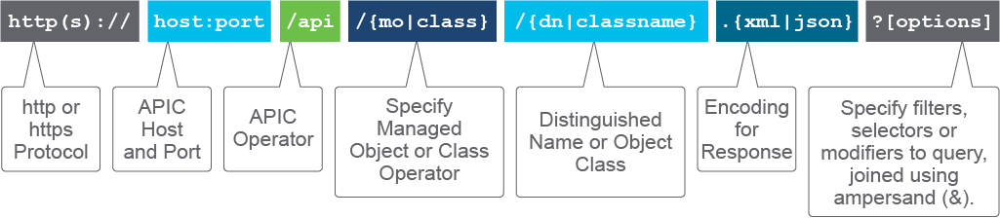

The URL format used can be represented as follows:

- **http:// | https://:** By default, only HTTPS is enabled.
- **host:** This component is the hostname or IP address of the APIC controller—for example, "APIC."
- **:port:** This component is the port number for communicating with the APIC controller if a nonstandard port is configured.
- **/api/:** This component specifies that the message is directed to the API.
- **mo | class:** This component specifies the target of the operation as a managed object or an object class.
- **DN:** This component is the distinguished name of the targeted managed object—for example, topology/pod-1/node-201.
- **className:** This component is the name of the targeted class, concatenated from the package and the class in the context of the package; for example, dhcp:Client is dhcpClient. The className can be defined in the content of a distinguished name—for example, topology/pod-1/node-1.
- **json | xml:** This component specifies the encoding format of the command or response body as JSON or XML.
- **?options:** This component includes optional filters, selectors, or modifiers to a query. Multiple option statements are joined by an ampersand ("&").

A Uniform Resource Identifier (URI) provides access to a target resource. The first two sections of the request URI specify the protocol and access details of the APIC. The literal string /api indicates that the API is to be invoked. The next specifies whether the operation is for a managed object or a class. Next, either the fully qualified distinguished name for object-based queries or the package and class name for class-based queries is specified. The final mandatory part of the request URI is the encoding format: either .xml or .json. The REST API supports a wide range of flexible filters, useful for narrowing the scope of your search to allow information to be located more quickly. The filters themselves are appended as query URI options, starting with a question mark ("?") and concatenated with an ampersand ("&"). Multiple conditions can be joined to form complex filters.

With the capability to address and access an individual object or a class of objects with the REST URL, you can achieve complete programmatic access to the entire object tree and the entire system.

One of the most common use cases for using API is monitoring the Cisco ACI Fabric. Proactive monitoring is a very important piece of the network administrator job, but it is often neglected because resolving immediate problems in the network usually takes priority. However, because the APIC makes it incredibly easy to gather statistics and perform analyses, it will save network administrators both time and frustration.

For example, if you want to learn about the details of all available fabric nodes (Cisco ACI leaf and spine switches), including the state, IP address, and so on, you can use the following Cisco ACI REST API call using the class query:

``` python
GET https://sandboxapicdc.cisco.com/api/node/class/fabricNode.json

Response code: 200
Response body: 
{
    "totalCount": "6",
    "imdata": [
        {
            "fabricNode": {
                "attributes": {
                    "adSt": "on",
                    "address": "10.0.240.32",
                    "annotation": "",
                    "apicType": "apic",
                    "childAction": "",
                    "delayedHeartbeat": "no",
                    "dn": "topology/pod-1/node-101",
                    "extMngdBy": "",
                    "fabricSt": "active",
                    "id": "101",
                    "lastStateModTs": "2019-11-17T15:32:30.294+00:00",
                    "lcOwn": "local",
                    "modTs": "2019-11-17T15:32:53.511+00:00",
                    "model": "N9K-C9396PX",
                    "monPolDn": "uni/fabric/monfab-default",
                    "name": "leaf-1",
                    "nameAlias": "",
                    "nodeType": "unspecified",
                    "role": "leaf",
                    "serial": "TEP-1-101",
                    "status": "",
                    "uid": "0",
                    "vendor": "Cisco Systems, Inc",
                    "version": ""
                }
            }
        },
<... output omitted ...>
```

Besides manual querying, information can also be gathered automatically and then policies are used and can be reused in other places, which can lead to minimization of human error and effort. As you can see in the following figure, when you start using automation when monitoring the ACI fabric, you can build various applications that can execute different tasks if there is a specific change in the network.

**Use case:** Proactive monitoring of the ACI fabric

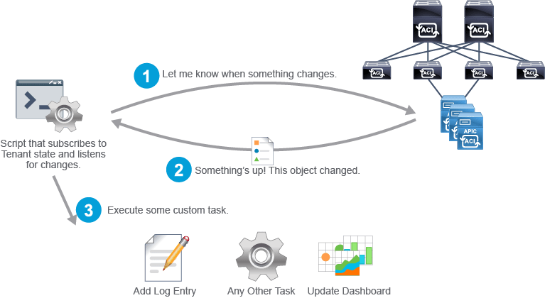

As you have seen, the Cisco ACI platform has a robust REST API. Anything that you can do via the GUI, you can do via the API. However, using the raw API can be tedious and cumbersome, because you need to know and configure low-level details such as which HTTP verb is being used, the URI, headers, and encoding supported. In addition, you need to take care of any error handling within any custom code you write when using a native REST API—for example, with the Python requests module. To simplify application development with ACI, Cisco has developed Cobra, a robust Python library for the APIC REST API. Objects in the Cobra library (SDK) are a one-to-one mapping to the objects within the Cisco ACI MIT.

If you are planning to dive deeper into Cobra, the best place to start is the official Cobra documentation that Cisco has hosted on readthedocs. These documents review everything from the installation to showing examples, and they even include a Frequently Asked Questions section to give a quick start to individuals looking to test Cobra.

To access Cisco APIC using Cobra, you must log in with valid user credentials. Cobra currently supports username/password-based authentication in addition to certificate-based authentication. To make configuration changes, you must have administrator privileges in the domain in which you will be working. A successful login returns a reference to a directory object that you will use for further operations.

You can use the Cobra SDK to manipulate the MIT generally though this workflow:

- Identify the object to be manipulated.
- Build a request to read, change attributes, or add or remove children.
- Commit the changes made to the object.

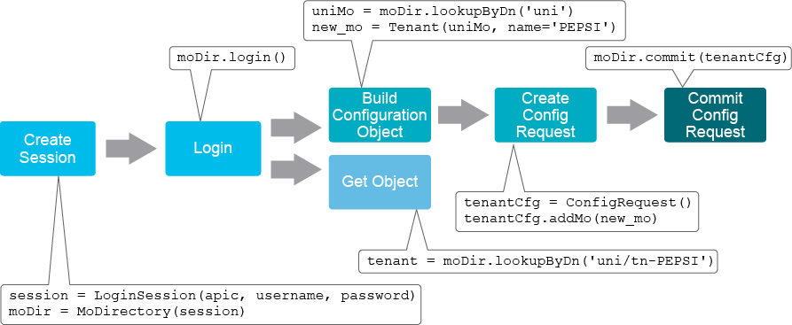

A common workflow for retrieving data using Cobra is as follows:

- Create a session object.
- Log in to Cisco APIC.
- Perform lookup by class or distinguished name.

In the same fashion, a common workflow for configuring the Cisco ACI Fabric is as follows:

- Create a session object
- Log in to Cisco APIC.
- Create a configuration object by first looking for an object by distinguished name or class and then creating the new object. As you can see in the figure, you also need to reference the parent object when building a configuration object.
- Create a configuration request object.
- Add your configuration object to the request.
- Commit.

## Cisco SD-WAN

Cisco SD-WAN software provides a REST API, which is a programmatic interface for controlling, configuring, and monitoring the SD-WAN devices in an overlay network. You access the REST API through the vManage web server.


The Cisco SD-WAN vManage GUI itself uses the same REST API to perform actions, as is exposed northbound. Taking that into consideration, it means that you can always easily find an API call that achieves the same goal as a certain sequence of GUI clicks, just by inspecting the HTTP requests that your browser makes. The same API calls can be performed from an outside client application.

The vManage API uses the JSON data model to represent the data, associated with a resource. Request and response bodies always contain JSON-formatted strings.

The API documentation is provided as a part of the vManage controller and is accessible at the URL with the following scheme [https://vmanage-ip-address:8443/apidocs], depending on the IP address of each individual setup.

When you use a program or script to transfer data from a vManage web server or perform operations on the server, you must first establish an HTTPS session to the server. To do so, you send a call to log in to the server with the following parameters:

1. URL to send the request to: Use https://{vmanage-ip-address}/
2. Request method: Specify a type of request
3. API call input: The input is an application—for example, for the Content Type, specify application/x-www-form-urlencoded
4. API call payload

REST API URL consists of three parts:

- Server (hostname or IP address)
- **Resource** (location of the data or object of interest)
- **Parameters** (details of scope, filter, often optional)


All REST API calls to vManage contains the root /dataservice.

In the vManage REST API, resources are grouped into collections, which are present at the top level of the API. There are multiple categories:

- Device actions: Manage device actions like reboot, upgrade, and lxcinstall
  - Example URI: /device/action/
- Device inventory: Retrieve device inventory information, including serial numbers
  - Example URI: /system/device/
- Device configuration: Create feature and device configuration templates, create and configure vManage clusters
  - Example URI: /template/
- Certificate managements: Manage certificates and security keys
  - Example URI: /certificate
- Monitoring: View status, statistics, and other information about operational services in the overlay network
  - Example URIs: /alarms, /statistics, /event
- Real-time monitoring: Retrieve, view, and manage real-time statistics and traffic information
  - Example URIs: /device/app-route/statistics, /device/bfd/status
- Troubleshooting: Troubleshoot devices, determine the effect of the policy, update software, and retrieve software version information
  - Example URIs: /device/action/software, /device/tools/ping
- Cross-domain integration: APIs to integrate with Cisco Software-Defined Access (SD-Access) and ACI
  - Example URI: /partner

Here is an example of the AP documentation:

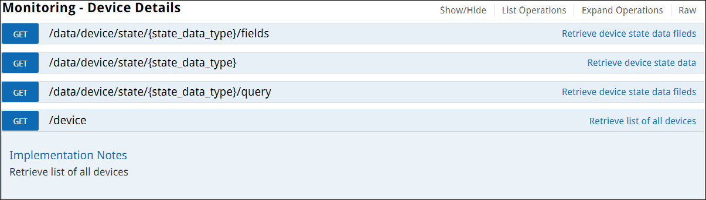

The following figure shows the response part of the /device resource documentation.

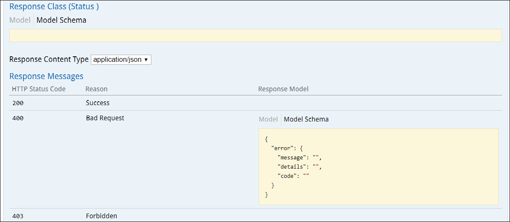

The documentation examples include the model schema of the response class, response status codes, and error messages. You also can run the requests directly from the documentation page.

A common REST principle is that APIs should be self-descriptive and self-documenting. The resource collections and resources in the Cisco SD-WAN REST API are self-documenting, describing the data you need to make a call and the response from each call. However, the collections and resources do assume that you are familiar with the solution's overlay network concepts, software and hardware features, and capability.

## Cisco SD-WAN Webhooks

The Cisco SD-WAN platform provides webhooks that allow third-party applications to receive data when a specified event occurs.

Webhooks enable a push-model mechanism to send notifications in real time. Another way of getting information is to frequently poll the data from vManage by using its REST API. However, by using webhooks, vManage can send an HTTP POST request to the external system in real time once a certain event occurs.

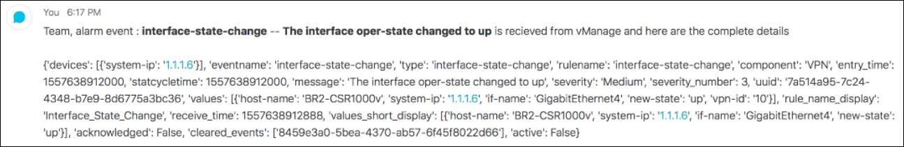

## Cisco SD-WAN REST API Example: List Devices

Part of network automation is to first gather information about all available devices under Cisco SD-WAN management. Listing all the devices is therefore an important step in the whole process of using network automation, regardless of the use case.

To list all the devices that are managed by vManage, request data from /dataservice/device resource. It is achieved by making an HTTP GET request to the vManage server.

```python
GET https://vmanage-ip:port/dataservice/device

Response code: 200
Response headers:
{
    "cache-control": "no-cache, no-store, must-revalidate",
    "content-encoding": "gzip",
    "content-type": "application/json",
    "date": "Tue, 19 Oct 2019 21:32:55 GMT",
    "server": "nginx/1.13.12",
    "status": "200",
    "strict-transport-security": "max-age=31536000; includeSubDomains",
    "vary": "Accept-Encoding",
    "x-frame-options": "DENY"
}

Response body: 
<... output omitted ...>
    "data": [
        {
            "deviceId": "192.168.4.90",
            "system-ip": "192.168.4.90",
            "host-name": "vmanage",
            "reachability": "reachable",
            "status": "normal",
            "personality": "vmanage",
            "device-type": "vmanage",
            "timezone": "UTC",
            "device-groups": [
                "\"No groups\""
            ],

<... output omitted ...>
```

Automating complex network configuration processes is a great way to propagate errors at extremely high speed to all corners of your data center. Orchestration platforms can be great tools in the right hands, but small errors have a way of doing greater damage in profound ways; for example, a power chain saw can do more damage with the slightest miscalculation. What’s needed is to couple orchestration platforms with rapidly emerging network verification technology. Network verification can now be completely automated, so you are not introducing additional manual processes to slow down your orchestration. But you can verify that everything is accurate and deployed correctly at light speed.

But what is network verification? You define the policy checks that you need to have in place, and the platform verifies in minutes or even less whether the current network configurations deviate from any of the policies. And all the procedure is done by using APIs—in the case of SD-WAN in this example, REST API.

**Use case:** Deployment verification

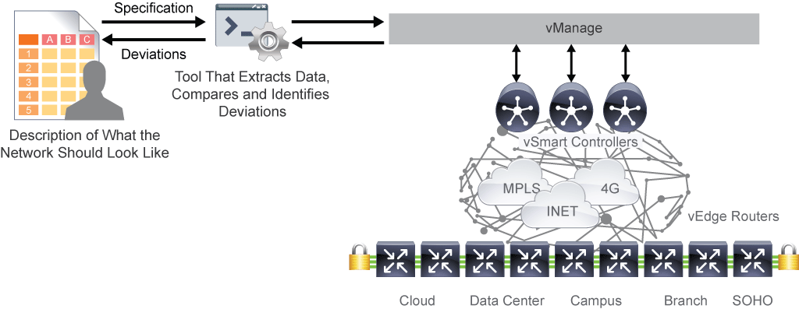

## Cisco NSO

Cisco NSO exposes a northbound REST API, which can be used by developers to perform operations. It supports the following methods:

- **GET:** Retrieve information from Cisco NSO
- **POST:** Add or modify the configuration on Cisco NSO
- **PUT:** Modify the configuration on Cisco NSO (replace)
- **PATCH:** Modify the configuration on Cisco NSO (merge)
- **DELETE:** Remove the configuration from Cisco NSO

The Cisco NSO REST API allows you to manage service and device configurations.

Although REST API is easy to use, you would sometimes need a more programmable approach to access and modify data in the Cisco NSO configuration database. For this purpose, three more SDKs are available in Cisco NSO:

- **Python SDK**
- **Java SDK**
- **Erlang SDK**

These SDKs can be used for accessing data in Cisco NSO, modifying the state in the configuration database, and serve for mapping logic between the service and device configuration. While configuration templates in Cisco NSO offer only static binding of variables from a service instance, using one of the SDKs, you can also perform calculations or connect to the external system.

Using the NSO Python API, the following Python versions are supported:

- Python 2.7.5 or later
- Python 3.4 or later

### Cisco NSO API Use Case Example

Among the main benefits of deploying Cisco NSO are faster service deployment and the deployment of configuration management systems. Cisco NSO also makes networks more scalable, because new devices can be added and configured with minimal effort. The same is true for device replacement; devices can be replaced quickly with little to no additional configuration.

**Cisco NSO API Use Case example:**

Cisco NSO provides rapid deployment of provisioning and configuration management systems (for example, networkwide end-to-end configuration of VPN service).

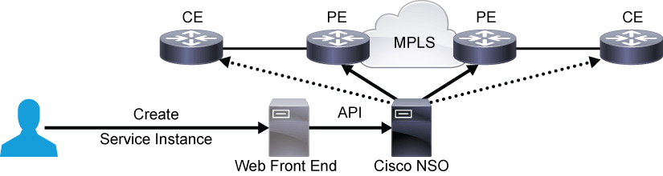

The figure illustrates a traditional Layer 2 or Layer 3 Multiprotocol Label Switching (MPLS) VPN where Cisco NSO can be deployed to manage provider edge routers and, optionally, also customer edge routers. The orchestrated solution typically would involve integration with a front-end portal to simplify service management.

## Content Review Question

Which Cisco product allows you to use Python API to create a mapping logic between service and device parameters?

- [x] Cisco NSO
- [ ] Cisco ACI
- [ ] Cisco SD-WAN
- [ ] Cisco DNA Center
