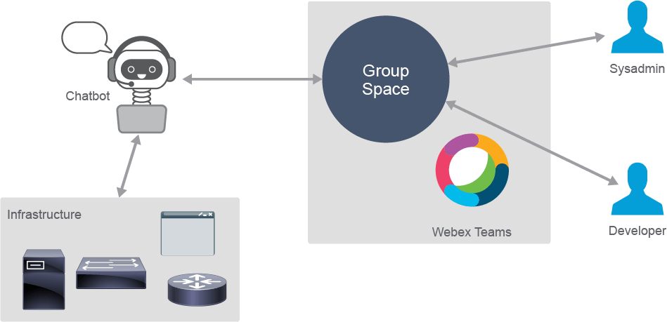
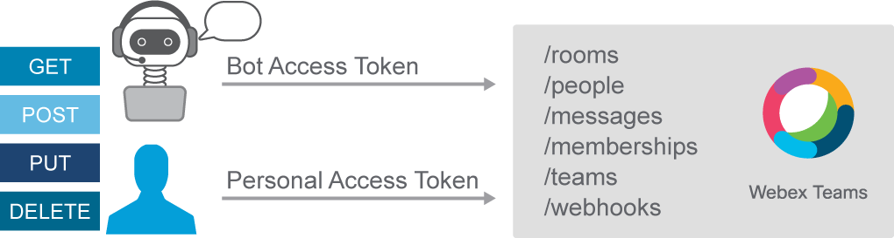
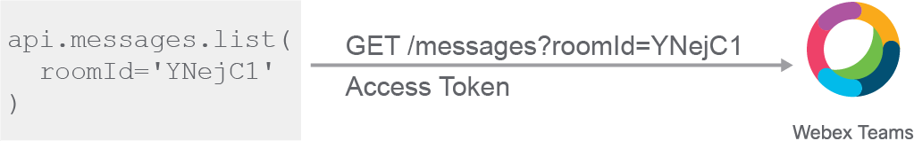

# Automating Cisco Webex Teams Operations

Developers, operators, systems, and network administrators all use some form of digital communication to convey information between them in some form or another. Having a conversation is a real-time experience, regardless of the media used, and most of the messaging applications today offer text, audio, and video support out of the box. IM and real-time chat applications are not new technologies that have just been invented. What is different about these applications now is how you use them.

The rise of API availability throughout the industry allows countless possibilities of integrating products and services into the existing infrastructure. From network devices to web applications, online search services and storage providers, many of them offer exposed and well-documented programmable interfaces that are essential for providing automated operations of these services.

The key to utilizing a collaboration platform like Cisco Webex Teams for performing automated operational workflows is using chatbots.

A chatbot is a software service that imitates human conversations for solving various tasks—for example, providing customer support or educational assistance. Chatbots can also be integrated into existing operational workflows, so they can, for example, provide administrators and operators with notifications and status messages directly in the messaging workspace. Integration with the infrastructure can be further expanded so that the operator can instruct the bot to perform some action or gather some data from the network, servers, or applications. In this way, the operator can execute tasks and react to events without leaving the central collaborative workspace environment. Workflows can be further automated with notifications being sent to the bot whenever some interesting event occurs. The bot can then react in real time and perform some action—for example, reconfigure a resource or create a trouble ticket.



Chatbot service providers can automatically supply chatbots with access to some of the following information:

- Member activity
- Channel information
- Chatbot information
- Metadata
- Statistics

Benefits of using chatbots in operational workflows include:

- Centralized infrastructure management
- Conversational approach to operations
- Tighter collaboration
- Transparent workflow

A collaboration platform can make bot-based interactions possible by providing a northbound API and implementing event notifications. Cisco Webex Teams assures it by providing a REST API and enabling webhooks.

## Cisco Webex Teams REST API

To use the Cisco WebEx Teams API, you must first generate an access token. A personal access token is retrieved from the Cisco Webex Teams developers website at `https://developer.webex.com/docs/api/getting-started`. The personal token is temporary, so if you require permanent access to the Webex Teams API, you should create a bot and use its token, which does not expire. The access token has to be sent with all API calls and is set in the value of the authorization HTTP request header. The token also serves as an identifier of the participant; for example, when you send a request to list rooms where a person is present, you do not need to send the person ID. The API matches the value of the access token to the person and responds with the appropriate data.



The Webex Teams API supports paginating responses, managing file attachments, and markdown formatting of messages.

The developer website also features full API documentation and references with examples and the capability to execute API calls from the web page.

## Webex Teams SDK

The webexteamssdk is a community-developed Python library for working with Webex Teams APIs. The library abstracts the Webex Teams REST API and wraps all the API requests and returned JSON objects within native Python objects and methods, and as such makes working with the API a native Python experience.



The Webex Teams SDK has these functions:

- Simplifies authentication
- Provides default arguments
- Supports automatic pagination and rate limiting
- Manages file attachments
- Provides comprehensive error reporting

The Webex Teams SDK project is maintained at `https://github.com/CiscoDevNet/webexteamssdk`.

## WebexTeamsAPI Class

The WebexTeamsAPI class hierarchically organizes Webex Teams APIs, following the same structure and naming as described in the Webex Teams API documentation (people, rooms, messages, and so on). Each subclass implements several methods, like list and get, which you can use to perform desired tasks.

| Class | Subclass | Methods |
| - | - | - |
| WebexTeamsAPI | people | list(), get(), me() |
| — | rooms | list(), create(), get(), update(), delete() |
| — | messages | list(), create(), get(), delete() |
| — | memberships | list(), create(), get(), update(), delete() |
| — | teams | list(), create(), get(), update(), delete() |
| — | teams_memberships | list(), create(), get(), update(), delete() |
| — | webhooks | list(), create(), get(), update(), delete() |
| — | access_tokens | get(), refresh() |

```python
api = WebexTeamsAPI()
me = api.people.me()
```

The following example is the most basic Python code that you need to perform an API call with the webexteamssdk library:

``` python
from webexteamssdk import WebexTeamsAPI

access_token = 'QWKmdmd8008jlkmWDziva'
api = WebexTeamsAPI(access_token=access_token)
me = api.people.me()
print(f'Display name: {me.displayName}')
print(me)
```

You import the WebexTeamsAPI class, create an instance of that class (a connection object), and call the me() method of the people subclass. If the access token is not specified when initializing the connection object, the WebexTeamsAPI class tries to read an environment variable WEBEX_TEAMS_ACCESS_TOKEN. Calling the me() method creates a GET request to the API and returns an object, containing information about the person authorized by the access token, like the ID, display name, and email address. The following example shows the output from the previous code.

```python
Display name: DevNet Student
WebEx Teams Person:
{
  "id": "Y2lzY29zcGFyazovL3VzL1BFT1BMRS9iODg0OThiYyTc3NDA",
  "emails": [
    "student1@example.com"
  ],
  "phoneNumbers": [],
  "displayName": "DevNet Student",
  "nickName": "Student",
  "orgId": "Y2lzY29zcGFyazovL3VzL09SR0FO25zdW1lcg",
  "created": "2019-10-15T12:53:05.550Z",
  "lastActivity": "2019-10-22T16:50:39.393Z",
  "status": "inactive",
  "type": "person"
}
```

## Spaces (Rooms)

Spaces or rooms, as they are referred to in the API, are virtual meeting places where people and bots collaborate and post messages. This API is used to manage the rooms themselves. You can create, delete, or update a room—for example, change the room title.

There are two types of spaces:

- Direct: A private space used by two participants.
- Group: Space shared by a team. To create a team room, you need to specify a teamId parameter key and value in the POST payload.

The following code is a request to list the rooms to which the authenticated user belongs, and the received response:

```python
GET https://api.ciscospark.com/v1/rooms
{
    "items": [
    {
        "id": "Y2lzY29z",
        "title": "DevNet Student",
        "type": "direct",
        "isLocked": false,
        "lastActivity": "2019-10-18T12:21:39.242Z",
        "creatorId": "Y2lzA",
        "created": "2019-10-15T20:36:47.455Z",
        "ownerId": "consumer"
    },
<... output_omitted ...>
```

The following code is the same example but uses the webexteamssdk:

```python
api = WebexTeamsAPI()
rooms = api.rooms.list()
for room in rooms:
    print(room)
WebEx Teams Room:
{
  "id": "Y2lzY29z",
  "title": "My New Room",
  "type": "group",
  "isLocked": false,
  "lastActivity": "2019-10-24T20:07:59.321Z",
  "creatorId": "Y2lzAasdr",
  "created": "2019-09-24T20:07:59.321Z",
  "ownerId": "consumer"
}
WebEx Teams Room:
{
<... output omitted ...>
```

You can limit the response to just direct or group spaces by specifying the type parameter.

## Memberships

To list participants (members) of any room that you are in, or to invite someone to a room, you use the memberships API. Memberships can also be updated by making a user a moderator, or delete so that a user leaves (or is kicked out of) a room.

The following code is a request to list all the members in a room, with a specified room ID:

``` python
GET https://api.ciscospark.com/v1/memberships?roomId=Y2lzY29zcGFR1

Response:
{
    "items": [
        {
            "id": "Y2lY2Fyazo00YGJiLTY2N",
            "roomId": "Y2lzY29zcGFR1",
            "personId": "Y2lzY29zcGFP3",
            "personEmail": "devnet.bot@webex.bot",
            "personDisplayName": "DevNet Chatops",
            "personOrgId": "Y2lzY29zMDVjMmNlODI",
            "isModerator": false,
            "isMonitor": false,
            "created": "2019-10-15T20:36:48.415Z"
        },
        {
            "id": "Y2lzYUzZi1iMGJiLTY2NWEwNDI3M2RhOQ",
            "roomId": "Y2lzY29zcGFR1",
            "personId": "Y2lzY29zcGFyazoP2",
<... output_omitted ...>
```

The following code is the same example but uses the webexteamssdk:

```python
api = WebexTeamsAPI()
members = api.memberships.list(roomId='Y2lzY29zcGFR1')
for member in members:
    print(member)
WebEx Teams Membership:
{
 "id": "Y2lY2Fyazo00YGJiLTY2N",
 "roomId": "Y2lzY29zcGFR1",
 "personId": "Y2lzY29zcGFP3",
<... output omitted ...>
```

You would invite a user to a space by making a POST request:

```python
POST /memberships
roomId=Yas8j440jas0z0MG
personEmail=student1@example.com
```

## Messages

You can post, read, or delete messages in a room in which you are a member by using the messages API. Messages can be also sent directly to a user by providing the toPersonId or toPersonEmail parameters.

The following code creates a new message in a room, specified by the room ID. You can also attach files or format the message with markdown:

``` python
POST /messages
roomId=Y2lzY29zcGFR1
text=Hello!

Response:
{ "id": "Y2lzY29zcGFM1",
  "roomId": "Y2lzY29zcGFR1",
  "roomType": "group",
  "text": "Hello!",
  "personId": "Y2lzY29zcGFP1",
  "personEmail": "student1@example.com", 
<"...output omitted"...>
```

The response contains the ID of the message, which can be referenced for future handling, retrieving, or deleting.

The following code is the same example but uses the webexteamssdk:

``` python
api = WebexTeamsAPI()
msg = api.messages.create(roomId='Y2lzY29zcGFR1', text='Hello!')
print(msg)
WebEx Teams Message:
{
  "id": "Y2lzY29zcGFM1",
  "roomId": "Y2lzY29zcGFR1",
  "roomType": "group",
  "text": "Hello!",
<...output omitted...>
```

## Content Review Question

Which Webex Teams API endpoint can be used to list the participants of a group space?

- [ ] /people
- [ ] /rooms
- [ ] /spaces
- [x] /memberships
- [ ] /teams
