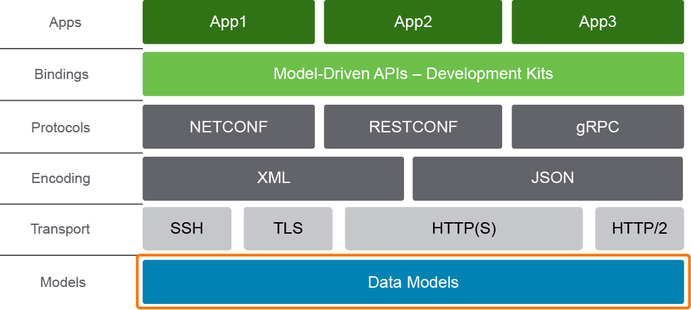
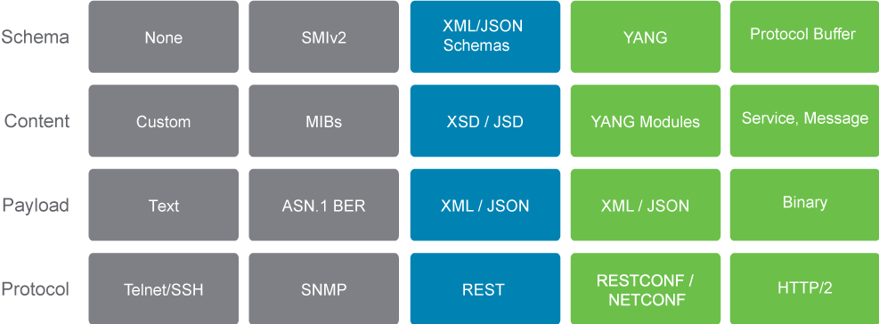

# Model-Driven Programmability Stack

For automation, traditional CLI-based interfaces, with text commands and output, are insufficient. When networking devices first started supporting APIs, these were RPC-style APIs, taking and executing CLI commands. They were not programming-friendly. It was difficult to extract information from unstructured text, designed for humans. This led to development of custom device APIs. However, these custom APIs often did not support full functionality and were sufficiently different from CLI to require additional work to translate commands. Instead, a model-based approach to APIs can be used to address these and other challenges.

Data models describe the syntax and semantics of working with specific data objects. They answer questions such as:

- How is a VLAN object structured? What properties does it have?
- What is the range of a valid VLAN ID?
- Can a VLAN name have spaces in it?
- Is the value a string or an integer?

One misconception is that data models are used to exchange data, which is not the case. Instead, protocols such as Network Configuration Protocol (NETCONF) and RESTCONF send JSON/XML encoded documents, that are governed by a given model.

As models focus on what is the content and not so much on how it is exchanged, they allow the API to do the following:

- Provide efficient and easy-to-use tooling to consume it (programming libraries).
- Support extensible and open interfaces (REST-based, NETCONF, and so on).
- Add flexibility and support for different types of encoding formats (XML and JSON).
- Support different types of transport.

The core components of the complete device API therefore include the following:

- **Data models:** The foundation of the API consists of data models. Data models define the syntax and semantics, including constraints of working with the API.
- **Transport:** Model-driven APIs support one or more transport methods, including SSH, TLS, and HTTP or HTTPS.
- **Encoding:** Model-driven APIs support the choice of encoding, including XML and JSON, as well as custom encodings such as Google protocol buffers.
- **Protocols:** Model-driven APIs also support multiple options for protocols, with the three core protocols being NETCONF, RESTCONF, and gRPC.

Consider the following figure:

Applications can now use programming libraries or development kits that leverage data models to simplify access to the API. Behind the scenes different protocols using various encodings and transports may be used to exchange data but the application does not need to concern itself with that. It only needs to operate on the data models. Likewise, the API server uses the same model, regardless of the protocol, allowing the server to support as many protocols as required.

The two main data encoding formats commonly used are XML and JSON. Each provides structured way of data formatting to send data between two computer systems. Since data conforms to the model, it is much easier to navigate and extract relevant information programmatically. This is in stark contrast to using Secure Shell (SSH) issuing CLI commands in which data is sent as raw strings (text).

XML and JSON were chosen for data transmission because they have these features:

- Human readable, because they are self-describing
- Hierarchical, because they store values within values
- Parsable and used by many programming languages

However, in some cases other encodings are also used. The figure below compares types of API, including schema language that is used to describe data models, as well as typical encodings and protocols.

As you can see, data models are not really new but are getting more attention as a building block of the model-driven APIs.

## Content Review Question

Which two options are main encoding formats? (Choose two.)

- [ ] NETCONF
- [ ] HTTP
- [x] JSON
- [x] XML
- [ ] gRPC
