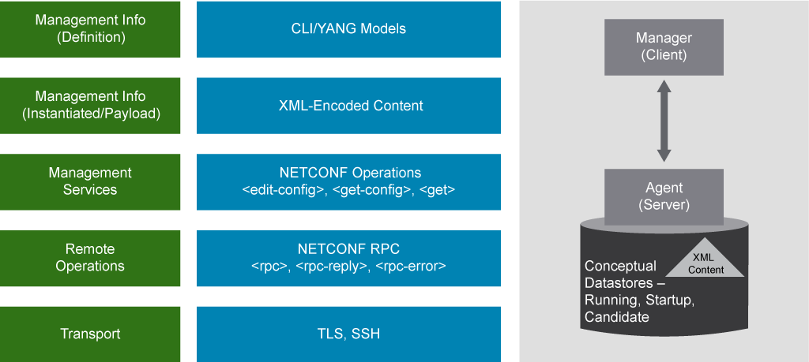
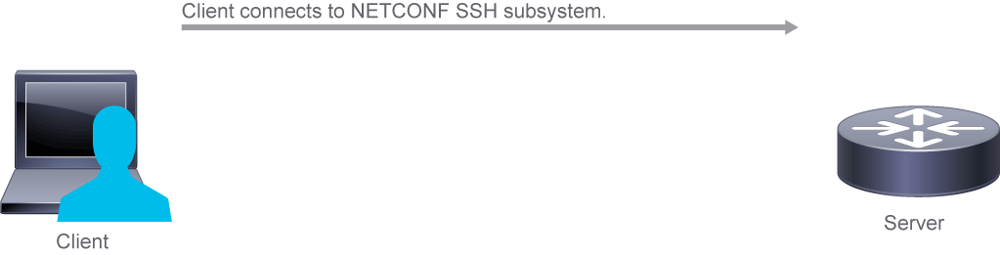
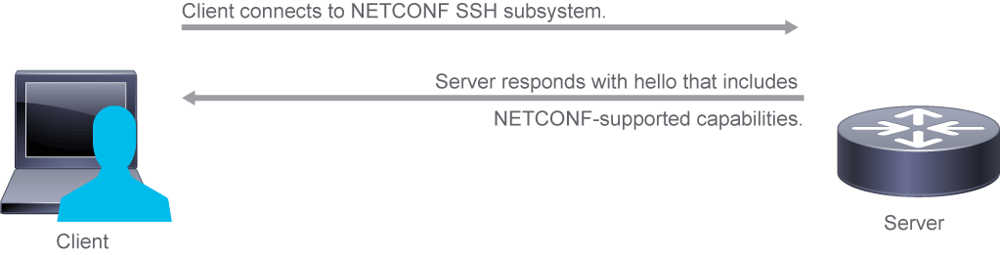
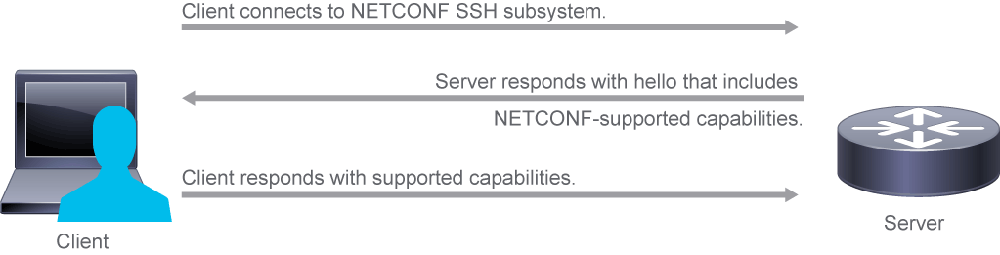
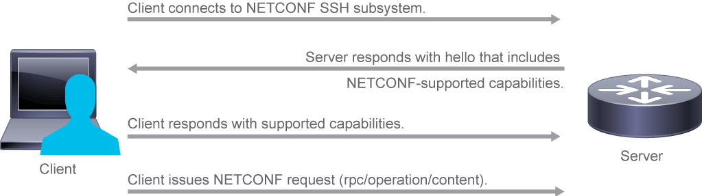
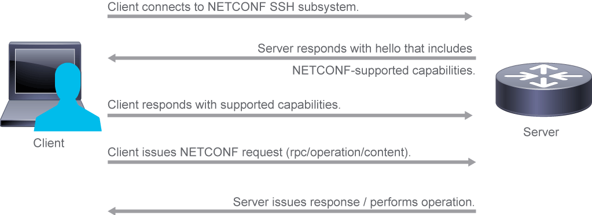

# Network Automation and NETCONF

The basic create, read, update, and delete (CRUD) mechanics for network device configuration and operational state are encapsulated in NETCONF. NETCONF provides a formal and generally interoperable means of opening a secure management session with a network device. It offers basic operations to act on the configuration data and get the operational state, mechanisms for notifications, and a set of framework definitions and operations to tie these functions together.

The basic purpose of NETCONF is to:

- Transport configuration payloads to a device, which is targeted at a specified configuration datastore
- Retrieve configuration data when queried
- Support notifications, often based on SNMP trap definitions

NETCONF is defined in RFC 6241. It is a protocol that is transported over TLS and SSH, which includes operations and configuration datastore concepts that allow management of a network device. The protocol is exposed as an API that applications can use to send and receive full and partial configuration data sets, and receive state and operational data sets. An example of a client-side tool for NETCONF is the ncclient Python tool, which you use in the discovery labs in this course.

Some primary features of NETCONF (RFC 6241):

- Defines framework for session management
- RPC messages to put and get configuration data
- Transaction-based communication
- Network service activation with networkwide transaction
- Datastores of configuration data

## Configuration Datastores

NETCONF defines the existence of one or more configuration datastores and allows configuration operations on those datastores. A configuration datastore is defined as the complete set of configuration data that is required to get a device from its initial default state into a desired operational state. The configuration datastore does not include state data or executive commands.

| Name | Description |
| - | - |
| running | This datastore holds the complete configuration currently active on the network device. Only one running configuration datastore exists on the device, and it is always present. This datastore is referenced by using the `<running>` element. See RFC 6241, Section 5.1. |
| candidate | This datastore holds configuration data that serves as a workplace for creating and manipulating configuration data. A `<commit>` operation causes the running configuration of the device to be set to the value of the candidate configuration. Any uncommitted changes to the candidate configuration can be removed by executing the `<discard-changes>` operation. See RFC 6241, Section 8.3. |
| startup | Configuration loaded by the device when it boots. Operations that affect the running configuration will not be automatically copied to the startup configuration. An explicit `<copy-config>` operation from `<running>` to `<startup>` is used to update the startup configuration to the current contents of the running configuration. Refer to using the `<startup>` element in RFC 6241 section 8.7.|

The existence of different datastores on a given device is advertised via capabilities, as defined in Section 8 of RFC 6241. Capabilities are exchanged when you start a NETCONF session with a device, and you can see these capabilities in the initial message from the NETCONF server on the device.

The running configuration datastore holds the complete configuration that is currently active on the network device. Only one running configuration datastore exists on the device, and it is always present. NETCONF protocol operations refer to this datastore using the `<running>` XML element. The running datastore may or may not support write operations.

If the running datastore cannot be written directly, you can still change the device configuration through the candidate datastore, identified in messages with the `<candidate>` XML element.

Cisco IOS XE Software supports a candidate datastore, which needs to be enabled in the CLI. When using NETCONF with Cisco IOS XE Software, you must explicitly state that it is the candidate datastore that is the target of operations, and you must explicitly commit changes.

The information that can be retrieved from a running system is separated into two classes:

- **Configuration data** is the set of writable data that starts the system operations.
- **State data** is the nonconfiguration data on a system, or operational data, such as read-only status information and collected statistics.

## Protocol Operations

NETCONF provides a set of low-level operations to manage device configurations and retrieve device state information. These operations include retrieving, configuring, copying, and deleting configuration datastores and retrieving state and operational data. Additional operations can be provided, based on the capabilities that the device advertises.

All NETCONF operations are encoded as XML messages and data models are described with a language called YANG. The main motivation for YANG was to provide a standard way to model configuration and operational data so that network device configuration and monitoring could be based on common models. Common models should be interoperable across different vendors, instead of being based on vendor-specific CLIs. It was also important to provide a means of defining such models that were amenable to automated translation. The following figure describes the NETCONF architecture stack.



NETCONF provides the following operations:

- `get` retrieves running configuration and device state information—that is, operational data.
- `get-config` retrieves all or part of a specified configuration datastore.
- `edit-config` loads all or part of a specified configuration to the specified target configuration datastore.
- `copy-config` creates or replaces an entire configuration datastore with the contents of another complete configuration datastore.
- `delete-config` deletes a configuration datastore. The ``<running>`` configuration datastore cannot be deleted.
- `lock` allows the client to lock the entire configuration datastore system of a device. Such locks are intended to be short-lived. They allow a client to make a change without fear of interaction with other NETCONF clients, non-NETCONF clients (for example, SNMP and CLI scripts), and human users.
- `unlock` releases a configuration lock that was previously obtained with the `<lock>` operation.
- `close-session` requests the graceful termination of a NETCONF session.
- `kill-session` forces the termination of a NETCONF session.

> **Note** \
For further details about NETCONF operations, see Section 7 of RFC 6241.

Protocol Message Examples
The next example shows an entire NETCONF RPC message, including the message ID (101), as defined by the base IETF NETCONF namespace.

```NETCONF
 <rpc message-id="101" xmlns="urn:ietf:params:xml:ns:netconf:base:1.0">
     <get-config>
         <source>
             <running/>
         </source>
     </get-config>
 </rpc>
```

The operation within the message is `get-config`, with the target data source of the `running configuration` — that is, the configuration that is used by the device for its current configuration state.

Once the operation is processed, a reply is sent back. The message ID of the reply corresponds to the message ID of the original RPC. The data is for the current device configuration in the example RPC shown in the previous figure. The response data contains several attributes, such as configuration of the network interfaces:

```NETCONF
<rpc-reply message-id="101" xmlns="urn:ietf:params:xml:ns:netconf:base:1.0">
  <data>
    <interfaces xmlns="urn:ietf:params:xml:ns:yang:ietf-interfaces">
      <interface>
        <name>eth0</name>
        <description>Link to asw1</description>
        <enabled>true</enabled>
        …
```

XML namespaces are widely used and have the following traits:

- They provide a means to mitigate element name conflicts.
- They are defined with the attribute xmlns:prefix="URI"; prefix is used as abbreviation of the namespace in the tag.
- You can have a default namespace using xmlns=url, eliminating the need to have an attribute in each tag.

Namespaces are present in both, requests and responses. They are especially important inside configuration elements. It is quite possible that there would never be a conflict of XML tags when working with network devices, but you may want to create custom XML objects. In doing so, you have the ability to create a namespace; it essentially becomes an identifier for each XML element. That way, you can read data from more than one source. You can create a larger object and not overwrite an object, because they would still be accessible by their separate namespace.

## NETCONF over SSH

SSH is the main transport protocol used by NETCONF. There are a few different steps that occur during a NETCONF session:

- Client connects to the NETCONF SSH subsystem.
- Server responds with hello that includes NETCONF-supported capabilities.
- Client responds with supported capabilities to establish a connection.
- Client issues a NETCONF request (rpc/operation/content).
- Server issues a response or performs operation.

The first step is to connect to the NETCONF server by using the following Linux command:

`$ ssh -p 830 cisco@csr1kv -s netconf`



When you connect to the network device and establish a connection, the device sends a hello, and it includes all its supported NETCONF capabilities. The Cisco Cloud Services Router (CSR) 1000V includes hundreds of capabilities.



The following output has been modified to improve readability.

```output
$ ssh -p 830 cisco@csr1kv -s netconf
cisco@csr1kv's password: 
```<?xml version="1.0" encoding="UTF-8"?>
<hello xmlns="urn:ietf:params:xml:ns:netconf:base:1.0">
<capabilities>
    <capability>urn:ietf:params:netconf:base:1.0</capability>
    <capability>urn:ietf:params:netconf:capability:writable-running:1.0</capability>
    <capability>urn:ietf:params:netconf:capability:xpath:1.0</capability>
    <capability>urn:ietf:params:netconf:capability:validate:1.0</capability>
    <capability>urn:ietf:params:netconf:capability:rollback-on-error:1.0</capability>
    <capability>urn:ietf:params:netconf:capability:notification:1.0</capability>
    <capability>urn:ietf:params:netconf:capability:interleave:1.0</capability>
    <capability>http://tail-f.com/ns/netconf/actions/1.0</capability>
    <capability>http://cisco.com/ns/yang/ned/ios?module=ned&amp;revision=2016-06-20</capability>
    <... output omitted ...>
</capabilities>
<session-id>203499</session-id></hello>]]>]]>
```

> **Note** \
All messages to and from the NETCONF server or client must end with `]]>]]>`. This way, the client, and server know that the other side is done sending the message.

When the server sends its hello, the client needs to send a hello with its supported capabilities. You can respond back with everything the server supports (assuming the client does as well) or just with the bare minimum `edit` and `get` commands.



The bare minimum is what is shown in the figure, just supporting the NETCONF base.

```NETCONF
<?xml version="1.0"?>
<hello xmlns="urn:ietf:params:xml:ns:netconf:base:1.0">
  <capabilities>
    <capability>urn:ietf:params netconf:base:1.0</capability>
  </capabilities>
</hello>]]>]]>
```

Once the client sends its capabilities, it can then send NETCONF requests. In this example, the client is sending a request to perform the NETCONF `get` operation (denoted by `<get>`). It is then asking for a given section of configuration using a filter. Based on the devices or servers being used, you often have to be aware of which model is being used (denoted by the XML namespace).



This filter is selectively asking for the configuration information of GigabitEthernet1.

```xml
<?xml version="1.0"?>
<rpc message-id="101" xmlns="urn:ietf:params:xml:ns:netconf:base:1.0">
    <get>
        <filter type="subtree">
            <native xmlns="http://cisco.com/ns/yang/ned/ios">
             <interface>
              <GigabitEthernet>
               <name>1</name>
              </GigabitEthernet>
             </interface>
            </native>
        </filter>
    </get>
</rpc>
]]>]]>
```

The server processes the client request and responds with the configuration as expected.



```xml
<?xml version="1.0" encoding="UTF-8"?>
<rpc-reply xmlns="urn:ietf:params:xml:ns:netconf:base:1.0" message-id="101">
    <data>
        <native xmlns="http://cisco.com/ns/yang/ned/ios">
          <interface>
           <GigabitEthernet>
            <name>1</name>
            <negotiation>
             <auto>true</auto>
            </negotiation>
            <ip>
             <address>
              <primary>
               <address>192.168.1.11</address>
               <mask>255.255.255.0</mask>
              </primary>
             </address>
            </ip>
           </GigabitEthernet>
          </interface>
        </native>
    </data>
</rpc-reply>]]>]]>
```

NETCONF also supports capability discovery and model downloads. Supported models are discovered using the `ietf-netconf-monitoring` model. You can see the revision dates for each model in the capabilities response. Data models are available for optional download from a device using the `get-schema` RPC.

## Content Review Question

Which three options are NETCONF protocol operations? (Choose three.)

- [x] `get-config`
- [ ] `close-config`
- [x] `lock`
- [ ] `lock-session`
- [ ] `delete-session`
- [x] `kill-session`
- [ ] `copy-session`
