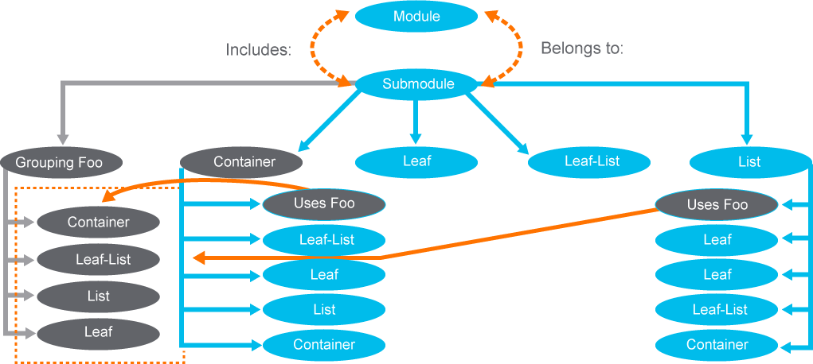
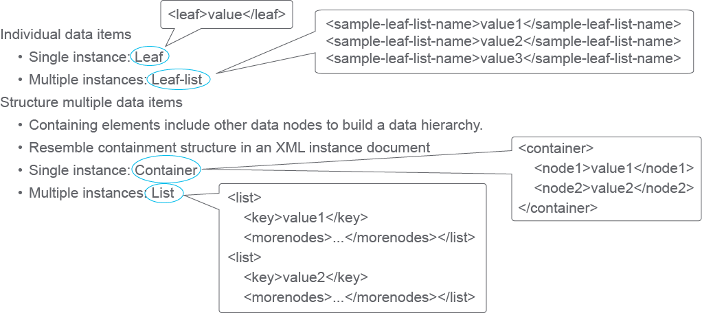
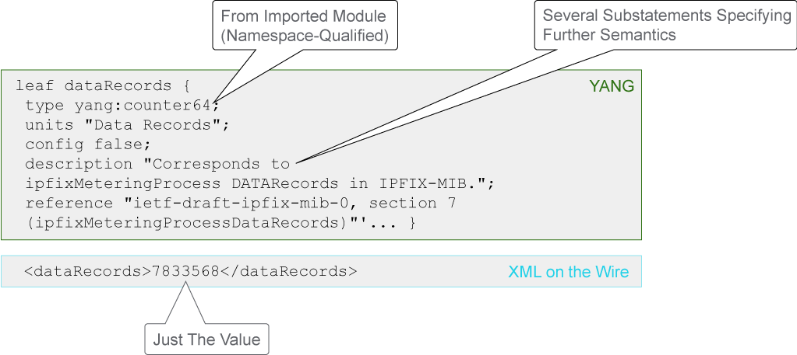
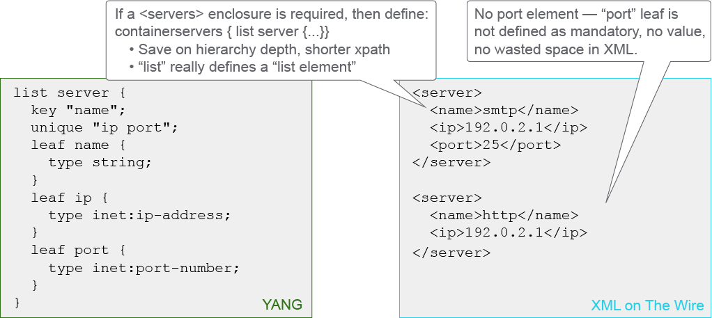

# Exploring YANG Models

YANG is a modeling language that is used with NETCONF and in an increasing number of other domains. It is used to define configuration and operational state data models, additional operational functions, and notifications that are transported within NETCONF commands.

Here are some primary features of YANG (RFC 6020):

- Language for data modeling and RPCs
- Describes data structure, type, and constraints in the form of a schema
- Standardizes the representation of data
- Allows configuration to be checked if valid
- Originally intended for NETCONF payloads
- Now also used elsewhere as an interface definition language—for example, in OpenDaylight

YANG is a data modeling language that originally was defined in RFC 6020 circa 2010. It is used to model configuration and state data that NETCONF manipulates, and the NETCONF remote procedure calls (RPCs) and notifications. Beyond its roots in NETCONF, YANG is now used as a general-purpose interface definition and data modeling language in different programming environments, including Cisco NSO, OpenDaylight (ODL), and with tools like YANG Development Kit (YDK).

The first version of NETCONF was defined before YANG, so the payload was, in effect, undefined. Configuration payloads defaulted to the CLI that was used on the device in question. This approach is helpful because it reduces implementation costs; it also allows timely access to new features that only the CLI can configure. However, it has all the disadvantages of the CLI that were previously discussed.

Because the CLI is unstructured and not interoperable, YANG was proposed as a way to define common data models for NETCONF configuration payloads and notifications. Currently, some NETCONF implementations use CLI, some use vendor-specific YANG models, and some use common models. While YANG itself is a mature standard, standardization of data models is still an ongoing effort, driven by multiple organizations.

## YANG Structure

A YANG module defines a hierarchy of data that supports a complete description of all data that is sent between a NETCONF client and server. YANG models the hierarchical organization of data as a tree in which each node has a name and a value or a set of child nodes. YANG provides clear and concise descriptions of the nodes and the interaction between those nodes.

Data models are structured with modules and submodules. A module can import data from other external modules and include data from submodules. The hierarchy can be augmented, allowing one module to add data nodes to the hierarchy defined in another module. This augmentation can be conditional, with new nodes appearing only if certain conditions are met.



Models can describe constraints to enforce on the data, restricting the appearance or value of nodes based on the presence or value of other nodes in the hierarchy. These constraints are enforceable by the client or the server.

A set of built-in types is defined, and a type mechanism exists through which additional types may be defined. Derived types can restrict the set of valid values of their base type using mechanisms like range or pattern restrictions. They can also define conventions for use of the derived type, such as a string-based type that contains a hostname.

YANG permits the definition of reusable groupings of nodes. The instantiation of these groupings can refine or augment the nodes, allowing it to tailor the nodes to its particular needs. Derived types and groupings can be defined in one module or submodule and used in that location or in another module or submodule that imports or includes it.

Data hierarchy constructs include defining lists where keys distinguish list entries from each other. Such lists may be defined as user sorted or automatically sorted by the system. For user-sorted lists, operations are defined for manipulating the order of the list entries.

Modules can be translated into an equivalent XML syntax called YANG-Independent Notation (YIN). YIN allows applications that use XML parsers and Extensible Stylesheet Language Transformations (XSLT) capabilities to operate on the models. The conversion from YANG to YIN is lossless, so content in YIN can be sent back into YANG.

A balance is struck between high-level data modeling and low-level bits-on-the-wire encoding. The reader of a YANG module can see the high-level view of the data model and understand how the data will be encoded in NETCONF operations.

YANG is an extensible language that allows standards bodies, vendors, and individuals to define extension statements. The statement syntax allows these extensions to coexist with standard YANG statements in a natural way. Extensions in a YANG module stand out sufficiently for the reader to notice them.

Some common extensions and models defined by IETF include:

- **RFC 6022:** YANG Module for NETCONF Monitoring
- **RFC 7223:** A YANG Data Model for Interface Management
- **RFC: 7277:** A YANG Data Model for IP Management
- **RFC 8519:** YANG Data Model for Network Access Control Lists (ACLs)

Other organizations providing YANG-related work:

- **Vendors:** Cisco IOS, IOS XR, IOS XE models
- **CableLabs:** Cable system management
- **Open Networking Foundation:** Service Provider networking
- **OpenConfig Group:** Publishes models, documentation, and other material for the community

## Data Nodes Generically Mapped to XML

YANG is expressed in XML; that is, an instance of something that is modeled in YANG is an XML document. The figure shows the generic rules for mapping YANG model elements to XML document elements.



An attribute of a YANG model is defined in a leaf, which maps to an XML document element of the same name. The value appears between the open and close elements. A list includes multiple document elements. Note that lists of leaf objects or attributes are unnamed and unordered and do not contain any <list> </list> elements. If you require such elements, then you would use a container in the YANG model. Lists are used for multiple instances in an XML document, but not attributes or leaf objects.

## Leaf Statement with XML

To illustrate the leaf-attribute concept further, the following example shows the definition of a leaf called dataRecords. Note that the definition of the leaf is comprehensive, so a client or server could use the model definition to validate the data and apply constraints to it. The wire representation in a NETCONF message, however, includes only the XML element and its value.

Example of a YANG model transformed in XML representation:



The type yang:counter64 comes from the ietf-yang-types module, also defined in RFC 6991. You can see the ietf-yang.types.yang model file in ~/git/yang/standard/ietf/RFC.

## List Statement with XML

This example shows a list of servers with leaf objects that are used for the attributes of the server. The XML representation shows multiple server elements but does not contain any `<list> </list>` elements. Note that neither the ip or port leaf attributes are mandatory, so they do not appear in the XML document unless there is a value for a given server instance. This approach allows more efficiency in the XML encoding.



Also note the inet: prefix for the ip-address and port-number types. These items are defined in the ietf-inet-types module.

## Container Structure with Augmentation

This example shows a container that is called "interfaces" containing a list of interface types with several attributes defined as leaf types. This example is based on RFC 7223.

``` YANG
 container interfaces {
         list interface {
             key "description";
             
             leaf description {
                 type string;
             }

             leaf type {
                 type iana:IfType;
             }
	  }
  }
```

```YANG
 import interface-module {
         prefix "if";
     }
     augment "/if:interfaces/if:interface" {
         when "if:type='ds0'";
         leaf ds0ChannelNumber {
             type ChannelNumber;
         }
     }
```

YANG allows a module to augment a data model by inserting additional YANG nodes into the model. This ability allows vendors to add vendor-specific parameters to standard data models in an interoperable way.

The augment statement allows a module or submodule to add to the schema tree, which is defined in a string that identifies a node in the schema tree. This node is called the augment target node. It is augmented with the nodes that are defined in the substatements that follow the augment statement.

In this example, the interface node in the interfaces container has a when condition that specifies that the interface is of a given type.

The `when` statement makes its parent data definition statement conditional. The node that is defined by the parent data definition statement is only valid when the condition that is specified in the `when` statement is satisfied. As with many other parts of YANG, the argument of the statement is an XPath expression.

If the `when` statement is a child of an `augment` statement, then the context node is the target node of the augment in the data tree—the YANG model file for RFC 7223.

### Interface IP Configuration Example

Let's now take a look at a real example.

The following (abbreviated) model describes IP configuration:

```YANG
module ietf-ip {
  import ietf-interfaces { prefix if; }
  augment "/if:interfaces/if:interface" {
    container ipv4 {
      list address {
        key "ip";
        leaf ip {
          type inet:ipv4-address-no-zone;
        }
        leaf prefix-length {
          type uint8 { range "0..32"; }
        }
      }
    }
  }
}
```

This model is defined in RFC 8344 as a standard way of configuring IP addresses on an interface. The full model also contains additional parameters, such as IPv6 configuration, which we will not use for this example.

First, notice that above model references ietf-interfaces model (through the import statement). This is required because IP configuration builds upon generic interface model, using the augment statement. To put it simply, ietf-ip module adds a new ipv4 container to each interface on a device.

Inside the ipv4 container, a list (address) allows you to define multiple IP addresses for each interface. Each address also comes with a prefix-length, which is used in calculating the subnet mask. Consider 192.168.1.10/24, where 192.168.1.10 is the address and 24 is the prefix-length.

> **Note** \
You can find the full YANG model in the `ietf-ip@2014-06-16.yang` file in the ~/git/yang/standard/ietf/RFC directory on the lab Student Workstation.

Using YANG model allows you to construct a filter (XPath) to limit results in NETCONF:

```YANG
XPath: /if:interfaces/if:interface/ip:ipv4
Data:
    <interfaces xmlns="urn:ietf:params:xml:ns:yang:ietf-interfaces"> 
      <interface> 
        <name>eth0</name> 
        <ipv4 xmlns="urn:ietf:params:xml:ns:yang:ietf-ip"> 
          <address> 
            <ip>192.168.1.10</ip> 
            <prefix-length>24</prefix-length> 
          </address> 
         </ipv4>
      </interface>
    </interfaces>
```

This way you only get the data you are interested in.

And you can reuse it to make changes (update an IP):

```YANG
<rpc xmlns="urn:ietf:params:xml:ns:netconf:base:1.0" message-id="102">
  <edit-config>
    <target><running/></target> 
    <config xmlns:nc="urn:ietf:params:xml:ns:netconf:base:1.0">
      <interfaces xmlns="urn:ietf:params:xml:ns:yang:ietf-interfaces"> 
        <interface> 
          <name>eth0</name> 
          <ipv4 xmlns="urn:ietf:params:xml:ns:yang:ietf-ip"> 
            <address nc:operation="replace"> 
              <ip>192.168.1.15</ip>
              <prefix-length>24</prefix-length>
            </address>
          </ipv4>
          ...
</rpc>
```

Alternatively, you can create the XML manually—by consulting the model.

Such an XML document is then sent through a NETCONF session to change the IP address to 192.168.1.15 on the target device's eth0 interface.

The XML above uses the `edit-config` NETCONF RPC that loads all or part of a specified configuration. The device analyzes the source and target configurations and performs the requested changes. Elements in the config subtree may contain an `operation` attribute. The attribute identifies the point in the configuration at which to perform the operation and may appear on multiple elements throughout the config subtree. If the operation attribute is not specified, then the default operation is merge and the configuration is merged into the configuration datastore.

The operation attribute can take one of the following values:

- `merge`: The configuration data that the element containing this attribute identifies is merged with the configuration. Data is merged at the corresponding level in the configuration datastore that the target parameter identifies. This behavior is the default.
- `replace`: The configuration data that the element containing this attribute identifies replaces any related configuration in the configuration datastore that is identified by the target parameter. Only the configuration that is actually present in the config parameter is affected.
- `create`: The configuration data that is identified by the element containing this attribute is added to the configuration only if the configuration data does not exist on the device. If the configuration data exists, an `<rpc-error>` element is returned with an `<error-tag>` value of "data-exists."
- de`lete: The configuration data that is identified by the element containing this attribute is deleted in the configuration datastore that is identified by the target parameter.

## Remote Procedure Call

YANG also supports the definition of RPCs. In other words, in addition to the intrinsic NETCONF operations — `get`, `get-config`, and similar—additional operations on the server and its data sets can also be defined in YANG. YANG is used like an Interface Definition Language (IDL), similar to the Common Object Request Broker Architecture (CORBA) IDL or Web Services XML message definitions.

This example shows an RPC activate-software-image, which is defined in YANG, with the corresponding XML documents for the NETCONF RPCs.

```YANG
rpc activate-software-image {
  input {
    leaf image-name {
      type string;
    }
  }
  output {
    leaf status {
      type string;
    }
  }
}
```

```YANG
<rpc message-id="101" xmlns="…">
  <activate-software-image xmlns="…">
    <image-name>acmefw-2.3</image-name>
  </activate-software-image>
</rpc>

<rpc-reply message-id="101" xmlns="…">
  <status xmlns="…">
    Image acmefw-2.3 is being installed.
  </status>
</rpc-reply>
```

The example shows the definition of a message to activate a given software image. The operational context is that network devices may have several images that are stored in flash memory, including the current running image, the previous image, and an image for upgrade. This RPC can be used to activate a specific image and make it the running image for the device. NETCONF does not support this common operational requirement as an intrinsic operation.

The definition of the RPC on the top contains the names of the operations, input parameters, and output parameters. The NETCONF `<rpc>` XML documents on the bottom show what an instance of the RPC request and response might look like on the wire, with the namespaces omitted for brevity.

## Notifications

The next listing shows a notification, with the YANG definition followed by an example in XML encoding.

```xml
notification link-failure {
  description "A link failure has been detected";
  leaf if-name {
    type leafref { path "/interface/name"; }
  }
  leaf if-admin-status { type admin-status; }
  leaf if-oper-status { type oper-status; }
}
```

```xml
<notification xmlns="…">
  <eventTime>2016-09-01T10:00:00Z</eventTime>
  <link-failure xmlns="…">
    <if-name>so-1/2/3.0</if-name>
    <if-admin-status>up</if-admin-status>
    <if-oper-status>down</if-oper-status>
  </link-failure>
</notification>
```

NETCONF notifications are defined in RFC 5277. This optional capability is an addition to the base NETCONF definition. The notification mechanism is conceptually one of subscribing to a stream of notifications with a filter, and with start and stop times for notification replay.

The notification statement takes one argument, which is an identifier, followed by a block of substatements that holds detailed notification information.

The example has the YANG definition for a link failure notification, including the interface name and the administration and operational statuses. It is possible for an interface to be in the administration status of "up", meaning it is configured to be available. However, in the example, it is operationally down—perhaps because someone disconnected the cable from the port.

## Content Review Question

Which YANG statement is used for an attribute that has one value, no children, and a single instance?

- [ ] container
- [x] leaf
- [ ] leaf-list
- [ ] choice
