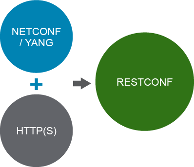
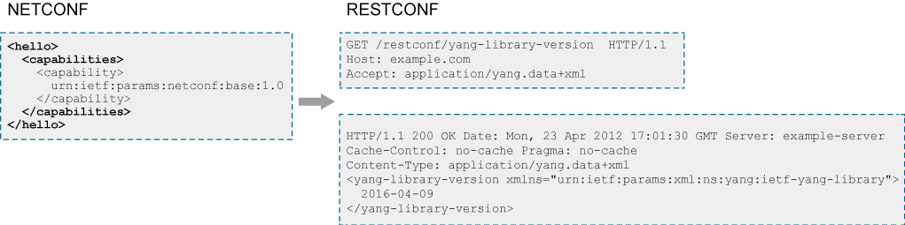

# Utilizing Data Models with RESTCONF Protocol

HTTP-based RESTCONF provides a programmatic interface that is based on standard mechanisms for accessing configuration and state data. You can also access data model-specific RPC operations and events that are defined in the YANG model. It is defined in RFC 8040.

RESTCONF offers these characteristics:

- Functional subset of NETCONF
- Exposes YANG models via a REST API (URL)
- Uses HTTP or HTTPS as transport
- Uses XML or JSON for encoding
- Developed to use HTTP tools and programming libraries
- Uses common HTTP verbs in REST APIs



RESTCONF is a REST-like protocol that provides a mechanism over HTTP for accessing data that is defined in NETCONF datastores and modeled in YANG.

RESTCONF combines the HTTP protocol simplicity with the predictability and automation potential of a schema-driven API. A client can determine all management resources for YANG models and NETCONF capabilities. Therefore, the URIs for custom protocol operations and datastore content are predictable, based on the YANG module definitions. The generation of the code to support RESTCONF APIs, and the mapping of these API calls to NETCONF, can be automated because the mapping from a YANG model to a RESTCONF Uniform Resource Identifier (URI) is well-defined.

RESTCONF helps support a common REST-based programming model for network programming in general. This model aligns with the wider trend in infrastructure programming to support REST APIs.

## Protocol Operations

| Operation | Description |
| - | - |
| GET | Retrieve data from a resource (config/operational).|
| POST | Create a configuration data resource.|
| PUT | Create or replace a configuration data resource. |
| PATCH | Merge configuration data with a target resource. |
| DELETE | Delete a configuration data resource. |

This mapping follows the general pattern of most REST APIs. Resources representing configuration data can be modified with the DELETE, PATCH, POST, and PUT methods. Data is encoded with either XML or JSON.

The HTTP GET operation represents the same semantics as the NETCONF GET and get-config operations, and can also be used for notifications. The HTTP PATCH operation supports partial configuration updates in a way that is similar to the NETCONF edit-config operation with operation=merge. The HTTP PUT operation is similar to PATCH, but it is typically used to replace the contents of a named resource, rather than changing attribute values of a resource.

The HTTP POST operation is used for NETCONF RPCs and, in some circumstances, to create a resource. The HTTP DELETE operation is equivalent to the NETCONF edit-config with operation=delete.

The client can also access the YANG libraries that the server implements—that is, the capabilities.

The API resource contains the entry points for the RESTCONF datastore and operation resources. It is the top-level resource that is referred to by the notation {+restconf}. It has the media type application/yang.api+xml or application/yang.api+json, depending on whether the encoding of the payload document is XML or JSON.

The YANG tree diagram for an API resource is as follows:

```
   +--rw restconf
      +--rw data
      +--rw operations
      +--ro yang-library-version
```

RESTCONF does not support all the NETCONF operations. Specifically, these operations are not supported:

- Configuration locking
- Candidate configuration
- Startup configuration
- Validate
- Confirmed commit

You can perform more granular operations when doing a change within NETCONF, such as specifying whether you want to replace an object, update it, or delete it. This example shows how RESTCONF operations map directly back to their counterparts in NETCONF.

Examples:

- GET `http://csr1kv/restconf/api/config/native`
  - Retrieve a full running configuration as an object.
- GET `http://csr1kv/restconf/api/config/native/interface`
  - Retrieve interface-specific attributes.
- GET `http://csr1kv/restconf/api/config/native/interface/GigabitEthernet/1`
  - Retrieve interface-specific attributes for GigabitEthernet1.

RESTCONF utilities and tools:

- The same tools that are used for native REST interfaces are used for RESTCONF:
  - Python requests module
  - Postman
  - Firefox RESTClient

> **Note** \
There are no API docs, so YANG tools will be used to generate the URL and request body.

## Get Interface

This example shows a request and response for an interface:

```RESTCONF
GET /restconf/data/ietf-interfaces:interfaces/interface/eth0?depth=1 
HTTP/1.1 
Host: example.com
Accept: application/yang.data+json
```

```
HTTP/1.1 200 OK Date: Wed, 18 Mar 2015 17:11:30 GMT Server: example-server Last-Modified: Wed, 18 Mar 2015 13:01:20 GMT ETag: eeeada438af Cache-Control: no-cache Pragma: no-cache
Content-Type: application/yang.data+json
  {
    "name": "eth0"
    "description" : "The interface description"
    "type": "ianaift:ethernetCsmacd"
    "enabled": true
    "link-up-down-trap-enable": 1
  }
```

This example request is made on the resource {+restconf}/data, which is a mandatory resource that represents the combined configuration and operational state data resources that a client can access. The client request is shown on the top, and the server response is on the bottom. In this case, an interface resource is being requested, to a depth of 1.

The depth parameter is used to specify the number of nest levels that are returned in a response for a GET method. It is defined in the IETF RESTCONF protocol draft, Section 4.8.2, which says: The "depth" parameter is used to limit the depth of subtrees returned by the server. Data nodes with a depth value greater than the "depth" parameter are not returned in a response for a GET method.

The requested data node has a depth level of "1." If the "fields" parameter (Section 4.8.3) is used to select descendant data nodes, then these nodes and all their ancestor nodes have a depth value of 1. This fact has the effect of including the nodes that are specified by the fields. The nodes are included even if the depth value is less than the actual depth level of the specified fields. Any other child node has a depth value that is 1 greater than its parent.

The value of the depth parameter is either an integer from 1 to 65535 or the string "unbounded." "Unbounded" is the default string.

## Get Interface Description

This example shows how to request only the interface description:

```RESTCONF
GET /restconf/data/ietf-interfaces:interfaces/interface/eth0/description
HTTP/1.1
Host: example.com
Accept: application/yang.data+json
```

```
HTTP/1.1 200 OK Date: Wed, 18 Mar 2015 17:11:30 GMT Server: example-server Last-Modified: Wed, 18 Mar 2015 13:01:20 GMT ETag: eeeada438af Cache-Control: no-cache Pragma: no-cache
Content-Type: application/yang.data+json
  {
    "description" : "The interface description"
  }
```

This RESTCONF GET example is a request for the interface description only. It is a specific example of how to construct a request URL to select leaf nodes from within a model structure.

## Get YANG Library Version

This example shows how to get information on the YANG library version:



The example request on the right is made on the {+restconf}/yang-library-version resource.

This mandatory leaf identifies the revision date of the ietf-yang-library YANG module, which is implemented by a server. This example shows how a client can determine which models the server supports and how the client can interact with it.

## Invoke RPC

This example shows how to invoke an RPC:

```
module acme-module {    
  prefix acme;
...
  rpc reset {
  }
}
```

```
POST /restconf/operations/acme-module:reset
HTTP/1.1
Host: acme.com

HTTP/1.1 204 No Content Date: Mon, 23 Apr 2012 17:01:30 GMT Server: example-server Cache-Control: no-cache Pragma: no-cache
```

This request is made on the {+restconf}/operations resource. This resource is an optional resource that provides access to the data model-specific protocol operations that the server supports, like YANG RPCs.

The operation resource is defined with the YANG RPC statement, or is a data model-specific action that is defined with a YANG action statement. It is invoked using a POST method on the operation resource POST {+restconf}/operations/<operation>.

The output shows a module with an RPC reset with no input or output parameters. The request to invoke that operation is a POST on the operation with a name that is created from the module name and the RPC name, which are separated by a colon.

If the operation is invoked without errors, and there is no output section, then the response message must not include a message body in the response message. It must send a "204 No Content" status line instead, as shown in the example. If the operation input is not valid, or the operation is invoked but errors occur, the server must send a message body containing an errors resource.

## Content Review Question

Which statement about HTTP operations is correct?

- [ ] The HTTP PATCH operation is equivalent to the NETCONF edit-config with operation=delete.
- [ ] The HTTP GET operation is equivalent to the NETCONF edit-config with operation=delete.
- [ ] The HTTP POST operation is equivalent to the NETCONF edit-config with operation=delete.
- [x] The HTTP DELETE operation is equivalent to the NETCONF edit-config with operation=delete.
