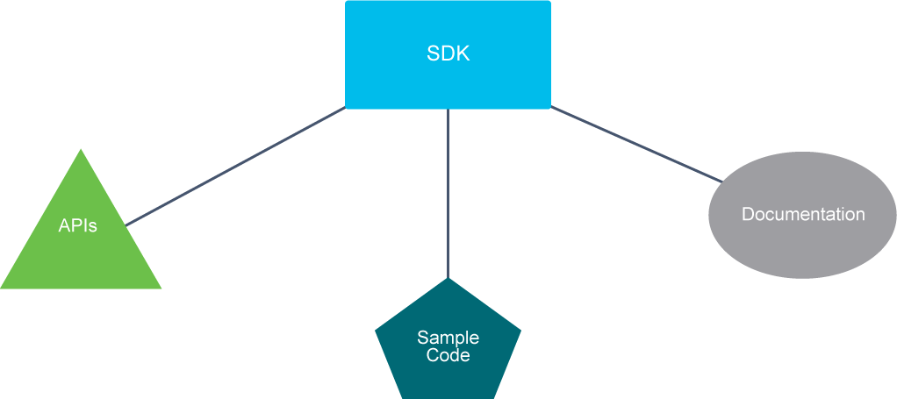
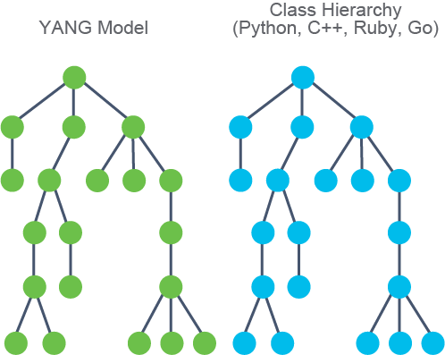
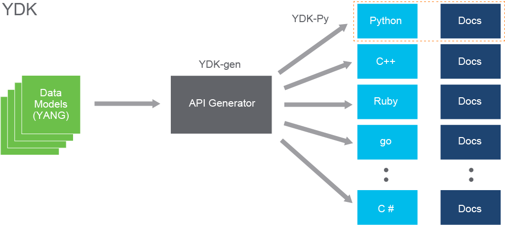
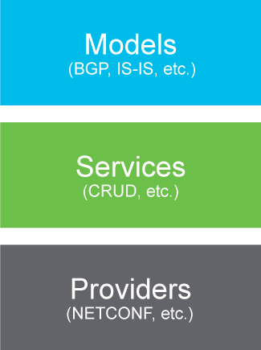
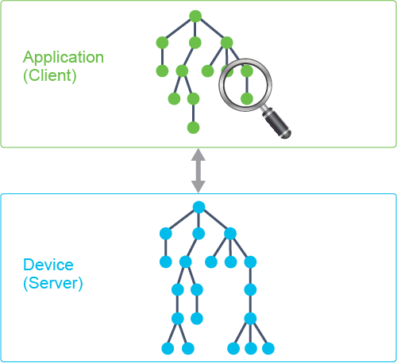

# Using Python Scripts and Cisco SDKs

A Software Development Kit (SDK) is a collection of tools that are used for developing software or applications. It is usually supplied by software and or hardware suppliers to ease integration with their products. An SDKIt often consists of APIs, tools, sample code, documentation, and much more.

Cisco developed various Python libraries and SDKs to help you interface with Cisco products. One example is the Cobra Python SDK for provisioning Cisco ACI, freely available from GitHub. But not all Cisco-developed SDKs are specific to Cisco devices. Some are useful across a wide variety of systems.



The YANG Development Kit (YDK) is an SDK that provides an easy way to access APIs modeled with YANG.

## YANG Development Kit

The main goal of YDK is to reduce the learning curve for interfacing with YANG-based APIs, such as NETCONF and RESTCONF. When using models, the programmatic interface (functions, data objects, URLs), called an API binding, can be automatically generated from data models, therefore the term "model-driven." As you can see in the figure below, the generated bindings directly correspond to the YANG model.



YDK's model-based bindings offer the following benefits:

- Simplify application development
- Abstract transport, encoding, modeling language
- API generated from the YANG model
- One-to-one correspondence between model and class hierarchy
- Multiple language (Python, C++, Ruby, Go, and so on)

YDK uses language-specific bindings, created from YANG models. Use pre-built, such as YDK-Py, or generate your own.



YDK-Py is a set of pregenerated Python modules that adhere to common YANG models. For example, you can use YDK-Py to use Python to configure a device that adheres to a given model such as the OpenConfig Border Gateway Protocol (BGP) model. For more advanced users who are developing custom data models, you can autogenerate your own Python bindings using YDK-gen. It is freely available on Cisco DevNet GitHub community at `https://github.com/CiscoDevNet`.

## Generating YDK Bindings

YANG data models contain the information required to generate the API bindings. YDK-gen ingests and reads the models, and its output are actual Python objects that can be used to interface with devices that support that given model.

To create custom Python bindings you will need:

- YANG module(s)
- Profile file
  - Contains metadata (header)
  - References modules
  - List dependencies
  - In JSON format

```JSON
module devnetasc-course {
    namespace "http://devnetasc.cisco.com/training";
    prefix "devnetasc";

    container system {
        leaf hostname {
            type string;
            description "Hostname for this device";
        }

        leaf-list domain-names {
            type string;
            description "List of domain names to search";
        }
    }
}
```

The first requirement is, of course, the YANG module or modules. Above listing contains a sample YANG file we will use. For simplicity, it only describes configuration of a managed system's host name and search domains (as used with DNS). This could also have been a device-specific data model, like Cisco IOS XE's, or a set of standard models, such as IETF's.

You also need to construct a JSON profile to use with `generate.py` script.

`**$ cat profiles/devnetasc.json**`

```json
{
  "name": "devnetasc",
  "version": "1.0",
  "models": {
    "file": [ "profiles/yang/devnetasc-course.yang" ]
  }
}
```

`**$ python generate.py --python --bundle profiles/devnetasc.json**`


Referenced models can include files, directories, or Git repositories.

A profile is simply metadata on the project, but more importantly, it states which YANG modules to include in the bundle. The figure uses the file parameter to specify modules, but you can also use Git or whole directories as well. Instead of `file`, you can use the `git` key to autoclone Git repositories or use the `dir` key if you have multiple modules in a given directory or directories on your local machine.

The last step is to create the bindings. You do this by running the `generate.py --python --bundle <profile>` command, as seen above.

> **Note** \
It is a common practice to store your profile in the profiles subdirectory of the YDK-gen directory.

Once you run the command, generated files are placed in ./ydk-gen/gen-api subdirectory. Here is an example output after the bindings are generated in the gen-api subdirectory:

```
$ tree gen-api/
gen-api/
└── python
    └── devnetasc-bundle
        ├── dist
        │   └── ydk-models-devnetasc-0.1.0.tar.gz
        ├── ydk
        │   ├── models
        │   │   └── devnetasc
        │   │       ├── _aug
        │   │       ├── __init__.py
        │   │       ├── _meta
        │   │       │   ├── __init__.py
        │   │       │   └── _devnetasc_course.py
        │   │       ├── devnetasc_course.py
        │   │       └── _yang_ns.py
        └── ...
```

You can start using them in Python immediately. Note how the path to Python module is constructed in the output above, as this is reflected in the import statements used inside scripts, such as this next one.

```python
from ydk.models.devnetasc import devnetasc_course

system = devnetasc_course.System()
system.hostname = 'router1'
system.domain_names = ['devnet.cisco.com', 'cisco.com']
```

`**>>> print(system.__dict__)**`

```output
{
           "hostname": "router1",
           "domain_names" : ["devnet.cisco.com", "cisco.com"]
}
```

Observe how every object in the YANG module gets an equivalent Python object.

The most important point to realize is that the modules are autogenerated. Without using model-driven APIs, each of these Python objects would need to be manually created. It would be a long and arduous process adding in error handling and client-side checks. Because these objects are autogenerated from models, all of that happens automatically.

## Using YDK

YDK is composed of a core package that defines services and providers, plus one or more module bundles that are based on YANG models. Each module bundle is generated using a bundle profile with YDK-gen and contains definitions for data objects. While data objects are also useful on their own, the true power of YDK comes from combining them with services and providers.

Functionality provided by different YDK components:

- Models group Python objects created for each YANG model (autogenerated).
- Services perform operations on model objects using providers.
- Providers implement services over different protocols.



This design allows us to separate the interface to operations (provided by services) from its implementation (providers).

Code using different protocols/providers can be mostly the same.

```python
from ydk.models.devnetasc import devnetasc_course
from ydk.services import CRUDService
from ydk.providers import NetconfServiceProvider

crud = CRUDService()
provider = NetconfServiceProvider(address=ip, username=user, password=pass)

system = devnetasc_course.System()
system.hostname = 'router1'
system.domain_names = ['devnet.cisco.com', 'cisco.com']
crud.update(provider, system)
```

Another significant benefit of model-driven APIs is client-side validation. It means your application that is written using YDK-Py bindings already understands the constraints that are embedded in the YANG model. Therefore, if you go to push a change to a device, an error is raised in Python (or a given language) before an API call is even made to the device.



YDK service will automatically perform local (client-side) validation for you:

- **Type checks:** enum values, string, number, and so on.
- **Value checks:** range, format, and so on.
- **Semantic checks:** key uniqueness/presence, mandatory values, and so on.

## Content Review Question

What are two aspects of client-side validation? (Choose two.)

- [X] YDK service will automatically perform local validation
- [X] semantic check (key uniqueness/presence, mandatory leafs, and so on)
- [ ] remote static check (enum, string, range, pattern, and so on)
- [ ] YDK service will automatically perform remote offline validation
- [ ] YDK does not allow client-side validation
