# Model-Driven Programmability in a Cisco Environment

One of the major byproducts of using models is model-driven programmability, which fully decouples transport, protocol, and encoding from the model being used. Over the past few years, YANG was predominantly used for NETCONF, which encodes only in XML. However, because models were first written in YANG, it was easy to build new tooling that autogenerated URLs and bodies that took advantage of models using a REST API in both JSON and XML. The model then becomes the definition of what can be done on a device that is completely decoupled from the encoding method.

Even though YANG is becoming the most widely used and standardized way of describing data models in networking, support is not yet ubiquitous.

Some devices and platforms may still be model driven but not support YANG, such as:

- Cisco Nexus 9000 and 3000 Series with NX-API REST
- Cisco Application Centric Infrastructure (ACI)

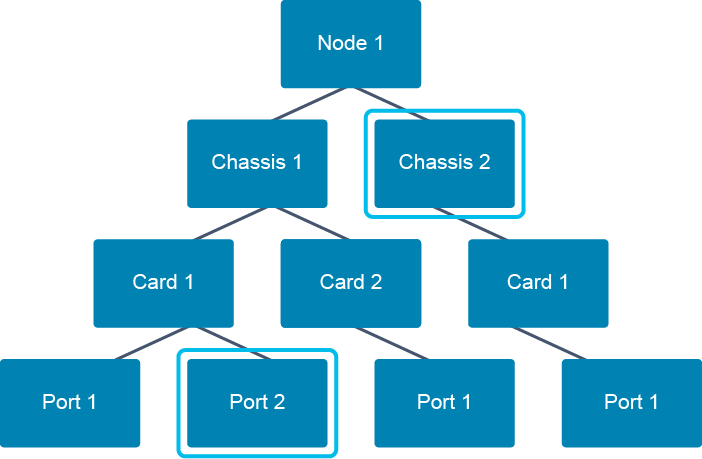

They implement an object model, like the example shown in the figure. Each of the items represents an object that describes a part or an aspect of the system. As the model only describes data (device configuration for example), it allows you to use different protocols and APIs for management.

Using a data model allows a platform like Cisco ACI to provide the following characteristics:

- Structured, computer-friendly access to data
- Choice of transport, protocol, and encoding
- Model-driven APIs for abstraction and simplification
- Wide standard support while using open source
- Deploys services faster and simpler
- Simplifies application development
- Models manage abstractions of the underlying network device data structures (configurations, state data, and so on)

These systems use a custom object model that may offer the same properties as if it was built using YANG. For example, with Cisco ACI, everything is an object. Every object has associated properties and constraints. These constraints are defined in the Cisco ACI Management Information Model as opposed to a YANG model. This is just a different way to model network devices. However, if YANG is not used, any associated YANG tooling is not supported. But Cisco ACI already has a robust toolset of libraries and an object model browser that you can use instead.

## Cisco NX-OS Programmability

The Cisco NX-OS open platform allows for programmatic access to Cisco Nexus platforms, providing network administrators with increased scale, agility, and efficiency. Open NX-OS on Cisco Nexus platforms offers a rich software suite that is built on a Linux foundation that exposes APIs, data models, and other programmatic constructs.

This support is delivered by several means, including NX-API CLI and NX-API REST, NETCONF, on-box Linux and Python scripting capabilities, and several traditional means already familiar to network administrators, such as the Scheduler feature, Embedded Event Manager (EEM), and PowerOn Auto Provisioning (POAP).

Cisco Nexus Programmability Features

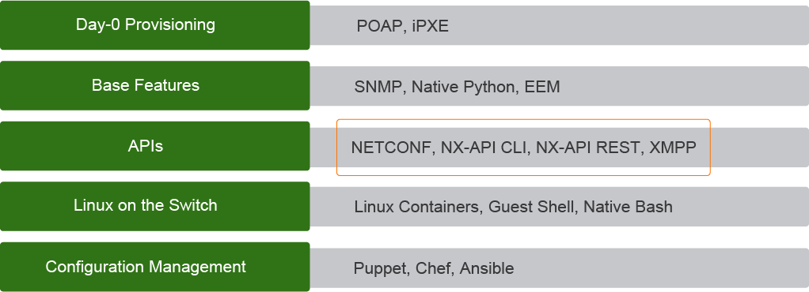

Here are the most common scenarios for device configuration and usage of device APIs:

- **Day 0 provisioning:** Zero-touch device provisioning is commonly associated with compute devices, but network devices have had this capability for years. POAP was designed to provide advanced Day 0 provisioning capabilities using an extensible framework. POAP includes the ability to execute Python scripts as part of its workflow. Today, POAP can download and install additional management agents and apply specific configurations that are based on information such as location in a network topology.
  - A similar approach is achieved by using Preboot Execution Environment (PXE). PXE has extended its presence into the network as infrastructure devices are increasingly managed more like servers. Cisco NX-OS uses iPXE, which utilizes an open source network firmware that is based on gPXE/Etherboot.
- **Base features:** In addition to providing traditional SNMP support, the Cisco Nexus platform also provides Python scripting capability on devices to provide programmatic access to the switch CLI to perform various tasks, including POAP and EEM actions. The Python interpreter is included in the Cisco NX-OS Software.
- **APIs:** Cisco NX-OS provides a built-in web server to respond to HTTP calls to the switch to improve accessibility, extend capability, and improve manageability of Cisco NX-OS. APIs include NETCONF, NX-API CLI, NX-API REST, and XMPP.
- **Linux on the switch:** Cisco Nexus switches have always been built upon a Linux foundation making available a native Linux Bourne Again Shell (Bash), but today, Cisco NX-OS also provides a Linux guest shell, which is a separate Linux environment running on the switch inside a container. Currently utilizing a CentOS distribution, an important benefit for the guest shell is the ability to securely run third-party applications that monitor and control the switch.
- **Configuration management:** Cisco NX-OS incorporates a set of tools, features, and capabilities that enable automation. Modern configuration management tools like Puppet, Chef, and Ansible drive programmability.

## NX-API CLI

The following are main features of the NX-API CLI:

- RPC-style web API that enables programmatic access to Cisco Nexus devices
- Improves accessibility of the CLI by making them available off box
- Supports `show` commands, configurations, and Linux Bash

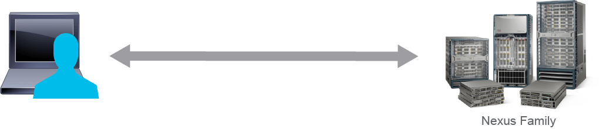

On Cisco Nexus devices, CLIs are run only on the device and used far too often to manage data center networks. NX-API improves the accessibility of these CLIs by making them available outside of the switch by using HTTP and HTTPS. You can use the NX-API as an extension to the existing Cisco Nexus CLI. The NX-API CLI API is great for network engineers getting started with the API because it still makes use of commands. It sends commands to the device, wrapped in HTTP and HTTPS, but receives structured data back. You have the ability to send `show` commands, configuration commands, and Linux commands directly to the switches using NX-API CLI.

Transports are supported for NX-API:

- Runs on HTTP and HTTPS
- CLI commands are encoded into the HTTP/HTTPS POST body
- The request/response format is encoded with JSON-RPC, JSON, or XML
- NGINX HTTP back-end web server to listen for HTTP requests

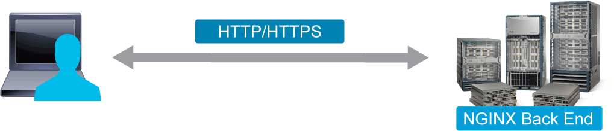

NX-API CLI uses HTTP and HTTPS as its transport. CLIs are encoded into the HTTP and HTTPS POST body. Here is one example of an HTTP request using JSON-RPC encoding:

```
[
  {
    "jsonrpc": "2.0",
    "method": "cli",
    "params": {
      "cmd": "show hostname",
      "version": 1
    },
    "id": 1
  }
]
```

Matching response

```
{
  "jsonrpc": "2.0",
  "result": {
    "body": {
      "hostname": “n9k2.cisco.com"
    }
  },
  "id": 1
}
```

The NX-API back end uses the NGINX HTTP server. The NGINX process, and all its children processes, are under Linux cgroup protection where the CPU and memory usage are capped. If the NGINX resource usage exceeds the cgroup limitations, the NGINX process is restarted and restored. The NX-API back end uses a lightweight on-box web server to listen for HTTP requests, which are converted to CLI and used to retrieve data or push configurations. The request-and-response format is encoded with JSON-RPC, JSON, or XML.

NX-API supports XML, JSON, and JSON-RPC, and commands are sent to a single HTTP request within a CLI wrapper. The following examples show the same request and response for `show hostname` for all three data encoding formats.

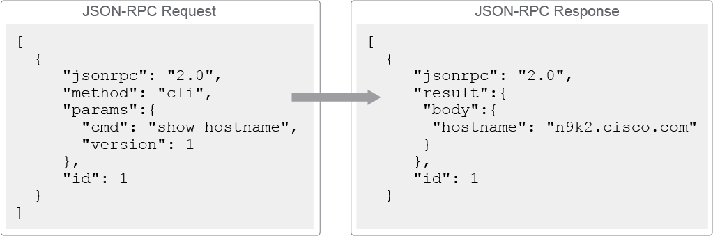

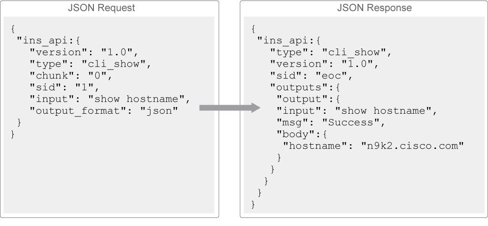

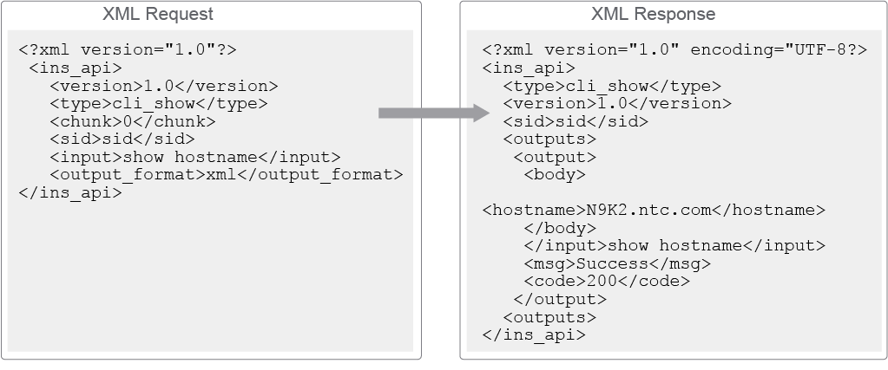

NX-API supports HTTPS; therefore, all communication to the Cisco Nexus device can be encrypted. By default, NX-API is integrated into the authentication system on the device. You access the device through the NX-API using user accounts containing a username and password, which are contained in the HTTP header.

NX-API is disabled by default and can be enabled by using the feature manager CLI command. NX-API provides a session-based cookie, nxapi_auth, when users first successfully authenticate. The session cookie expires in 600 seconds, which is a fixed value that cannot be modified.

With the session cookie, the username and password are included in all subsequent NX-API requests that are sent to the device. If the session cookie is not included with subsequent requests, another session cookie is required and is provided by the authentication process.

The NX-API feature must be enabled via the CLI.

- Enable the feature via the command line.
- Identify the alternate port being used (if any).
- Identify an HTTPS certificate file to use.
- Enable the NX-API Sandbox.


The NX-API Sandbox is available on the switch itself and accessed via a web browser. There are helpful buttons available with commonly used built-in scripts. It is a great way to become familiar with the API because you get to visualize the JSON/XML objects coming back without having to write actual code.

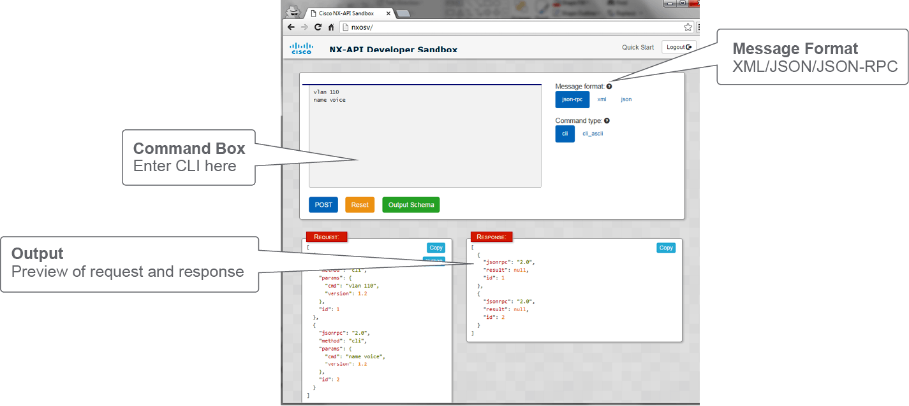

The buttons on the right are used to select JSON-RPC, JSON, or XML encodings. Commands are entered in the Command Box and executed with the Post button. The request being sent to the device is displayed in the Request box in the lower left, and the response output from the device is displayed in the lower right.

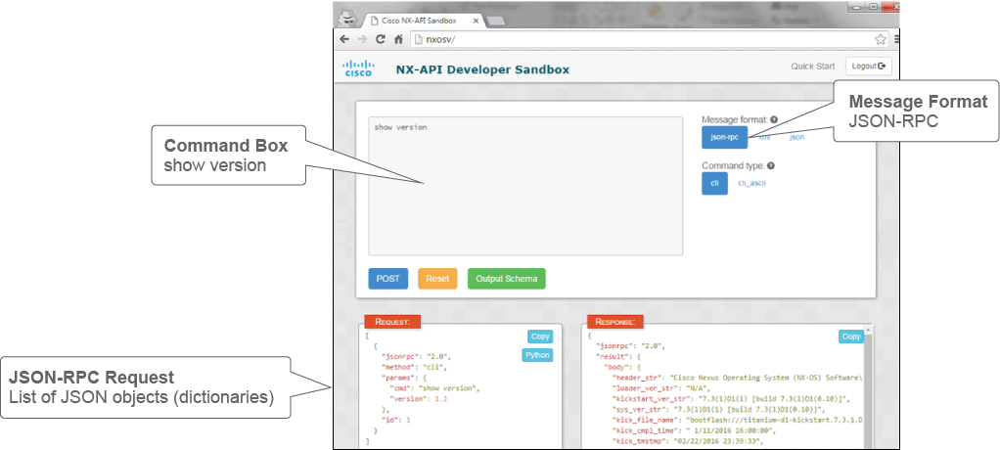

When you are using JSON-RPC, you are always sending a list of JSON objects (dictionaries), even if it is a list of one (single command). Here is an example of sending show version with the associated request and response. The response is similar in that it is always a list of dictionaries for JSON-RPC.

> **Note** \
When you use JSON encoding, you only receive a list in the response when you send more than one command. On the other hand, JSON-RPC always replays with a list of dictionaries.

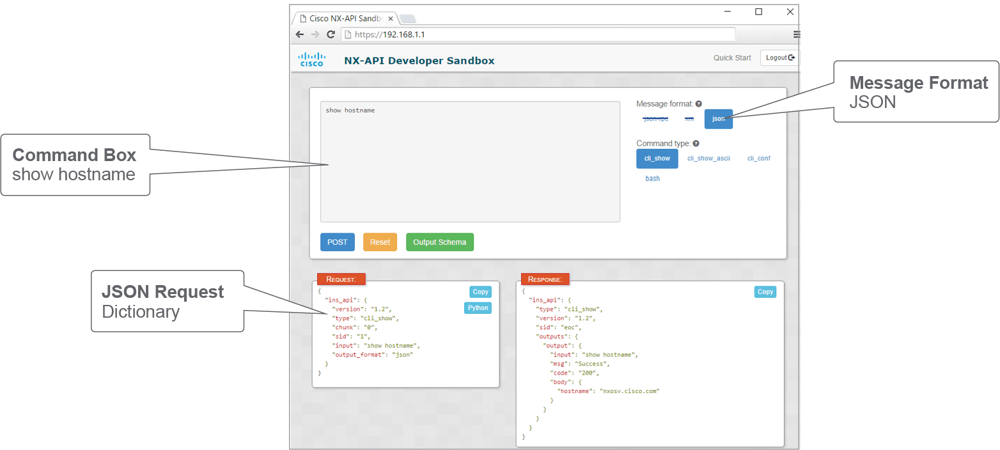

Here is another example of sending a command but this time using the JSON format.

> **Note** \
JSON sends a dictionary when sending one command but sends a list of dictionaries when sending more than one command.

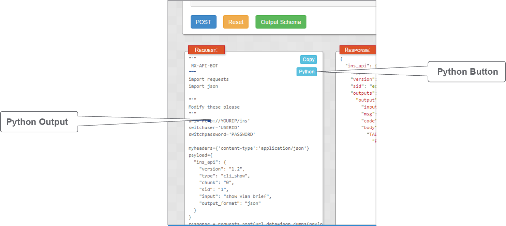

The NX-API Sandbox can convert CLI into Python automatically to help get you started. In the Request box, click the `Python` button. It uses a built-in Python requests module to convert the commands to a Python script that can be copied into a .py file.

## NX-API REST

NX-API REST is supported on Cisco Nexus 9000 and 3000 Series Switches starting with 7.0(3)I2(2). NX-API REST is the next-generation API for the Cisco Nexus platform in that it supports sending and receiving objects in the API payload. If you recall, NX-API CLI supports sending commands to the device while receiving structured data back (JSON, XML). With NX-API REST, it is completely based on structured data. Therefore, JSON/XML payloads are sent to the device in the HTTP request and received from the device in the response.

This list outlines the NX-API REST implementation:

- NX-API REST is an evolved version NX-API CLI.
- Complete REST interface that brings model-driven programmability to standalone Cisco Nexus family switches.
- Configuration and state information of the switch is stored in a hierarchical tree structure that is known as the MIT.

The implementation of NX-API REST is similar to the model that is used by Cisco ACI. All information about the switch, including configuration and state data, is stored in a hierarchical tree called the Management Information Tree (MIT). Every object in the tree can be directly accessed via the REST API.

Here are the main features of NX-API REST:

- Object instances are referred to as managed objects.
- Managed objects are also of a certain type of class.
- A unique distinguished name can identify every managed object in the system
- URLs and URIs map directly to distinguished names identifying objects on the tree
- Data can be encoded in XML or JSON

Every object in the MIT is referred to as a managed object. Each managed object is also of a certain type of class. For example, Ethernet interfaces are of type l1PhysIf, and switch virtual interfaces (SVIs) are of type sviIf, but all interfaces are of type intf. These types are called classes.

It is important to understand the relationship, between distinguished names and classes because you can make an API to the Cisco Nexus switch with NX-API REST, using a distinguished name-based query or class-based query. For example, you can query a single interface (distinguished name) or query all interfaces of a given type (class).

NX-API REST operates in forgiving mode, which means that missing attributes are substituted with default values (if applicable) that are maintained in the internal Data Management Engine (DME). The DME validates and rejects incorrect attributes. The API is also atomic. If multiple managed objects are being configured and any cannot be configured, the API stops its operation. It returns the configuration to its prior state, stops the API operation that listens for API requests, and returns an error code.

URLs and URIs map directly to distinguished names identifying objects on the tree. Any data on the MIT can be described as a self-contained structured text tree document encoded in XML or JSON.

NX-API REST supports three methods:

- **GET:** Used to retrieve and read information from the MIT.
- **DELETE:** Used to delete and remove an object from the MIT.
- **POST:** Used to create or update an object within the MIT. In NX-API REST, POSTs to the API are idempotent, meaning that the change is made just once no matter how many times the API is called. This is because requests specify managed object's DN.

There is a dedicated API to handle authorization when using the API. The device returns a token that is then sent in subsequent API calls that perform CRUD operations.

Regarding Content-Type and Accept, Cisco Nexus switches ignore them, because the payload format must be specified as a file extension. All API calls using NX-API REST will have either ".json" or ".xml" appended to them. This notation lets the switch know what the Content-Type is and how to respond—for example, with which encoding format.

The URL format that is used can be represented as follows:

`/api/[mo|class]/[dn|class][:method].[xml|json]?{options}`

The various building blocks of the preceding URL are as follows:

- **System:** System identifier; an IP address or DNS-resolvable hostname
- **mo | class:** Indication of whether it is a managed object or tree or class-level query
- **class:** Managed-object class (as specified in the information model) of the objects queried; the class name is represented
- **dn:** Distinguished name (unique hierarchical name of the object in the MIT tree) of the object queried
- **method:** Optional indication of the method being invoked on the object; applies only to HTTP POST requests
- **XML | json:** Encoding format
- **options:** Query options, filters, and arguments

Here are GET method examples for NX-API REST:

- http://n9k/api/mo/sys/intf/phys-[eth2/5].json
- http://n9k/api/mo/sys/bgp/inst.json

The typical sequence of configuration is:

- **Authenticate:** Call https://<IP of Nexus switch>/api/mo/aaaLogin.xml with a payload in XML. This call returns a cookie value that the browser uses for the next calls.
- **Send HTTP POST to apply the configuration:** The URL of the POST message varies depending on the object. Here is an example: https://<IP of Nexus switch>/api/mo/sys/bgp/inst.json. Api indicates that this call is to the API. Mo indicates that this call is to modify a managed object. Bgp/inst refers to the BGP instance, and .json indicates that the payload is in JSON format. If the end of the URL is .xml, that would mean that the payload is in XML format.
- **Verify the HTTP status code:** You should want a response of 200 OK. With the capability to address and access an individual object or a class of objects with the REST URL, you can achieve complete programmatic access to the entire object tree and to the entire system.

Here is an example of a managed object-based or distinguished name-based query. It is based on the URI being used: /api/mo/sys/intf/phys-[eth2/5].json. You can also see that it is an HTTP GET, so you are only retrieving information with this API call.

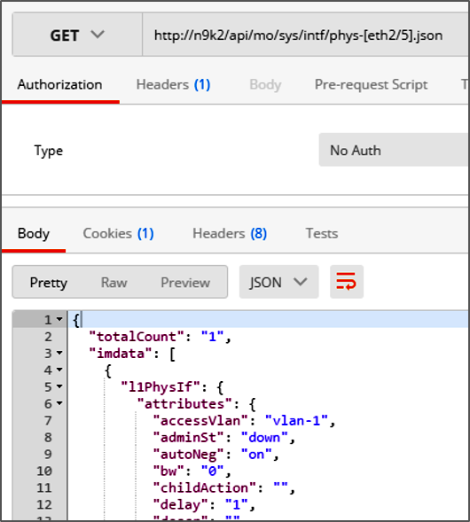

Remember that /api/mo signifies that it is a distinguished name-based query. Therefore, a specific object is being queried—in this example, physical interface Ethernet2/5. You can also see in the response two keys that are used quite often. The first is "totalCount" and this count is "1," which makes sense because there is only one Ethernet2/5 interface. All data in NX-API responses is returned in the "imdata" key; "imdata" is a list of dictionaries (JSON objects), and in this case, it is a list of one.

In this example, you can see that Postman is being used to make an HTTP POST request. This request is performing an admin down (shutdown) of Interface Ethernet2/5.


You can see that /api/mo/sys/intf.json is the URI being used, and as such, it means that it is a distinguished name-based query. But in this example, you can see that the parent object "intf" is specified in the URL, and the individual object being modified is in the JSON payload.

You could have also used the full URI to specify Eth2/5 as well (/api/mo/sys/intf/phys-[eth2/5].json) and kept the same JSON body.

In this example, Postman is being used to make an HTTP GET request. This request is in contrast to previous examples because it is a class-based query. The URI being used here is /api/class/l1PhysIf.json. Notice how it starts with /api/class instead of /api/mo.

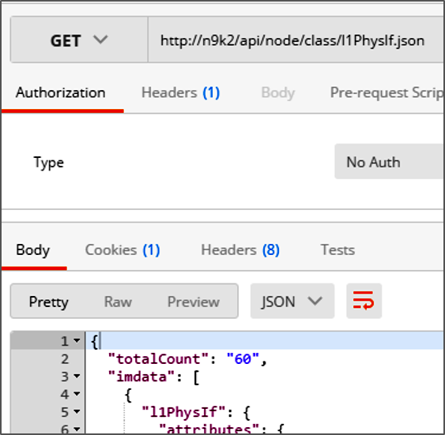

All Ethernet interfaces are of type l1PhysIf, which means you can query the class to obtain information for all interfaces (objects) within the class.

## Cisco nxtoolkit

Cisco has published a Python library called nxtoolkit that is a set of modules that simplify getting started with Python to program against NX-API REST. The library can be used to perform common operations such as collect information from Cisco Nexus devices but also to make configuration changes. Using nxtoolkit eliminates the need to worry about the underlying URLs being used because they are abstracted away from the developer and built into the library itself.

While nxtoolkit is a Python library that simplifies working with NX-API REST on Cisco Nexus switches, it also comes with a collection of prebuilt scripts that perform common operational tasks. These prebuilt scripts can be used immediately to eliminate the need to write any code. All that you need to do is enter specific device information such as credentials and IP address information and execute the script.

Visore is a tool for NX-API REST that is built into each switch. It is a managed object browser. It allows you to browse and navigate the MIT in real time and inspect the state of each and all objects. Visore is a great tool to understand and learn about the relationship between all objects of the system. You can access Visore by navigating to http(s)://<nexus>/visore.html and authenticating using standard device credentials.

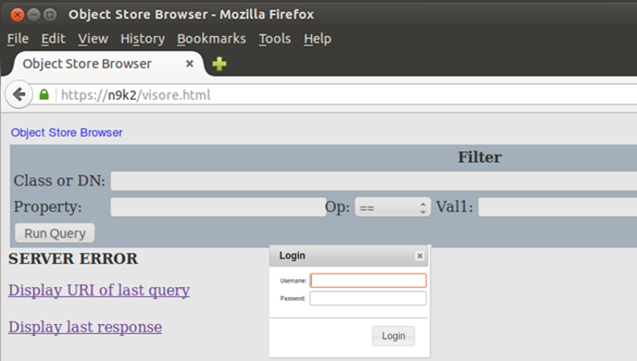

The following figure shows a class-based query being made for the class rmonEtherStats. Because it is a class, it is going to return interface stats for all associated interfaces. Notice how 63 objects are returned. Only the first one is shown in the figure, but you can see the first one displayed also includes an attribute for its distinguished name.

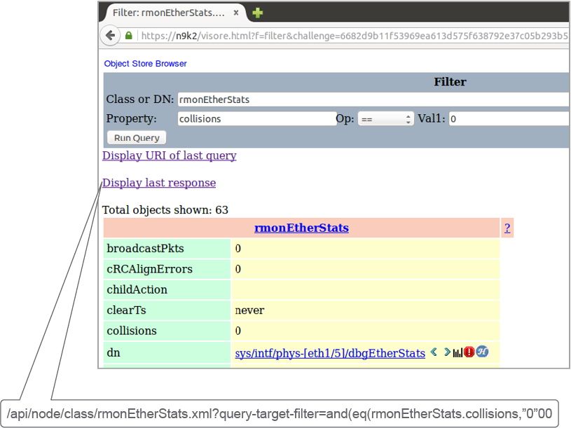

Visore is helpful because it has two links in the center that say "Display URI of last query" and "Display last response." By clicking "Display URI of last query," you get to see the URI, which for this API call was:

`/api/node/class/rmonEtherStats.xml?query-target-filter=and(eq(rmonEtherStats.collisions,"0"))`

Once you have the URI, you are able to make native REST calls using Postman or the equivalent. As you can see, the API also supports filters, and using Visore simplifies learning how to use them by seeing the URIs generated automatically. This API call queried the device for all objects of class type rmonEtherStats but then added a filter to only return those objects that had 0 collisions.

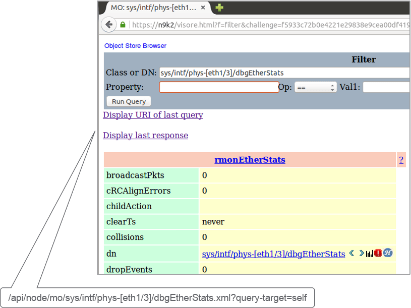

The previous figure was used to show how to make a class-based query for a specific interface. This example builds on it by using the distinguished name provided in the API response from the class-based. This query, because it is based on the distinguished name, is specifically querying a single given object.

If you wanted to get the results in JSON, you could use the URI generated and add ".json" to it, as shown here:

`/api/node/mo/sys/intf/phys-[eth1/3]/dbgEtherStats.json `

This response would include the Ethernet statistics just for Ethernet1/3 because it is a distinguished name-based query.

This figure compares and contrasts class-based and distinguished name-based queries one more time.

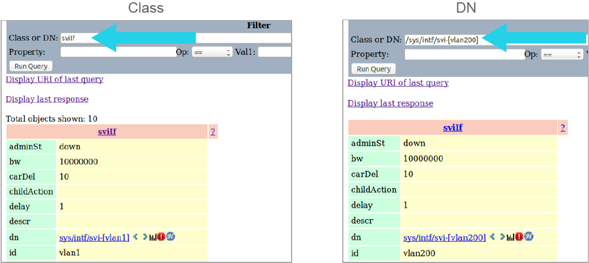

You can query all switched virtual interfaces on the system with the class-based query:

`/api/node/class/sviIf.xml`

Notice how there were 10 objects that were returned with this API call. It means that there were 10 SVIs on the switch when this API was executed on the switch.

You can also query a single SVI such as "interface vlan200" with the following distinguished name-based query:

`/api/node/mo/sys/intf/svi-[vlan200].xml`

> **Note** \
The addition of the /node in the resource is optional, making API calls back into the system.

## Content Review Question

Which two methods are supported in NX-API REST? (Choose two.)

- [x] POST
- [x] GET
- [ ] PATCH
- [ ] PUSH
- [ ] UPDATE
