# SDN and IBN

For many years, designing and then building a network started with the network, meaning the devices in the network. Often, the needs of the application or data that you were putting on the network were never considered until you installed the application and it did not work as needed. These same networks were decentralized in nature, demanding that engineers often configure each device, device by device, for their specific needs. Then, this configuration was repeated for the specific needs of each application, taking days if not weeks or longer to finally deploy an application.

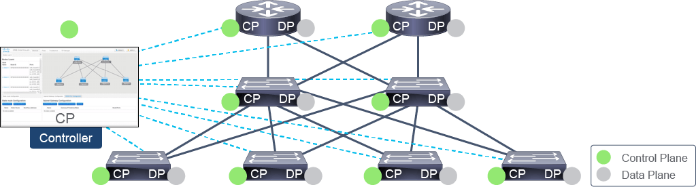

SDN moves away from a decentralized approach to management and to a centralized controller. It also moves away from configuring exact settings on each device and centrally configures the needs of the application. Those needs or intents are pushed from a central controller to the devices where the application resides. SDN seeks to program network devices either through a controller or some other external mechanism. It allows the network to be managed as a whole and increases the ability to configure the network in a more deterministic and predictable manner. Several common themes in this trend are disaggregation of the control and data planes of a network device, virtualization of network functionality, policy-centric networking, and movement toward open protocols. Examples of SDN are Cisco Application Centric Infrastructure (ACI) in the data center, Cisco Digital Network Architecture (DNA) Center in the campus, and Cisco Network Services Orchestrator (NSO) for enterprise- and service provider-level administration. SDN is a foundational building block of IBN.

A trend in the networking industry is to focus on business goals and applications. IBN transforms a hardware-centric, manual network into a controller-led network that captures business intent and translates it into policies that can be automated and applied consistently across the network. The goal is for the network to continuously monitor and adjust network performance to help assure desired business outcomes. IBN builds on SDN principles, transforming from a hardware-centric and manual approach to designing and operating networks that are software-centric and fully automated and that add context, learning, and assurance capabilities. IBN captures business intent and uses analytics, machine learning, and automation to align the network continuously and dynamically to changing business needs. That means continuously applying and assuring application performance requirements and automating user, security, compliance, and IT operations policies across the whole network.

An example where SDN and IBN can be used is a modern-day data center. A modern data center is at a large scale and hardware-dense, comprising multiple different technologies from multiple different vendors. Such a large-scale, multivendor, and dense environment will not support a common command line but instead needs to be configured through multiple different clients and GUIs.

Properties of a modern-day data center:

- Large scale
- Densely populated
- Multiple technologies
- Multivendor

Device-by-device management in a modern data center does not scale.

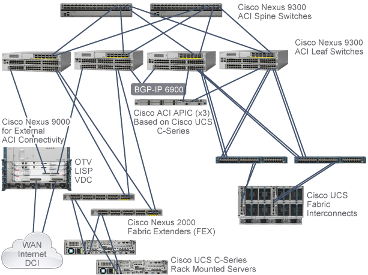

Consider a scenario where you are asked to simply deploy a new host in an enterprise application. This new host may be a virtual machine (VM). That VM needs to be created and an operating system installed. The newly installed operating system needs to be customized. The host will need access to storage, be placed on a VLAN, and given an address that is part of a routable subnet. Just in that scenario alone, for example, an engineer will need to use the vSphere Client to create a new VM, install and customize Windows Server through the server GUI, and perhaps configure access to existing logical unit numbers (LUNs) on a NetApp storage array using the System Manager session. Additionally, the engineer may need to extend an existing VLAN on Cisco switches and ensure routed connectivity through Cisco routers. This scenario uses four different vendors across five different technologies and four different client interfaces.

Going through such a decentralized management approach is simply not scalable, quick, consistent, or secure, to name a few attributes. To scale to the needs of a modern data center, you need a new approach; Cisco SDN and taking an intent-based approach to network configuration does exactly that.

## SDN Characteristics and Components

SDN addresses the needs for:

- Centralized configuration, management, control, and monitoring of network devices (physical or virtual)
- The ability to override traditional forwarding algorithms to suit unique business or technical needs
- Allowing external applications or systems to influence network provisioning and operation
- Rapid and scalable deployment of network services with life-cycle management

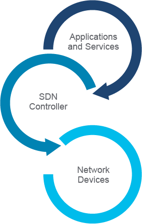

SDN characteristics and components are as follows:

- **Network devices:** Physical and virtual devices that participate in the network, responsible only for forwarding packets based on instructions from the SDN controller. They communicate with SDN controller's southbound interface.
- **SDN controller:** The brains of SDN, responsible for communicating with network devices and applications and services using application programming interfaces (APIs). The SDN controller has full awareness of the network state by keeping information in a local database.
- **Southbound interface:** This interface is a layer of device drivers that the SDN controller uses for interacting with physical and virtual devices in the network.
- **Northbound interface:** Representational State Transfer (REST) APIs facing outside the network so applications and services can interact with the SDN controller and use resources in the network.
- **Network management applications and services:** Clients accessing resources in the network using REST APIs. Clients can be automation user applications, automation servers, or software libraries for many programming languages like Python, Java, Ruby, and others.

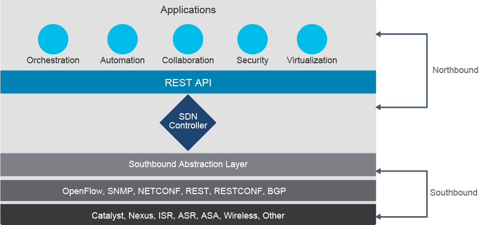

Northbound APIs or northbound interfaces are responsible for the communication between the SDN controller and the services that run over the network. Northbound APIs enable your applications to manage and control the network. So, rather than adjusting and tweaking your network repeatedly to get a service or application running correctly, you can set up a framework that allows the application to demand the network setup that it needs. These applications range from network virtualization and dynamic virtual network provisioning to more granular firewall monitoring, user identity management, and access policy control. Currently, REST API is predominantly being used as a single northbound interface that you can use for communication between the controller and all applications.

SDN controller architectures have evolved to include a southbound abstraction layer. This abstraction layer abstracts the network away to have one single place where you start writing the applications to and allows application policies to be translated from an application through the APIs, using whichever southbound protocol is supported and available on the controller and infrastructure device. This new approach allows for the inclusion of both new and southbound controller protocols and APIs, including but not limited to:

- **OpenFlow:** An industry-standard API defined by the Open Networking Foundation (ONF), OpenFlow allows direct access to and manipulation of the forwarding plane of network devices such as switches and routers, both physical and virtual (hypervisor-based). The actual configuration of the devices is by the use of Network Configuration Protocol (NETCONF).
- **NETCONF:** An IETF standardized network management protocol. It provides mechanisms to install, manipulate, and delete the configuration of network devices via remote procedure call (RPC) mechanisms. The messages are encoded by using XML. Not all devices support NETCONF; the devices that do support it advertise their capabilities via the API.
- **RESTCONF:** In simplest terms, RESTCONF adds a REST API to NETCONF.
- **OpFlex:** An open-standard protocol that provides a distributed control system that is based on a declarative policy information model. The big difference between OpFlex and OpenFlow lies with their respective SDN models. OpenFlow uses an imperative SDN model, where a centralized controller sends detailed and complex instructions to the control plane of the network elements to implement a new application policy. In contrast, OpFlex uses a declarative SDN model. The controller, which, in this case, is called by its marketing name Cisco Application Policy Infrastructure Controller (APIC), sends a more abstract policy to the network elements. The controller trusts the network elements to implement the required changes using their own control planes.
- **REST:** The software architectural style of the World Wide Web. REST APIs allow controllers to monitor and manage infrastructure through the HTTP and HTTPS protocols, with the same HTTP verbs (GET, POST, PUT, DELETE, and so on) that web browsers use to retrieve web pages.
- **SNMP:** Simple Network Management Protocol (SNMP) is used to communicate management information between the network management stations and the agents in the network elements.
- **Vendor-specific protocols:** Many vendors use their own proprietary solutions that provide REST API to a device. For example, Cisco uses NX-API for the Cisco Nexus family of data center switches.

### SDN Benefits

SDN offers the following benefits:

- **Centralized provisioning:** Every networking device is provisioned from an SDN controller. There is no need for a network administrator to connect to any device and configure it using CLI.
- **Network security:** The SDN controller knows everything about the network and enables easy collection and analysis of network traffic. This information can be used to automatically respond to suspicious activity. Also, by using centralized provisioning, policies can be applied consistently through the whole network and applied to all devices.
- **Faster deployments:** Applications and services can be deployed faster by using open APIs. Opening a ticket and waiting for the network team to configure devices and security policies to enable your new application becomes a thing of the past.
- **Programmable:** Network infrastructures do not have to be rebuilt to be used for a new purpose. They can be programmed to change on demand without the need to manually configure a single device. Applications can consume REST APIs on the northbound interface to request a network change. The SDN controller translates that request and uses southbound interface APIs to configure network devices for a new purpose.

SDN allows network engineers to provision, manage, and program networks more rapidly, because it greatly simplifies automation tasks by providing a single point of administration for the programming of the infrastructure. The nature of controller-based networking makes centralized policy easy to achieve. Networkwide policy can be easily defined and distributed consistently to the devices connected to the controller. For example, instead of attempting to manage access control lists (ACLs) across many individual devices, a flow rule can be defined on the central controller and pushed down to all the forwarding devices as part of the normal operations.

Compared with traditional networking, controller-based networking makes it easy to define special treatment for specific network traffic. Instead of adding complexity to the network through advanced mechanisms like policy-based routing, a traffic flow rule can be defined on the controller and pushed down to all the forwarding devices as part of normal operations. The largest benefit here is that there is a device, a controller, that has a unified view of the network in one location.

With automated processes, the time to provision a new service or implement a change request is drastically reduced. What would previously take days or weeks to implement can be automated to run in hours, along with testing and verification. Another important step in automation is life-cycle management, from Day 0 design and installation of the infrastructure components to Day 1 service enablement and Day 2 management and operations. Also, after the customer no longer needs the service, you must deallocate the resources that are used and clean up the configuration on the devices. Even with proper change management procedures, this process is tedious at best if performed manually. If the process is fully automated, you can make sure that the same configuration changes that were applied when provisioning the new service will be removed when it is deprovisioned.

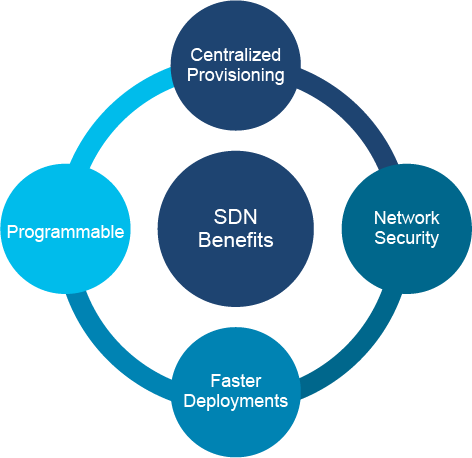

## Intent-Based Networking

IBN adds context, learning, and assurance capabilities to SDN by tightly coupling policy with intent. “Intent” enables the expression of both business purpose and network context through abstractions, which are then translated to achieve the desired outcome for network management. In contrast, SDN is purposely focused on instantiating change in network functions.

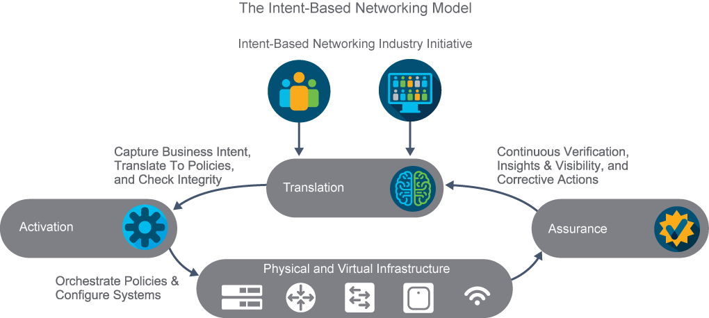

Three foundational elements of IBN are as follows:

- The translation element enables the operator to focus on "what" they want to accomplish, and not "how" they want to accomplish it. The translation element takes the desired intent and translates it to associated network policies and security policies. Before applying these new policies, the system checks if these policies are consistent with the already deployed policies or if they will cause any inconsistencies.
- Once the new policies are approved, the activation element automatically deploys the new policies across the network.
- With the assurance element, an intent-based network performs continuous verification that the network is operating as intended. Any discrepancies are identified; root-cause analysis can recommend fixes to the network operator. The operator can then "accept" the recommended fixes to be automatically applied, before another cycle of verification. Assurance does not occur at discrete times in an intent-based network. Continuous verification is essential because the state of the network is constantly changing. Continuous verification assures network performance and reliability.

IBN is a form of network administration for automating administrative tasks across the network by allowing only the goal of a request to be specified. For example: "Make sure that this application can access that server."

It is up to the IBN system to determine the following:

- Determine intent
- Find network devices between the application and server
- Find an optimal route between the application and server
- Configure network devices required for the optimal route

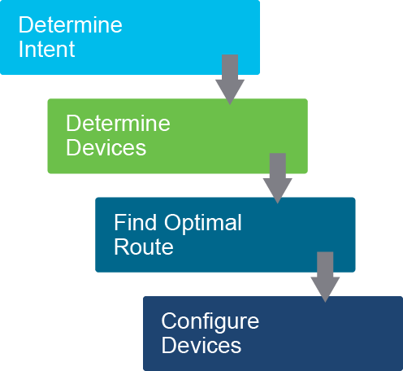

In some ways, IBN is similar to SDN:

- They both rely on a centralized controller to manage devices.
- They are both aware of the current network state and state of every device.

Where they differ is how the network is administered. Software-defined networks focus on how a specific set of network devices should operate, while intent-based networks are focused on what must be done to get to the final goal. This level of abstraction is a primary component in IBN. You can think of IBN as a next step in the evolution of SDN.

### IBN Characteristics

Every intent-based network, together with characteristics of an SDN, incorporates the following features:

- **Translation and validation:** Every intent is verified that it can be properly executed. Only after successful validation can the translation of the intent to valid actions begin.
- **Automation:** Resource allocation and policy enforcement are done automatically after the desired state of an intent is known.
- **State awareness:** The current state of the network is always known by gathering and monitoring data from all network devices.
- **Assurance and optimization:** By learning from gathered data, IBN can assure that the desired state of a network is always maintained. This feature is where artificial intelligence and machine learning become an important part of the network.

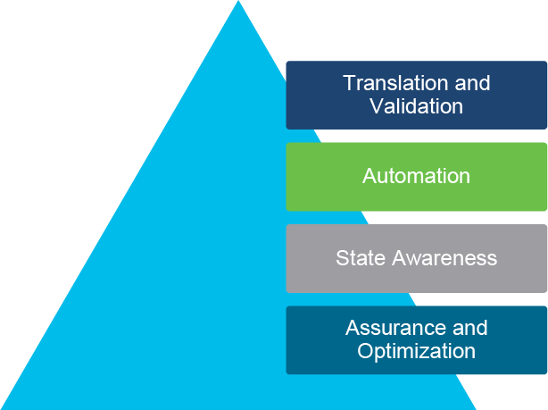

### IBN Benefits

In addition to the benefits of having a software-defined network, the following are benefits of having IBN:

- Reduces complexity: Management and maintenance of an IBN network becomes much simpler.
- Simplifies deployment: Additional network services deploy faster by abstracting network actions. You do not need to specify what, where, or how to configure specific devices or services; you only request the final state.
- Strengthens security: Machine-learning algorithms and artificial intelligence can learn and respond to new threats before they become an issue.
- Improves agility: Having network data in one place helps the network to quickly adapt to changes and have all services available despite failures.
- Eliminates repetition: Any repetition is prone to errors. Even by using APIs, programmers can make errors. Automation is essential to eliminating repetitive tasks and keeping manual labor to a minimum.

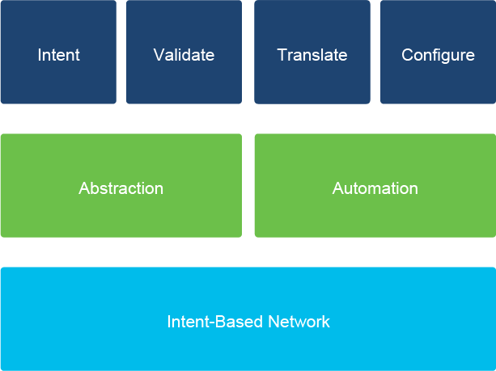

### IBN Architecture

An enterprise network infrastructure may be managed in different domains, separating the operational duties into campus and branch sites, WAN, data center, and the cloud. Applications hosted in the data center or cloud, as well as clients, may also have their own operational procedures and therefore be considered domains. In an IBN, one or more domains are expected to be governed by a controller, which provides a holistic view of the infrastructure and maintains a consistent state (configurations, software images, and so on).

The intent-based system accommodates this arrangement of network infrastructure into domains. Translation and orchestration capabilities are applied across domains, allowing for the characterization of networkwide intent-based policies across the campus and branch sites, WAN, data center, and the cloud. An orchestration function disseminates the captured policies to the relevant domains, which also enables restriction of the scope by design of some policies.

Automating the translation of the model-based policies into device-specific configurations, and instantiating these into the network infrastructure, is covered by the domain-specific controllers. IBN assurance functions may apply to a particular domain to ensure adherence to the expressed intent-based policy. Additionally, assurance functions operate across domains to check for compliance with the expressed intent networkwide and end to end (from application to application, regardless of where the apps are hosted).

The following figure illustrates additional functional details of the translation, activation, and assurance building blocks of IBN and how they relate to different infrastructure domains. The figure also highlights the feedback loop that sends insights gained by assurance back into the activation functions for ongoing optimization of the network.

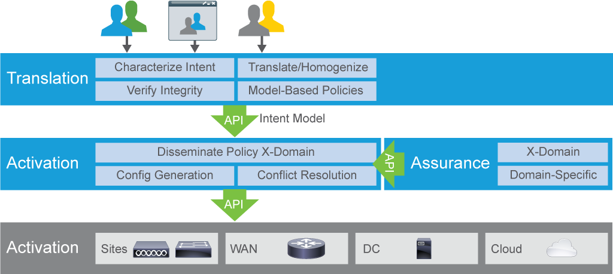

IBN is made possible thanks to next-generation, fully programmable ASICs developed and integrated into IBN-capable routers and switches. Modern router and switch operating systems, such as Cisco IOS-XE or NX-OS systems, provide the necessary APIs for configuring these ASICs. The operating systems also are available in a virtual form factor (on the server and in the cloud) and a physical form factor (embedded in a switch and router), making it very versatile.

For example, in the desktop and campus domains, you will find a Cisco Catalyst 9000 Series family of switches, extending the Catalyst architecture to wireless and wired devices, while the routers provide edge connectivity at the branch and headend locations. Finally, a controller, such as Cisco DNA Center within the campus domain and vManage for software-defined WAN (SD-WAN) administration, manages all the status, configuration, and analytics.

## SDN and IBN Examples

The network needs to support an increasingly diverse and fast-changing set of users, devices, applications, and services. It needs to ensure fast and secure access to and between workloads wherever they reside. And for the network to work optimally, all this needs to be achieved from end to end, between users, devices, apps, and services across each network domain—campus, branch, WAN, data center, hybrid cloud, and multicloud. This means that organizations need a way to align to application performance and security requirements across domains of the enterprise network and also service provider networks, which is provided by different SDN and IBN techologies.

Modern-day examples of SDN and IBN technologies include:

- Cisco ACI
- Cisco DNA Center
- Cisco SD-WAN
- Cisco Software-Defined Access (SD-Access)
- Cisco NSO

Cisco IBN solutions extend across campus and branch access networks with Cisco DNA, across the WAN with Cisco SD-WAN, and across distributed application environments with Cisco ACI. In the service provider networks, Cisco NSO supports the process of validating, implementing, and abstracting network configuration and network services, providing support for the entire transformation into IBN. Applied policies and assurance integration across these domains enables consistent performance, compliance, and security enforcement that allows IT and business intent to be expressed in one domain and then exchanged, enforced, and monitored across all of them.

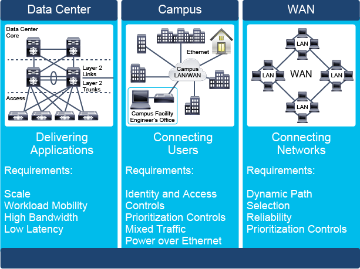

These technologies are built from the ground up with APIs first and programmability in mind. They provide a centralized point of network configuration and applying the desired configuration, intent, or desired state to the devices where needed.

For example, Cisco ACI and Cisco SD-Access policy integration maps Cisco ACI application-based microsegmentation in the data center with Cisco SD-Access user group-based segmentation across the campus and branch. Now, security administrators can automate and manage end-to-end segmentation seamlessly with uniform access policies—from the user to the application. With such segmentation, policies can be set that allow Internet of Things (IoT) devices to access specific applications in the data center or allow only financial executives and auditors to access confidential data. This is just one example of how Cisco solutions are enabling consistent multidomain policy segmentation and assurance for end-to-end alignment to business intent.

## Content Review Question

What are two benefits of software-defined and intent-based networks? (Choose two.)

- [ ] faster network speeds
- [x] centralized provisioning
- [x] network security
- [ ] no more CLIs
- [ ] lower latency
- [ ] open source
