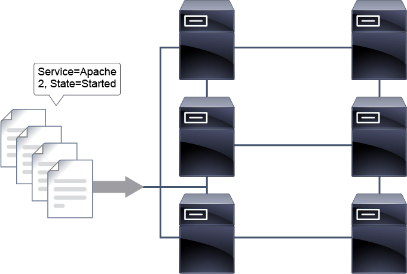
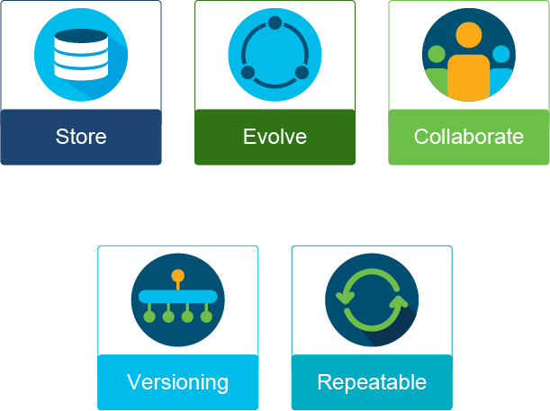
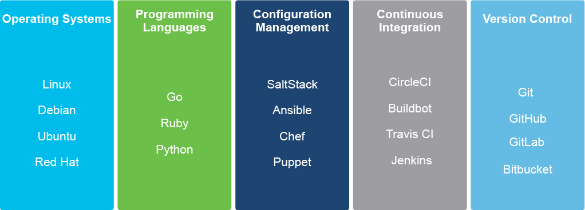

# Infrastructure as Code

Traditional infrastructure management often looks like this:

- A problem is realized and needs to be resolved.
- Often, a user contacts the helpdesk, and the user or an administrator creates a ticket.
- An engineer opens the ticket and investigates it via the CLI or a GUI on a device-by-device and system-by-system basis.
- Maybe, the ticket is escalated to the next-level engineer.
- This process is repeated until the original problem can be resolved.

This process is too slow, too decentralized, and too manual to scale to the level of management needed for a modern-day data center. With infrastructure as code (IaC), you follow a simple mantra: "If you do it more than once, automate it."

IaC allows you to identify the state or outcome, produce instructions to accomplish the desired state, and then reuse, repeat, and evolve to meet new needs as your environment grows. Here, you no longer focus on infrastructure but instead on the articulation of the business outcome.

IaC is a way of defining, managing, and interacting with your physical and virtual resources by using machine-readable configuration files and scripts instead of an interactive GUI or CLI. These files are often part of the application itself and contain instructions on how to configure, create, and destroy resources in the infrastructure on demand or automatically.

Tools that are involved in provisioning such an infrastructure are text editors, version control systems, and scripts.

Editing a configuration file or a script, applying configuration to infrastructure, and committing changes to a remote code repository is a new process that replaces the legacy workflow. The legacy workflow was to copy CLI commands, edit them to reflect the wanted changes, and paste them to select devices. This practice and the tools it uses are the primary elements of what is known as DevOps (development and operations merged).

The tools used in IaC are always evolving, but their areas of focus are consistent:

- Centralized storage
- Collaboration
- Life-cycle management
- Automation

With IaC, you start by identifying the steps and tasks that you repeat regularly—for example, an administrator who checks the status of their perimeter devices and critical servers every morning before the users start to file into the office. Those GUI or CLI steps will then be coded to produce the desired outcome. The code or script can be used to re-create the desired outcome quickly and identically.

Network as code is the application of IaC—more specifically, to the network infrastructure or what is referred to as the networking domain.

NetDevOps is the practice of ongoing development of your network infrastructure using DevOps tools and processes to automate and orchestrate your network operations.

## IaC Benefits

When defining your IaC, you may observe the following benefits:

- Capturing your actions "as code" allows you to capture the result or desired state configuration.
- The declarative model allows you to focus on the state instead of which actions are needed to get there.
- Life-cycle management helps you with evolution of your code from concept to creation to collaboration and use.

When that desired final state of your infrastructure is defined within code, you can do the following:

- Store your code in a repository for safekeeping as a backup of your network configuration.
- Evolve as your needs change or your network grows, because you are able to update and add to your code to meet these changes.
- Collaborate with others in your team and around the world as you work toward that final desired state.
- Versioning allows the developers within your team to create a copy of the existing repository or an entirely new "fork."
- Repeatable; once perfected, this code is your product that can be repeated wherever and whenever needed.

## IaC Tools

It is important to understand that IaC is not just about the code you create but also managing, storing, collaborating on, and controlling the version of your code. Here are a few tools to help you manage the life cycle of your IaC.

Here are a few tools that are essential to the IaC life cycle:

- GitHub and GitLab
- Chef and Puppet
- Ansible
- Cisco NSO
- Terraform
- Integrated development environments (IDEs)

Cisco DevNet and the Postman tool are invaluable resources.

Github is the largest online service when offering version control and collaboration services.

- Version control
- Collaboration
- Bug tracking
- Wiki
- Free public repositories
- Founded in 2008
- Acquired by Microsoft in 2018

Github is a web-based service helping developers centrally manage, store, collaborate on, and control versions of code. You have the options of performing all management functions via the web interface or downloading and installing a client on your computer.

Github is available at `https://www.github.com`.

The Cisco Data Center specific repository on Github is available at `https://www.github.com/Datacenter`.

The Cisco DevNet repository can be found at `https://www.github.com/ciscodevnet`.

Chef and Puppet are configuration management systems that require an agent present on a managed host.

- Open source
- Configuration management
- Agent
- Pull operations

Chef takes a "recipe" (a single operation) and "cookbooks" (a collection of operations) approach to specifying the steps needed to get to the desired configuration. This process is a procedure-based approach to configuration management. Recipes and cookbooks are used to describe the procedure necessary to get your desired state.

Chef is available at `https://www.chef.io`.

Chef and Puppet have many characteristics in common. One important difference is in their approach. Chef focuses more on the control of your nodes, while Puppet focuses more on writing the actual configuration files. In other words: Chef is procedural, while Puppet is declarative. Chef and Puppet both require agents to be installed on a managed device, which is instructed that a change as been made. They then pull new instructions from your management station and execute them to get to desired state.

Puppet is available at `https://puppet.com`.

Ansible is younger than other configuration management systems but the most widely adopted.

- Red Hat
- Open source
- Configuration
- Agentless
- Push operations

Instead of managing each individual node or system, Ansible uses a model-based approach to your infrastructure by describing how the components and systems are related to one another. Ansible is agentless and uses playbooks to define the declared changes and final state. Ansible playbooks are written using YAML files that are human and machine readable. You issue commands from your management station with Ansible installed, and the commands are executed on the remote system. This approach is known as push.

Ansible is available at `https://www.ansible.com`.

Cisco NSO is software for automating services across physical and virtual networks:

- Cisco
- Enterprise
- Service provider
- Vendor agnostic
- APIs

Cisco NSO is an enterprise- and service provider-level software automation platform that operates across physical and virtual devices. Operations can be accomplished through automation, a self-service portal, and manual provisioning. The latest innovations in Cisco NSO allow the administrator to create their own element drivers, or non-Cisco vendor definitions. You can find out more about Cisco NSO at `http://www.cisco.com/go/nso`.

Terraform is an open source IaC software tool:

- HashiCorp
- Execution plans
- Cloud agnostic
- APIs

Terraform is a tool to aid the provisioning of your infrastructure. It uses "execution plans" written in code. These execution plans outline what will happen when you run your code. Terraform builds a graph of your resources and can be used to automate changes. Terraform is available at `https://www.terraform.io`.

## Content Review Question

Which three options best describe IaC? (Choose three.)

- [ ] takes a device-by-device approach to CLI and GUI administration
- [x] a broad definition under which is network as code is executed using the DevOps model
- [ ] offers a single copy; not to be changed by others within your group
- [x] uses a declarative model to capture a desired state or result
- [x] brings with it the benefits of centralized storage, collaboration, and evolution of the code
