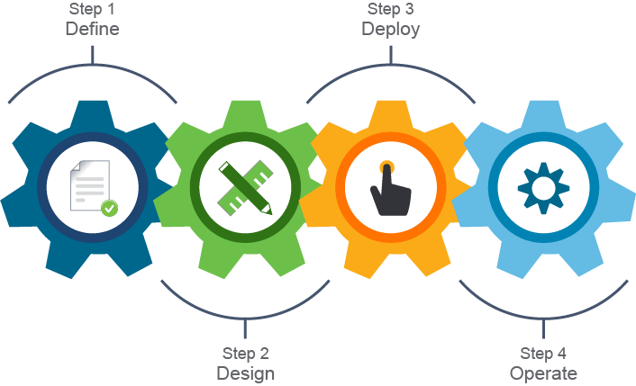
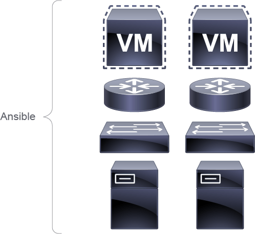
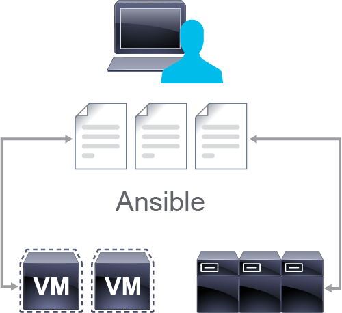
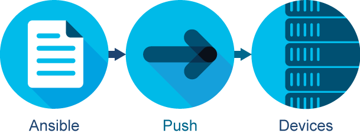

# System Management with Ansible

The challenge with modern-day data centers lies in their complexity, density, and multivendor solutions spanning across multiple different technologies. The solution is to programmatically manage a data center full of devices using a scripting language like PowerShell or a full programming language such as Python. These options bring their own challenges of complex features, syntactical instructions, and the learning curve that comes with both. For that reason, another piece in the DevOps puzzle was developed, Ansible. Ansible is an open source provisioning software that allows for centralized configuration management.

Ansible originally was written by Michael DeHann of AnsibleWorks, which was acquired by Red Hat in 2015. Red Hat in turn was acquired by IBM in 2019. Ansible is free and open source and is included as part of Fedora. It is also available for RHEL, CentOS, Scientific Linux, and other operating systems through their respective package management systems or the Python package management tool pip.

Ansible can be used for almost any automation task. It has these characteristics:

- Free, open source
- Used for:
  - Provisioning
  - Configuration management
  - Deployment
- Uses its own declarative language
- Agentless
- Serverless

Unlike other management platforms and services, Ansible does not require an agent to be installed on the system that it manages, nor does Ansible need or use a centralized controller for configuration management. Automation can be performed from any management system referencing inventories, modules, or playbooks.

A declarative approach means that you only tell Ansible what you want to achieve as a final goal instead of encoding all instructions to reach it. For example, you do not have to tell Ansible where a specific service resides, how to start it, and what to do after it starts. You simply say: “I want this service to be started, and then I want another service to be restarted.”

More information on Ansible is available at `https://www.ansible.com`.

## Components

The components of Ansible come together to make a very powerful management system.

Understanding each component and their relationships is essential to using their power:

- **Ansible control station** is the management station and launching point for all Ansible activities. Unlike many other management platforms, Ansible does not require a dedicated server or elaborate hardware to manage an environment. You could literally manage an enterprise from your personal laptop.
- **Ansible modules** are a standalone collection of commands that are written in a standard scripting language (for example, Python) and used to execute the desired state change. An administrator can write their own Ansible module using any language so long as that language supports JavaScript Object Notation (JSON) as a data format.
- **Playbooks:** Are files, also used to define the desired or final state but are used to orchestrate operation across multiple nodes.
- **Inventory files** contain systems managed by Ansible. Within an inventory file, an administrator groups managed systems. Inventory files can be dynamically built by contacting a remote API that responds with a valid JSON response.
- **YAML** commonly is referred to as a configuration file and a destination for data being stored. Ultimately, YAML is a data format.
- **Transported over Secure Shell (SSH)** by default and with PowerShell support for Windows nodes over the WS-Management protocol.
- **Ansible Tower** is a web service console (GUI) following the REST standard for programmability. It is a licensed product from Red Hat, based on the open source AWX Project.

## Tools

Managing Ansible is a simple process—simple enough that you are largely able to select your terminal program of choice to connect to your management server running Ansible. You can select your preferred text editor for creating and editing inventory files, playbooks, and modules, and use your preferred version control service to manage access to code and control collaboration and editing.

Ansible allows you to pick the tools that you already know:

- Linux Operating System
- Terminal program
- Text editor
- Version control system

Examples of such tools might be PuTTY for SSH access, Visual Studio Code for configuration file management, and GitLab for storage, collaboration, and version control. All this can be done from any Linux-based operating system with Python and Ansible installed.

## How Ansible Works?

Working with Ansible requires only a few quick installation and update steps. Once the installation and update is complete, you are able to configure Ansible operations and defaults. An inventory file and modules will work together to help you execute your changes to the specified target systems.

Getting Ansible to run is simple and straightforward. Follow a few simple steps and complete your Ansible installation in a few moments:

- Installation
- Ansible configuration files
- Inventory files
- Modules
  - Built-in
  - Custom
- Execution

Installing Ansible can be done in multiple ways, but the easiest one is to use Python pip. With your Python virtual environment active, execute `pip install ansible` and you are done. You can then execute `ansible -version` to verify that installation was successful.

Many operating systems offer prepackaged Ansible in their respectful repositories (yum install ansible, apt-get install ansible).

Ansible configuration files are used to configure Ansible operations. The base configuration file is located at /etc/ansible/ansible.cfg.

Inventory files enable an administrator to define an inventory of systems against which Ansible modules will be executed. The basic contents of an inventory file are hosts and groups. Host entries point to the Domain Name System (DNS) name or IP address of a managed end system, while groups are a collection of hosts under a collective label.

## Push Model

With Ansible installed and upgraded and a list of devices within your network defined in an inventory file, it is time to manage configuration modules and execute them to make changes to your managed devices.

Ansible modules can be thought of as a small program pushed to and run on the managed device to achieve the desired configuration state of that device. Most modules are standalone. Ansible also gives an administrator the ability to write their own module using standard scripting languages such as Python. With more than 750 built-in modules that are organized by vendor and technology, Ansible enables administrators to ramp up and manage their environment quickly and easily.

There are many Cisco built Ansible modules for various data center technologies in the Cisco Data Center GitHub repository at `https://www.github.com/datacenter`. More specifically; Cisco ACI modules for Ansible are at `https://github.com/datacenter/aci-ansible`.

You can use `ansible-doc modulename` to quickly view the information and examples on how to use the installed module. More information can be found at `https://docs.ansible.com`.

Once your modules are installed, they can be executed from the Ansible host against the systems defined with your inventory file using the a`nsible-playbook example-playbook.yml` command. Ansible will connect to all systems defined in the inventory simultaneously, make the prescribed changes, and display a status of "PLAY RECAP" on the terminal screen.

Ansible also supports ad hoc execution of modules using `ansible host1,group2 -m modulename -a moduleargs`, where `host1,group2` are entries that are defined in your inventory file, `modulename` is the name of the Ansible module you want to execute, and `moduleargs` are the required arguments for that specific module.

Some modules don't require arguments and can be called only with `modulename`; for example, `ping` module `ansible host1,host2,host3 -m ping` would return success if all hosts are reachable.

## Content Review Question

What is the name of the Ansible agent required to be installed on every managed device?

- [ ] There is no installation needed because Ansible manages devices using RDP.
- [ ] AnsibleAgent is available for download from the app store.
- [x] There is no required agent, Ansible is an agentless management solution.
- [ ] The required agent is included with your Windows operating system and only needs to be enabled using the `ansible-agent --enable` command.
