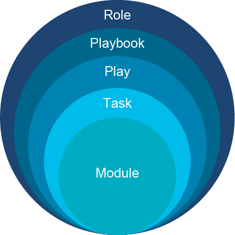
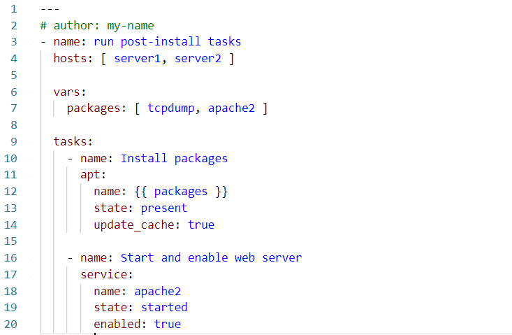

# Infrastructure Automation with Ansible Playbooks

Unlocking the true power of Ansible is done through orchestration, and orchestration is done through Ansible Playbooks.

Now that Ansible is installed and updated, and your managed devices are defined through an inventory file, it is time to use Ansible on a large scale. For that, you will use Playbooks and other Ansible operations.



Keep in mind that a modern-day data center is made up of multiple different vendors and technologies. The process of making the needed changes in the required order against the specific technology, following the parameter of that technology, is known as orchestration. Ansible Playbooks is a powerful method to use Ansible for orchestration.

## Ansible Playbooks: Terms

As with any technology, a set of terms and their definitions is important to better understanding that technology. Ansible uses the following terms for orchestration through Playbooks:

| Tool | Description |
| - | - |
Module | Code, which is written using many scripting languages (for example, Python) to perform an action on a managed device.|
| Task | An action referencing a module to run together with input argument and actions |
| Play | A set of tasks to a host or group of hosts |
| Playbook | A file, written in YAML, that includes one or more plays |
| Role | A set of playbooks, often prebuilt, used to execute a standard configuration in a repeatable manner |

You can assign multiple roles to a single host.

**Example:**

My inventory file contains server1, server2 and server3 host entries that are part of internet_servers group, which should have ssh_server, http_server and php_server roles applied.

## Ansible Playbooks: Components

An Ansible playbook is a simple human-readable text file in YAML format, with keywords that Ansible recognizes as instructions. Because YAML is a plaintext file, it is ideal for collaboration and makes troubleshooting much easier because line numbering and version control provide insight into what was changed and when and who made changes.

 

A playbook consists of a (optional) name, hosts, and tasks that should be performed. There are a lot of optional keywords that change the way that Ansible interacts with hosts that are defined in your inventory file. For example, `gather_facts` is an instruction to Ansible that enables or disables runtime variables available to your tasks. Setting it to `no` will make execution faster, but your tasks lose access to variables that Ansible collects before execution (ansible_distribution would be empty instead of value Ubuntu or RedHat).

A pound sign (#) indicates a comment; everything from here to the end of the line is ignored by Ansible.

The vars section contains user-defined variables that are later referenced in the tasks section. Variable expansion is done by enclosing the variable name inside double-curly brackets, "{{ variable }}."

The tasks section contains tasks that are executed in the order they appear, and they are executed in linear fashion on each host (when one task finishes on all hosts, then execution of the next task starts). This can be changed by setting strategy to free under the top-level section of the playbook.

Ansible will run in parallel on a maximum five hosts, meaning that you must wait longer for each task to complete if you add more hosts. This behavior can be changed with forks set to 20 under the top-level section of the playbook.

Each task section starts with an (optional) name, followed by a module name that you want to use (`apt` and `service` in this example). Module parameters belong under the module name and must be indented to indicate that they belong to the module and not the task. Some module parameters are required; others are optional.

This playbook is made of two tasks and does the following:

- Declares a variable named packages
- Connects to server1 and server2
- **First task:**
  - Updates the apt cache with the latest package information from remote repositories
  - Installs tcpdump and apache2 packages
- **Second task:**
  - Starts the apache2 web server
  - Enables the apache2 web server to start on boot

## Ansible Playbooks: Inventory File

An inventory file is a collection of all your hosts that are managed by Ansible. It is a simple plaintext file where you specify your hosts, logical groupings, and special variables for Ansible itself.

```
[datacenter:children]
servers
switches
routers
[routers]
r1
r2
[switches]
sw1
sw2
[servers]
server1 ansible_port=2201
server2 ansible_port=2202
```

The example inventory file has the following information:

- A group named `servers` with two hosts, each with a special variable `ansible_port` to indicate that sshd is running on a nonstandard port.
- Group `switches` with two hosts
- Group `routers` with two hosts
- Group `datacenter` with groups `servers`, `switches`, and `routers` as members

You can now target any of the hosts or groups in your inventory by changing the `hosts` keyword in your playbook. Group `datacenter` is convenient when you want to execute something on all the desired groups or set a variable for all groups in one place.

There is also a predefined group named `all`, which you can use to target all hosts in your inventory.

## Ansible: Executing the Playbooks

You can execute the playbook by using the ansible-playbook -u root example.yml command, where -u username is your username for administrative login and example.yml the name of your playbook.

Ansible uses the root username by default, so -u can be omitted.


- "Gathering Facts" runs before any tasks to collect system information and populate variables that your tasks might need. You can disable this behavior by setting gather_facts to false.
- The "Install packages" task runs first.
- "Start and enable web server" runs second.
- "PLAY RECAP" informs you how many tasks made changes on each host. Notice that Gathering Facts reports "ok," because when nothing changes on the destination host, the result status is "ok" instead of "changed."

Ansible also offers loops and templates, which are used to extend the power of Ansible Playbooks, all for scale and dynamic orchestration. Dynamic inventories are available from cloud providers so that you do not have to constantly update your inventory file; instead, your inventory information is built every time that you execute a playbook. Ansible does this by contacting the API specified by your cloud provider, which responds with a properly formatted JSON response.

## Content Review Question

Which three statements best describe the components that are found in Ansible Playbooks? (Choose three.)

- [x] A module is code to be executed, while a task is an action referencing a module.
- [ ] A module is a hardware accelerator that is used in the dedicated Ansible Management Server.
- [x] A play is a set of tasks to be executed, while a playbook is a collection of plays.
- [x] A role is a set of playbooks that are to be executed in a repeatable manner.
- [ ] A role is defined within the Active Directory to which the Ansible Management Server is linked and defines the privileges or actions an Ansible administrator is assigned.
