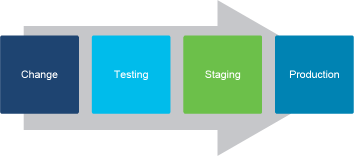
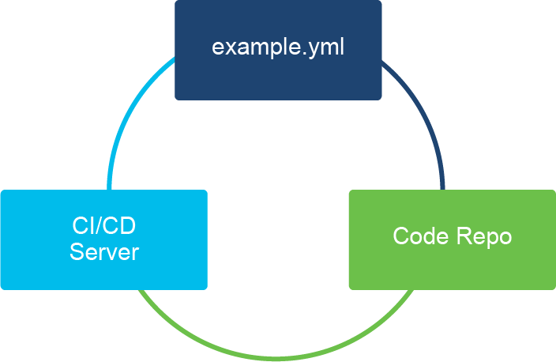

# CI/CD Pipelines for Infrastructure Automation

Once you see the power of automation, it is easy to imagine the other side—the side of automation where an incorrect configuration value is entered and deployed across your entire enterprise, breaking an application or severing connectivity. For that reason, you need to strike a balance between introducing changes to the automation system and making sure that said changes do not harm the enterprise network. That is where CI/CD comes into play.

CI/CD is the process of testing to make sure that changes do not break an application or network and make sure that the change to be deployed is ready for the production environment. CI/CD is simply a quality assurance and testing process for the scripted changes that ultimately will be applied to your production environment.

You can imagine that testing your existing infrastructure is not an easy task. On one hand, you need to test how a new feature, an application, or service behaves in your existing environment. On the other hand, testing in production is out of the question. For these reasons, you need to have a separate test environment that resembles your production environment as close as it can.

A CD/CI server can create a test and staging environment automatically as a part of your workflow when you commit changes to your source code repository, or you can have a CI/CD server monitor for changes in your repository and execute automated builds for every new commit or periodically.

Code review also is very important in projects where many team members are collaborating. Everyone has their own style of coding, and they may use different code editors or IDEs to get the work done. You can imagine that in the end, code would look very inconsistent. This is where code review becomes a necessity. Your IDE can be configured to follow specific rules of code (variable names, function names, indentation) and automatically correct or warn you if those rules are broken.

Instead of making changes to code and executing everything from your workstation, a CI/CD pipeline should be implemented to push that change to production in a consistent and predictable manner. Everyone collaborating on the project should see what other team members changed and when that change was made.

The tests can only be run in a staging environment when the source code repository accepts a change, and the changes can only be propagated into the production environment when the staging environment results in a stable state.

## Example

Pipelines really depend on the complexity of your infrastructure and the tools used. Let's focus on the IaC with Ansible Playbooks as examples.

The following pipeline is very common:

- You commit a change for example.yml to a code repository.
- The repository executes syntax and sanity checks, code review rules, and:
  - Accepts your commit and notifies the CI/CD server to run tests.
  - Rejects your commit based on failed checks.
- CI/CD prepares an environment and runs predefined tests for any Ansible playbook:
  - pip install ansible==2.8.1
  - ansible-version
  - ansible-playbook example.yml --syntax-check
  - ansible-playbook -i staging_inventory.cfg -check
  - ansible-playbook -i staging_inventory.cfg -vvvv
- You are notified that you can propagate your changes to the production environment.

There are different ways in which you can implement the above process. Perhaps the easiest option is to start with changes in a separate code branch, just like application developers do with feature branches. Syntax and sanity checks will then run on this separate branch and will have to pass before your changes are merged to the main repository (branch). This is done through a merge (pull) request, which is where code review happens.

In application development also various synthetic code tests would run before the merge. For infrastructure automation these often aren't all that useful and we instead prefer to test generated configurations directly. However, such tests are usually quite expensive, time- and resources-wise. So we first do code review to catch any glaring errors before we tie up physical resources.

As for the testbed, today's virtualization technologies allow you to stand up devices and topologies dynamically. While this can help ensure tests always start from the same, known state, it does add additional complexity and makes tests run even longer.

For this example, as well as when you're starting your own infrastructure automation journey, it makes more sense to avoid the complexity of having to manage virtual machines or containers in addition to everything else. Since you are already managing these device configurations anyway, you only need to restore initial configuration on test start. This becomes even easier if your devices can use a protocol like NETCONF, that has built-in support for it.

A pipeline like this ensures the following:

- There are no syntax errors in your playbook.
- There are no missing or misspelled modules in your playbook.
- The code is compliant with the rules of coding for this project (code review).
- Ansible version 2.8.1 is used for tests.
- Your playbook executed successfully in the staging environment.
- Everyone can see the change and why it failed or succeeded.

## Content Review Question

Which statement best describes a CI/CD pipeline?

- [ ] A CI/CD pipeline is an ISO 9000 standard specification for formalizing the creation of an application to run on a NetDevOps platform.
- [x] A CI/CD pipeline is a process of adding quality control and assurance to the creation, collaboration, testing, and final delivery of scripted changes to the production environment.
- [ ] A CI/CD pipeline is a process by which one memory-resident application is able to pass executable code to another memory-resident application.
- [ ] A CI/CD pipeline is an ideal process by which developers monitor the automatic delivery of newly developed scripts to your production environment.
