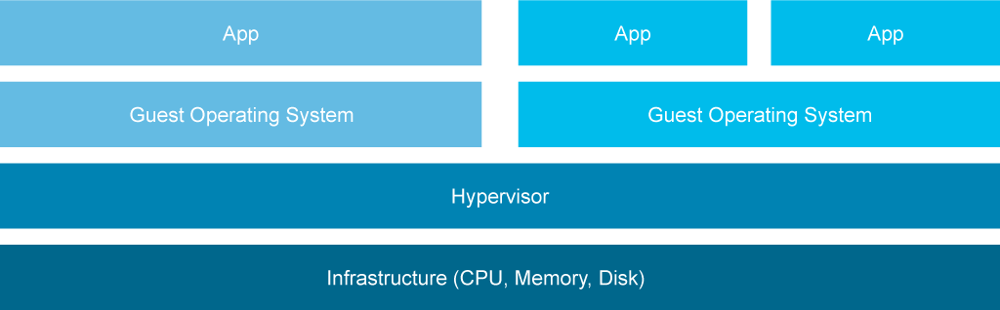
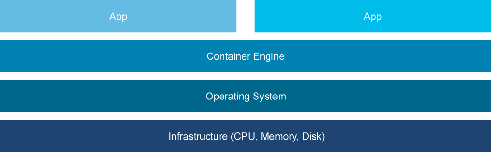

# Application Deployment Types

The word "server" was first mentioned in the 1960s during the study of a queuing theory that predicted one or more waiting lines, or queues, in which jobs were waiting to be processed. An entity that processes jobs from a queue is called a server.

The term "computer server" also dates back to 1960s to an early document describing the Advanced Research Projects Agency Network (ARPANET), the predecessor of the Internet.

The purpose of a computer server is to serve or share data between different nodes. Today, multiple types of servers exist:

- Application servers
- Catalog servers
- Computing servers
- Database servers
- File servers
- Network servers
- Web servers

While "server" describes a computer program that is performing a task, a program must run on computer hardware, which includes CPU, memory, I/O devices, and more. Hardware requirements for servers vary widely, depending on the purpose of the server. Each server type has its own requirements, and a dedicated hardware platform is needed to maximize the number of tasks that a server can perform. These hardware platforms are known as bare-metal servers.

A bare-metal server is a physical computer server with dedicated hardware and is dedicated to a single tenant. Bare-metal servers are not shared between customers. Each server may be used by multiple users and may perform multiple tasks, but it is dedicated entirely to a single customer.

Increasing demand for servers added to the requirements for servers, which changed with each new generation. Keeping up with these changes can be difficult for users. Another disadvantage was that each hardware server could only perform a specific task, which meant the hardware could not be repurposed for different server tasks.

To answer these problems, IBM started working on a system that would have:

- Multifunctional hardware to replace dedicated hardware
- Backward compatibility

The result was the CP-40 operating system. This was only used in lab and was a foundation to the CP-67, a virtual machine operating system developed in 1967 for the IBM System/360 Model 67 mainframe. One of the most important features of this operating system was time sharing, which allowed multiple users to access the system at the same time. Time sharing was the first in a series of features that led to virtualization as it is known today.

Virtualization today mostly refers to hardware virtualization, the creation and maintenance of so-called virtual machines.

Virtual machines have these advantages:

- **Snapshots:** A state of a virtual machine can be recorded at any point of time.
- **Migrations:** A snapshot of a virtual machine can be moved to another host machine with its own hypervisor.
- **Failover:** A virtual machine can be run on any other host server if the primary server fails.
- **Backup and restore:** A snapshot of a virtual machine can be created at any time and restored when needed.

Virtual machines also have some disadvantages:

- **Overhead hardware resources:** Some of the hardware resources are used for running hypervisors, so not all the resources are available for virtual machines.
- **Large resource usage:** Each virtual machine runs its own operating system, which also decreases the amount of the resources that are available for the server to perform tasks.

Modern virtualization platforms can decrease the amount of unused resources by dynamically reallocating them between virtual machines based on current requirements. However, these techniques still do not allow virtual machines to directly communicate with the physical resources. They must still communicate through the hypervisor.

To compensate for the disadvantages of virtual machines, container technology was developed. Container technology removes the abstraction layer and directly uses the host operating system to provide an environment for multiple services (containers) to run on the same physical server. Container technology has these advantages:

- Direct access to bare-metal hardware
- Optimal use of system resources

Container technology on bare-metal servers also shares advantages with virtual machines:

- Deploy applications inside portable environments
- Provide resource isolation between containers

However, container technology on bare-metal servers also has some disadvantages:

- Physical server replacement is difficult. When replacing a bare-metal server, the container environment must be recreated from scratch on the new server.
- Container platforms do not support all hardware configurations.
- Bare-metal servers do not offer rollback features.

As already discussed, multiple deployment types are available, each with their own advantages and disadvantages. It is your choice to select the appropriate type based on the application needs and your company policies and processes.

## Bare-Metal Servers

A bare-metal server is a physical server that is dedicated to a single tenant. It can run multiple applications, but the resources are not shared with other tenants.

Bare-metal servers have these advantages:

- **Performance:** Physical server resources can be optimized for a specific workload.
- **Security:** Data, applications, and other resources are physically isolated.
- **Reliability:** Physical resources are dedicated to a specific workload and are not shared.

## Virtual Machines

A virtual machine is an emulation of a computer system running on a shared host. Each virtual machine consists of its own environment (including operating system, libraries, and applications) and is not aware of other virtual machines running on the same physical host. Communication between applications inside a virtual machine and physical resources is through an abstraction layer called a hypervisor. This abstraction layer is responsible both for resource allocation and isolation.

Virtualization consists of multiple layers:

- Host machine: A physical server that supports virtualization.
- Hypervisor: Computer software that runs on the host machine and manages the virtual machines, also known as the virtualization layer.
- Virtual machine: A virtual computer that emulates a physical computer system. It has its own operating systems as well as dedicated software to perform a specific task. Software that is executed on these virtual machines is separated from the underlying hardware resources.

## Containers

Container technology uses host operating system features to provide an isolated environment for multiple applications to run on the same server. An early example of the technology behind containers is the chroot command, which provides isolation in UNIX-based operating systems. The chroot (change root) command allows users to change the root directory for a running process, which makes it possible to isolate system processes into separate file systems without affecting the global system environment. The chroot command was added to the seventh edition of the UNIX operating system in 1982. The environment created with the chroot command is called chroot jail.

In 2006, Google engineers started implementing process containers, later renamed control groups (cgroups), a feature that allows isolation and limiting of the resource usage (CPU, memory, disk I/O, network, and so on) for a certain process. This feature was merged into Linux kernel 2.6.24 in 2008.

Control groups provide:

- **Resource limiting:** Limit CPU, memory, disk I/O, and network for a specific group
- **Prioritization:** Some groups might have a larger share of resources than others.
- **Accounting:** Measurement of group resource usage

In 2008, the Linux Containers (LXC) technology was developed. LXC provides virtualization at the operating system level by allowing multiple Linux environments to run on a shared Linux kernel, where each environment has its own process and network space.

The operating system has these features:

- chroot
- Process and network space isolation
- cgroups

Container solutions are now also supported on Microsoft Windows and macOS.

The most widely used container solution used today is Docker. Docker was released in 2013 and enables users to package containers so that they can be moved between environments. Docker initially relied on LXC technology, which was replaced by the libcontainer component in 2014.

Docker is popular because it contains more features than its predecessor, LXC:

- **Portable deployments across machines:** You can use Docker to create a single object (image) containing all your bundled applications. The image can then be installed on any other Docker-enabled host.
- **Versioning:** Docker can track versions of containers, inspect differences between versions, and commit new versions.
- **Component reuse:** Docker allows building and stacking of already created packages.
- **Shared images:** Anyone can upload new images to a public registry of Docker images.

Docker originated from a public cloud service called dotCloud and is used in many platform as a service (PaaS) offerings today. PaaS provides a platform that enables customers to develop, run, and manage applications without the complexity of building and maintaining the application infrastructure.

Container solutions are now supported on Linux operating systems, Microsoft Windows, and macOS.

## Content Review Question

Which deployment model uses host operating system features to provide an isolated environment for multiple tenants to run applications on the same server?

- [x] containers
- [ ] virtual machines
- [ ] bare-metal servers
- [ ] all of them
