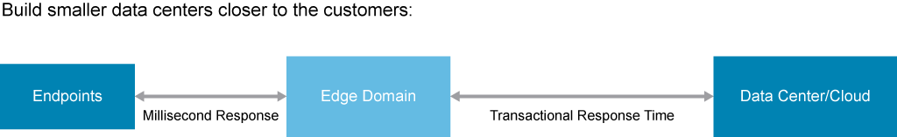

# Application Deployment Models

Cloud computing, often referred to simply as cloud, represents delivery of computing resources (servers, storage, databases, software, networking, and more) over the Internet on a pay-as-you-go basis. Cloud computing has become popular in recent years, but the history of cloud computing dates back to 1950s, where large-scale mainframes were built to be used by different corporations and schools. The mainframe hardware was installed in a server room, and users were able to access it via terminals, dedicated stations for accessing the mainframe. Mainframes were large and expensive, and organizations could not afford a mainframe for each user, so it became common practice to allow multiple users to access the same data storage from any station.

Cloud computing can be divided into three groups:

- Public clouds
- Private clouds
- Hybrid clouds

Public Cloud | Private Cloud | Hybrid Cloud
| - | - | - |
| - Resources dedicated to one organization   - Resources owned by a service provider   - Amazon Web Services   - Microsoft Azure   Google Cloud Platform | - Resources dedicated to one organization   - Resources owned by your organization or a service provider, or both   - Used by government and financial institutions | - Combination of public and private cloud   - Offers cloud bursting   - Combination of public and private cloud vendors   - Cisco Meraki |

## What Is a Public Cloud?

Public clouds are the most popular cloud deployment solution. Resources are owned by a third-party cloud service provider and are physically located in the provider data center. No resources are located at the customer data center. Physical and virtual resources in the provider data center also are shared between multiple organizations. Customers and end users access these services over the Internet using a web browser.

Public clouds have multiple advantages:

- **No capital expenditures:** There is no need to purchase hardware or software; services are on a pay-as-you-go basis.
- **No maintenance:** Maintenance is provided by a cloud service provider.
- **Scalability:** Resources in the data center can be scaled easily.
- **Reliability:** High availability of services offers greater reliability.

Multiple vendors offer public cloud solutions:

- Amazon Web Services
- Microsoft Azure
- Google Cloud Platform

## What Is a Private Cloud?

Resources of a private cloud are used exclusively by a single organization. They can be physically located at the data center of an organization or in a cloud provider data center. Services in private cloud are always maintained on a private network, and the hardware and software are dedicated to a single organization. Private clouds often are used by financial institutions, government agencies, and other organizations with business-critical operations.

Private clouds have multiple advantages:

- **Flexibility:** Resources are dedicated only to your organization, so you can customize the environment based on your business needs.
- **Security:** A higher level of security is available because resources are not shared with other organizations.
- **Scalability:** Private clouds can still afford the scalability of public clouds.

## What Is a Hybrid Cloud?

A hybrid cloud is a combination of a public and private cloud, often referred to as “the best of both clouds.” Hybrid clouds combine on-premises infrastructure (private cloud) with public infrastructure (public cloud). In a hybrid cloud, data can be moved between a private and public cloud for greater flexibility. An organization can use a public cloud for low-security use cases and a private cloud for high-security use cases. Hybrid clouds also offer so-called “cloud bursting,” which enables organizations to expand services from a private to a public cloud in high-demand situations.

Hybrid clouds have multiple advantages:

- **Cost effectiveness:** With the scalability available in public clouds, you can pay additional fees only when needed.
- **Flexibility:** You can use a public cloud for additional resources only when needed.
- **Control:** Sensitive data can be kept in a private cloud, while other data can be kept in a public cloud.

Most vendors that offer public and private clouds also offer hybrid cloud deployment models.

## Application Deployment Options

Most cloud computing services belong to one of these categories:

- Infrastructure as a service (IaaS)
- Platform as a Service (PaaS)
- Software as a service (SaaS)

IaaS is the most basic category of cloud computing services. You rent the IT infrastructure (network devices, storage systems, servers and virtual machines) from a cloud provider.

PaaS refers to an on-demand environment for developing and testing software applications. It is designed to save time for developers when creating and deploying web or mobile applications.

SaaS is a way of delivering software applications over the Internet, typically on a subscription basis. End users are only provided an application, while service providers manage the underlying infrastructure and the application.

## Edge Computing

Edge computing is a network solution that brings computing resources as close to the source of data as possible to reduce latency and bandwidth use. Today, more applications are moving to the cloud, and multiple clouds are being deployed. The increased number of endpoints dramatically increases the volumes of data that need to be processed, and transporting the data to central locations for processing becomes expensive. At the same time, users want high-quality experiences, best possible application performance, and security across data. To solve these issues, a new service architecture is being introduced: edge computing, which is based on distributing computing capacity to the edge of the network.

Edge computing focuses on:

- Lowering the latency between the end user device and a processing and storage unit to get better performance
- Implementing edge offloading for greater network efficiency
- Performing computations and reducing transport costs

Two examples of using edge computing include:

- Radio access network
- 5G Core network

## Content Review Question

Which application deployment option refers to an on-demand environment for developing and testing software applications?

- [ ] SaaS
- [ ] IaaS
- [x] PaaS
- [ ] serverless computing
