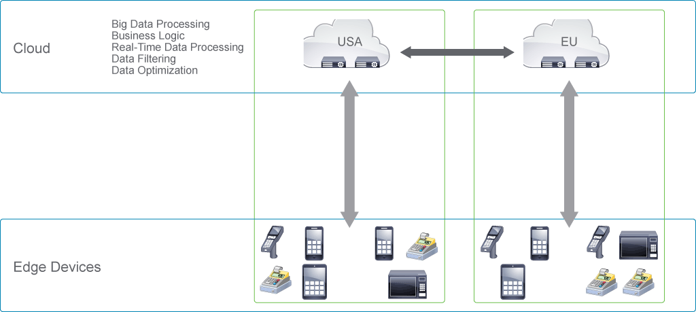
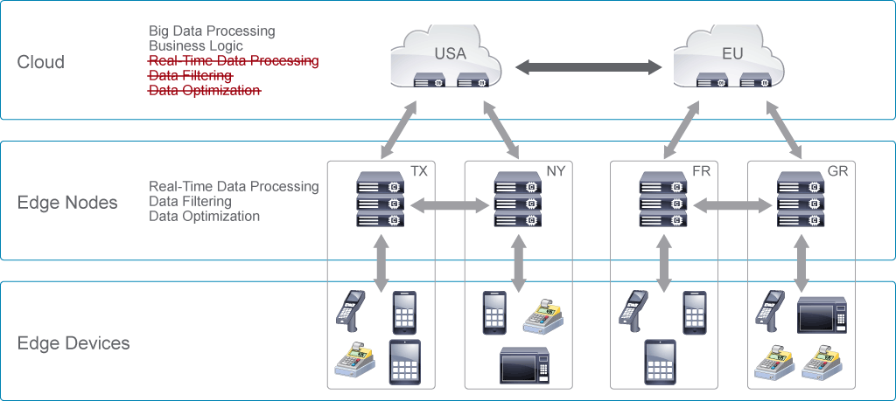
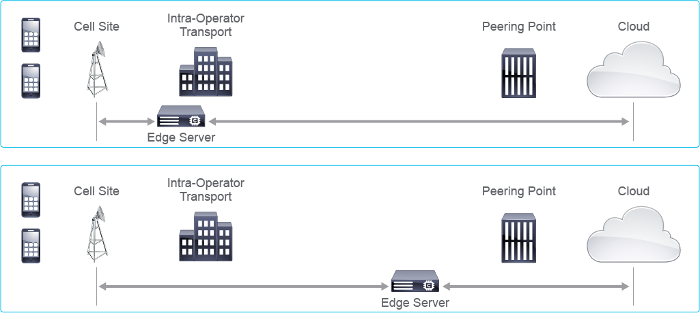

# Edge Computing Overview

A new, more sustainable approach to networking is necessary, with an architecture that is more open and places computing capacity in the best location for a set of services. The end user experience drives the perceived value of your services and is directly related to how the network performs and how the required latency is achieved.

Low latency creates a good user experience for many types of services. However, low latency is not equivalent to close proximity. A properly designed IP network supports both low latency and optimal economics. In the enterprise environment, the location of an enterprise might be the optimal location for edge computing. Potential locations include metro data centers and repurposed central offices or public exchanges, but not cell sites.

Edge computing is a distributed network architecture that moves your compute, storage, communication, control, and decision making closer to the network edge or where the data is being produced to mitigate the limitations in the current infrastructure.

You do not necessarily have to do all tasks at the edge of your network, but there are some good use cases for this approach:

- **Bandwidth reduction:** The cost that is incurred in sending large quantities of data can be reduced.
- **Filtering:** Filtering allows you to capture only relevant data flows and transport.
- **Latency optimization:** Some types of data are susceptible to latency and require more real-time data flows.
- **Partitioning:** Partitioning helps to balance and allocate resources across the network.
- **Simplified applications:** Simplified applications help normalize data and the data organization process.
- **Dynamic changes:** Data can be redirected based on content and priority.
- **Analytic support:** Data can be used for analytics and higher-level systems.
- **Network efficiency:** Edge computing allows you to use the network more efficiently.

Three major architectural shifts underpin the emergence of the edge computing network infrastructure:

- **Decomposition:** Network functions are separated (control/signaling and user/data) for optimization of resources.
- **Disaggregation into software and hardware:** Software-centric solutions use off-the-shelf or white-box hardware, which can be procured separately.
- **Infrastructure convergence:** Fixed and mobile networks share a common 5G Core (5GC)-based infrastructure for efficient operational practices.

The 5G system promotes the emergence of an edge infrastructure that combines decomposed subscriber management from a converged core with the data plane of a wireline access node—for example, DSL access multiplexer/optical line terminal (DSLAM/OLT)—as well as upper layers of the Third Generation Partnership Project (3GPP) radio stack. Edge computing use cases are driven by the need to optimize infrastructure through offloading, better radio, and more bandwidth to fixed and mobile subscribers.

Some organizations are testing edge computing at the cell site itself. At first glance, this approach might appear reasonable because it puts computing as close as possible to the mobile subscribers. However, several issues result:

- It is operationally complex because of the typically large number of cell sites.
- It is expensive because of enclosures, power, and heating, ventilation, and air conditioning (HVAC) needs. Specialized servers may be needed instead of tapping mass-scale production servers.
- New trends in radio are for leaner cell-site architectures composed primarily of lean elements such as remote radio heads.

> **Note** \
Cloud radio access networks (C-RANs) do not have packet awareness at the cell site.

Instead of focusing on proximity, you can focus on addressing latency requirements. A good IP design can cure latency issues between a centralized metro location and the cell site. The economics are important for the location of the edge in edge computing. You need to consider capital expenditures (CAPEX) and operating expenditures (OPEX) to ensure a good IP network design. An edge server that is closer to the cell site means less IP network growth but more cost (OPEX and CAPEX) for the edge servers because of the larger number of locations that need to be supported. An edge server that is located farther from the cell site means that the operator must deploy more IP network capacity. However, it can lower edge server costs due to the economies of scale of the centralized metro location. The higher network capacity is easily manageable through priority queues on latency-sensitive traffic.

To determine the location of the edge computing node, consider these questions:

- Can the more efficient location be the customer premises equipment (CPE)?
- Can the more efficient location be located on the customer premises?
- If the edge location is optimally in the network, is there enough low-latency queuing to the endpoint device?
- For mobile access use cases, can the locations be mapped to a present or future C-RAN central unit location?

## Content Review Question

What is edge computing?

- [ ] Edge computing is a centralized network architecture that allows you to transfer your compute, storage, communication, control, and decision making closer to the network edge.
- [ ] Edge computing is a centralized network architecture that keeps computing, storage, communication, and control functions in a single data center.
- [ ] Edge computing is a distributed network architecture that allows you to transfer your compute, storage, communication, control, and decision making closer to the network core.
- [x] Edge computing is a distributed network architecture that allows you to transfer your compute, storage, communication, control, and decision making closer to the network edge.
