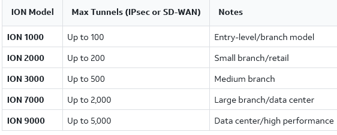

# PaloAlto SDWAN

## Architecture

- Strata Cloud Manager (SCM)
- Instant on Network (ION)

### SCM

### ION

- Uses TLS1.2 to establishes connection to SCM, which is secure channel -- Temporary Connection
- MIC (Manufacturer Installed Certificate) to digitally sign a device (Physical or Virtual)
-

**Process:**

- Claim the device
- Assign to a site(s)
  - DC
  - Branch
  - Branch GW
-

### Misc

- BFD status Using CLI. [URL](https://docs.paloaltonetworks.com/prisma-sd-wan/ion-cli-reference/use-cli-commands/dump-commands/dump-bfd-status).
- 
